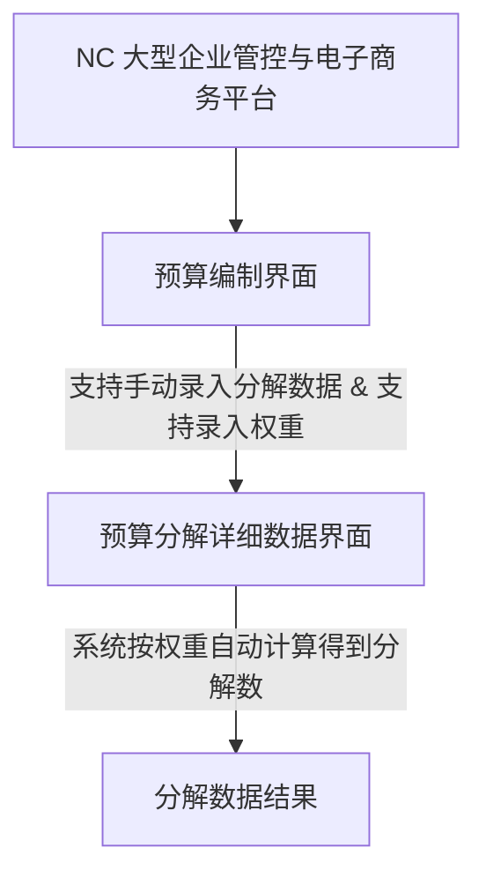

# NCV65产品手册-全面预算
## Page 1

NC

大型企业管理与电子商务平台

---

yonyou NC

产品手册 - V6.5

---

全面预算

用友网络科技股份有限公司

## Page 2

**NC**

大型企业管理与电子商务平台

# 版权

* 用友集团版权所有

未经用友集团的书面许可，本操作手册任何整体或部分的内容不得被复制、复印、翻译或缩减以用于任何目的。本操作手册的内容在未经通知的情形下可能会发生改变，敬请留意。请注意：本操作手册的内容并不代表用友软件所做的承诺。

用友网络科技股份有限公司

## Page 3
用友网络科技股份有限公司
## Page 4

NC
大型企业管理与电子商务平台

# 目录

|  |  |
| --- | --- |
| 版权 | 1 |
| 名词解释 | 4 |
| 第一章 概述 | 9 |
| 1.1 产品概述 | 9 |
| 第二章 初始准备 | 11 |
| 2.1 构建预算体系 | 12 |
| 2.1.1 单一集团预算组织体系构建 | 12 |
| 2.1.2 多集团预算组织体系构建 | 15 |
| 2.1.3 多个预算组织体系 | 17 |
| 2.1.4 分级管理预算体系 | 18 |
| 2.1.5 多套预算体系 | 20 |
| 2.2 管控模式 | 21 |
| 2.3 控制策略 | 24 |
| 2.4 预算档案 | 26 |
| 2.5 预算模型设置 | 28 |
| 2.5.1 维度管理 | 28 |
| 2.5.2 维度属性 | 31 |
| 2.5.3 应用模型 | 32 |
| 2.5.4 数据集管理 | 33 |
| 2.5.5 业务规则 | 33 |
| 2.5.6 控制规则 | 36 |
| 2.5.7 套表管理 | 36 |
| 2.5.8 节点发布 | 37 |
| 2.6 审批流 | 40 |
| 2.7 规划维度、模型和套表 | 44 |
| 2.7.1 规划应用模型和套表 | 44 |
| 2.7.2 抽取维度 | 46 |
| 2.8 预算套表设计 (Excel端) | 47 |
| 2.8.1 套表设计基本功能 | 47 |
| 2.9 设置控制规则方案 | 67 |
| 2.9.1 单项指标预算控制 | 67 |
| 2.9.2 多项指标组合控制 | 68 |
| 2.9.3 以约定支的预算控制(弹性控制规则) | 70 |
| 2.9.4 柔性预算控制 | 74 |
| 2.9.5 一对多的预算控制 | 77 |
| 2.9.6 累计控制 | 80 |
| 2.9.7 零预算规则 | 82 |

i

## Page 5

NC

大型企业管理与电子商务平台

|  |  |
| --- | --- |
| **第三章 应用场景** | **85** |
| 3.1 预算编制 | 85 |
| 3.1.1 预算编制流程 | 85 |
| 3.1.2 不同格式要求预算表的编制 | 98 |
| 3.1.3 固定额度和自定义期间预算表 | 118 |
| 3.1.4 资产负债表(双表头) | 121 |
| 3.1.5 滚动预算的编制 | 125 |
| 3.1.6 公式追踪 | 135 |
| 3.1.7 批量计算 | 137 |
| 3.1.8 外币折算 | 141 |
| 3.1.9 预算汇总 | 146 |
| 3.1.10 预算分解 | 147 |
| 3.1.11 预算催报 | 149 |
| 3.1.12 两阶段审批 | 152 |
| 3.1.13 数据的穿透查询 | 153 |
| 3.2 预算调整 | 155 |
| 3.2.1 预算调整流程 | 155 |
| 3.2.2 预算调整业务 | 168 |
| 3.3 预算分析 | 169 |
| 3.3.1 基于任务的预算分析 | 170 |
| 3.3.2 自定义查询分析(即席分析) | 172 |
| 3.3.3 利用语义模型查询分析 | 174 |
| 附录 | 181 |
| 附录 1: 接口说明 | 181 |
| 附录 2: Excel 客户端安装常见问题 | 184 |

## Page 6

大型企业管理与电子商务平台


# 导读

此手册面向实施顾问以及企业关键用户,旨在为实施规划、解决方案制定和落实提供指导。手册围绕产品能够解决的主要业务场景展开,并以此为依托展现产品的关键应用功能,提供业务需求与产品功能相匹配的思路。

本手册包括四大部分,第一部分是对产品及其价值的概要介绍;第二部分是对有关本模块的主要业务场景、流程、以及对应的业务功能的介绍;第三部分是初始准备设置;第四部分是关于本模块功能点的重要操作,此部分未就详细条目展开,详情可查阅产品相关模块的在线帮助说明。

此外,为了便于用户对整体内容加深理解,手册中对一些关键的名词进行了解释,并在附录中对一些可能需要对照查询的关键点进行了补充说明,以使用户查找对照。

为突出重点,本手册定位为方案性说明,仅对产品操作中的重要控制点有所描述,若读者希望深入了解特定模块的产品应用,可结合本手册,查阅如下资料:

1. 《NCV6.5 产品手册-组织管理》——深入阐述了产品关键概念(如集团、组织、业务委托关系等)以及建模思路,是实施规划、蓝图设计的重要参考资料。
2. 产品帮助——针对具体功能点的关键字段、按键操作进行详细解释,并提供关键应用示例。
3. 《NCV6.5 产品手册-流程管理》——提供关于交易类型、流程设计工具的应用指导。
4. 《NCV6.5 产品手册-基础数据》——可对手册第三部分(即初始准备设置)中的有关基础数据的理解和应用进行更详细深入地了解。

## Page 7

## 名词解释

1. **指标**

   指标是指，在营运管理的过程中，公司为内部成员单位、部门、个人等所设定的一些经营任务。

   指标分为财务指标及非财务指标。财务指标即“硬指标”，包括：销售额、毛利润、各项营运费用、损耗、利息、净利润、税金、库存天数等。非财务指标即“软指标”，包括：人员编制、员工满意度、人员流动率、来客数、客单价、顾客满意度等等，在V61产品中，指标置入维度管理中。
2. **维度**

   维度是，对指标进行多重解释的具体分类，一个指标可以按照多个维度进行解释。如，营运费用指标，可以用主体维度、时间维度、币种等维度进行解释。

   维度的一个具体取值称为维度成员，如，业务方案维度，具体成员有：预算数、预测数、实际数等。
3. **维度组合**

   维度组合（维度向量）是预算产品中特有的一种概念，预算样本表中有行/列/表头维度交叉成员的组合称为维度向量。

   1. 数据描述方式

   在NC预算系统里，虽然数据的展示形式也是一种表格，但是每个单元格都会有维度组合的属性。预算中使用维度组合而不是单元格坐标来描述数据，主要是考虑在表格应用时会存在一些缺陷，特别是不能进行数据的多维旋转、钻取等操作，而且基于单元格的应用，如果单元格发生变化往往需要重新定义取数公式，增加了维护工作量。因此在预算系统中使用多维的储存方式。如图01中的B3单元格，预算数据存储的时候将存储为：

   （主体=集团，业务方案=预算数，年维度=2009，指标=手机通讯费，币种=本币，月=4月）的值。


## Page 8
# 图 01: 预算中的表单
2) 如何快速知道单元格维度组合
那么如何才能快速的知道单元格的维度组合信息?如何根据维度组合快速定位到数据单元格?在预算里一个单元格的维度信息受三方面的维度作用:表头维度、行维度和列维度,多个维度交叉又生成一个单元格的维度组合。我们看一个单元格的维度信息时如果知道行列及表头维度信息,通过多个维度成员组合就能知道一个单元格的维度信息,如图 02 所示。


**图 02: 单元格的维度组合属性**

在一个模型中,维度组合是唯一确定的。一个维度组合(维度向量)只能储存一个数据,因此维度向量相同的单元格,他们之间是数据共享的关系。也可以说,单元格和维度组合的关系是多对一的关系。
## 4. 应用模型
应用模型可以理解为预算系统用来储存数据的一个多维数据空间。应用模型中的预算维度相互交叉组合,最终确定数据在应用模型中的储存位置。
如下图示例的应用模型,包含三个预算维度“产品名称”、“地区”、“时间”,通过交叉组合确定了各个预算数据的储存位置。
## Page 9


电子产品

日用品

书籍


江苏

上海

浙江

在预算系统中的应用模型，可以包含 6 到 20 个维度。我们建立的应用模型中必须包含的维度有 6 个：“业务方案”、“版本”、“币种”、“主体”、“计划期间”、“指标”。一般情况下，模型中的维度数量在 **10 个左右比较合适**，完全可以满足客户的需求。应用模型中的维度越多，数据关系就越复杂，系统处理的效率也就越慢。后续章节中我们会讲到如何抽取维度，以提高系统运算效率。

应用模型的多维化，对于数据的汇总查询、切片查询等有很大益处。如下图所示，数据可以在“时间”“地区”维度上进行汇总查询：


电子产品

日用品

书籍

一季度

二季度

三季度

江浙沪

也可以在“时间”“地区”的层面上进行切片查询：

## Page 10

大型企业管理与电子商务平台


鉴于上述应用模型的数据储存、汇总和查询特性，我们要求“凡是具有相互联系的数据，尽量放在同一个模型当中”。用上述的图示举例来说，季度预算表、月度预算表以及年度预算表的数据就需要建立在同一模型中。

### 套表

套表，可以理解为一个 Excel 文件模板。

举例来说，我们建立了一个套表《综合预算》，目前这个套表还不能进行填报，因为他只是一个模板，我们还没有赋予他具体的“主体”、“时间”等维度含义。

我们通过任务管理节点，选择“主体”、“时间”等维度发生任务，把《综合预算》套表赋予了“主体”、“时间”等维度的具体含义后，这个 EXCEL 文件模板就变成了可以填报的“EXCEL 文件”。我们称这个“EXCEL 文件”为“预算任务”。

如下图，选择了时间、币种、主体等参数后，启用任务，就可以生成可以编制的 EXCEL 文件：2012年综合预算（西安公司）xlxs、2012年综合预算（中建七局）xlxs


套表中可以设计多个 MDarea（多维数据区域）。MDarea（多维数据区域），是下图所示中双线的区域，绿色单元格是维度成员，黑色字体是用户的原有 Excel 字体，空白的单元格就是上一章节中提到的应用模型中的多维数据。

## Page 11


大型企业管理与电子商务平台
Giant Enterprise Management and E-Commerce Solution Platform

---

| 指标 | 月 | 1 2 3 4 5 | | | | |
| --- | --- | --- | --- | --- | --- | --- |
| 1月 | 2月 | 3月 | 4月 | 5月 |
| RA\_global.0001.1001 | 1001现金 |  |  |  |  |  |
| RA\_global.0001.1002 | 1002银行存款 |  |  |  |  |  |
| RA\_global.0001.1003 | 1003存放中央银行款项 |  |  |  |  |  |
| RA\_global.0001.1011 | 1011存放同业 |  |  |  |  |  |
| RA\_global.0001.1012 | 1012其他存放款项 |  |  |  |  |  |
| RA\_global.0001.1021 | 1021结算保证金 |  |  |  |  |  |
| RA\_global.0001.1031 | 1031存出保证金 |  |  |  |  |  |
| RA\_global.0001.1101 | 1101长期性金融资产 |  |  |  |  |  |
| RA\_global.0001.1111 | 1111买入返售金融资产 |  |  |  |  |  |

一个 MDarea (多维数据区域) 必须指定一个数据储存的来源, 即关联一个应用模型。

一般来讲, 在一个套表中, 所有的 MDarea 尽量对应同一个模型。这样做, 有利于编辑公式、数据汇总、分析查询等后续应用。


## Page 12

大型企业管理与电子商务平台

NC

## 第一章 概述

### 1.1 产品概述

全面预算产品能够满足企业集团管控的应用要求，提供了完善的企业预算体系解决方案，为企业提供了从预算目标下达直到下级预算填报、预算数据上报和批复、数据多版本管理、预算调整、执行监控和预算多维分析的完整的预算管理解决方案。NCV6.5 支持财务、预算、企业报表数据整合；提供 NC/Excel 双客户端预算编制，支持 NC 端完整的预算编制流程；计划平台多维模型和预算执行、预算控制应用等根据客户需求进行了优化。

目前预算产品的解决方案分为四大块内容：

1. 预算体系创建平台：通过该平台搭建用户的多维预算体系，预算体系支持集团管控，既可以满足集中式管理型集团的应用要求，又可以实现各下属企业个性化预算体系的要求；
2. 预算编制的过程管理平台和预算填报的全流程支持：实现预算编制的过程管理，监控下级的预算填报过程；支持从集团预算目标下达、下级预算填报、预算数据上报、预算数据批复、数据汇总、预算数据调整等全过程的预算填报过程；支持预算几上几下的填报过程；
3. 预算的分析和执行监控平台：提供了执行监控功能，能够从业务数据获取执行数，对业务系统进行预算控制和预警；支持预算多维分析，可以按不同的角度进行数据分析，预置了差异分析、趋势分析和预算分析等分析方法；
4. 提供 NC/Excel 双客户端应用，通过 Excel 客户端，完成预算表单设计、预算分析；通过 Excel 客户端或 NC 客户端进行预算数据填报、上报、汇总析；通过 NC 客户端完成预算审批。

产品功能架构如图 1-1-01 所示：

## Page 13

产品业务流程如图 1.1-02 所示:

图 1.1-01

| 全面预算模块构成 | | | EXCEL客户端 | 相关模块 |
| --- | --- | --- | --- | --- |
| 全面预算 | NC客户端 | 任务管理 | 预算编制 | 预算审批 | 预算编制 | 采购计划 |
| 预算桌面 | 预算查阅 | 版本查询 | 预算分析 | 资金计划 |
| 局部调整 | 直接调整 | 预算调剂 | 调整单管理 | 费用预算 |
| 基础设置 | NC客户端 | 调整审批 | 控制方案 | 日常执行 | 预算版本 数据集管理 套表管理 | NC业务系统 |
| 控制策略 | 预算科目 | 业务方案 |
| 维度管理 | 指标属性 | 应用模型 |
| UAP平台 | NC客户端 | 业务规则 | 控制规则 | 业务方案 | 套表设计 | NC业务系统 |
| 预算组织 | 预算组织体系 | 数据权限 |
|  |  | 审批流程 | 自定义档案 | 基础数据管理 |  |  |

## Page 14

用友网络科技股份有限公司

图表下方有公司名称水印，但该名称不适用于文档正文。

| NC客户端 | | Excel客户端 |
| --- | --- | --- |
| 计划平台 | 维度设置 → 应用模型 |  |
| 控制规则 → 业务规则 | ↓ |
| ↓ (绑定) | 套表管理 |
| 全面预算 | 任务管理 | ↓ 设计表单 |
| ↓ | ↓ 下载任务 |
| 预算编制 | ↓ |
| 预算审批 | 预算编制 预算调整 |
| ↓ 执行监控 | ↓ 预算调整 |
| ↓ 分析查询 | ↓ 预算查阅 |

图 1.1-02

## 第二章 初始准备

全面预算产品的初始准备包括动态组织管理、管控模式设定、控制策略、预算档案、预算模型设置、相关审批流等的配置。如图2-01所示：


## Page 15

大型企业管理与电子商务平台

NC


图 2-01

## 2.1 构建预算体系

### 2.1.1 单一集团预算组织体系构建

#### 业务描述

1. 集团公司制定统一的预算体系、预算套表，下发给所有分子公司执行；
2. 集团公司对各分子公司最后定案的预算进行审批。

## Page 16

大型企业管理与电子商务平台


# 功能清单

| 领域 | 产品模块 | 功能节点 |
| --- | --- | --- |
| 动态建模平台 | 组织管理 | 业务单元 |
| 动态建模平台 | 组织管理 | 部门 |
| 动态建模平台 | 组织管理 | 成本中心 |
| 动态建模平台 | 组织管理 | 预算组织体系-全局 |
| 动态建模平台 | 组织管理 | 组织结构图 |

## 产品解决方案

1. 根据预算业务需要，建立业务单元、部门和成本中心

   我们建议，把预算主体中的用来储存汇总数据的汇总主体，建成业务单元，方便后续使用；
   举例说明：
   北京控股集团（行政结构）如图2.1.1-01所示：

   bkcorp 北京控股集团有限公司

   * bk001 北京市燃气集团有限责任公司
   * bk0101 北京燃气第一分公司
   * bk0102 北京燃气第二分公司
   * bk002 北京燕京啤酒股份有限公司
   * bk003 北京首都高速公路发展有限公司

   图 2.1.1-01 所示

   北京控股集团（根据预算业务建立业务单元）如图2.1.1-02所示：

   bk 北京控股集团有限责任公司（汇总）

   bk000 北京控股集团有限责任公司（本部）

   bk001 北京市燃气集团有限责任公司（汇总）

   bk0100 北京市燃气集团有限责任公司（本部）

   * bk0101 北京燃气第一分公司
   * bk0102 北京燃气第二分公司

   bk002 北京燕京啤酒股份有限公司

   bk003 北京首都高速公路发展有限公司

   bkgroup 北京控股集团

   图 2.1.1-02

   此例中，我们把行政结构中的公司“北京控股集团有限责任公司”，根据预算业务需要建立了两个业务单元：一个是用来储存预算汇总数据的业务单元“北京控股集团有限责任公司（汇总）”，一个是实体公司“北京控股集团有限责任公司（本部）”。

## Page 17

## 2. 建立预算组织

预算组织用于描述企业集团的预算管理组织及执行组织，可以对应多种实体类型的组织，在 NC 产品中可以对应业务单元、部门或成本中心。

1. 在【动态建模平台】-【组织管理】-【组织结构定义】-【业务单元】节点建立业务单元，并勾选“预算”的属性；
2. 在【动态建模平台】-【组织管理】-【组织结构定义】-【部门】节点建立部门，并勾选“预算”的属性；
3. 在【动态建模平台】-【组织管理】-【组织结构定义】-【成本中心】节点建立成本中心，并勾选“预算”的属性。

预算组织是全面预算的主组织，围绕全面预算展开的一系列业务活动均是基于预算组织的：

1. 预算套表通过指定到预算组织体系而对应到相应类型的预算组织上；
2. 预算组织将成为后续预算编制和描述的基础组织，基于预算组织进行预算（计划）的编制；
3. 基于预算组织建立业务控制规则，执行预算控制；
4. 基于预算组织体系进行预算的查询分析。

### 3. 建立预算组织体系

全集团建立一套预算组织体系，在【动态建模平台】-【组织管理】-【组织结构定义】-【预算组织体系-全局】节点建立一套预算组织体系。

预算组织间没有上下级关系，通过预算组织体系建立多预算组织树，体现计划预算组织间的上下级关系，预算系统根据这棵预算组织树，进行数据的自动汇总。

根据上例中北控集团预算体系的具体业务情况，若需对北京控股集团有限公司进行差额汇总，则将北京控股集团有限公司（汇总）作为虚成员加入，并且勾选为“差额组织”。

### 4. 预算组织体系查询

在 UAP 平台组织管理完成后，标识了预算组织属性的组织单元构成为企业组织整体结构树当中的一个分支。

在【动态建模平台】-【组织管理】-【组织结构视图】-【组织结构图-全局/集团】节点中，可以查询各种业务组织结构图，包括预算组织结构图。同时，通过【生成快照】的功能，可以对预算组织结构的变动进行记录。

## Page 18


## 2.1.2 多集团预算组织体系构建

### 业务描述

1. 集团母公司制定一套统一的预算体系，下发给所有子公司（内容主要为综合指标）；
2. 集团对各子公司最后定案的预算进行审批；
3. 各子集团根据行业特性分别制定适用于各行业的一套或几套预算体系，在子集团范围内执行；
4. 各子集团需要同时编制本集团和集团总部制定的预算体系。

### 功能清单

| 领域 | 产品模块 | 功能节点 |
| --- | --- | --- |
| 动态建模平台 | 组织管理 | 业务单元 |
| 动态建模平台 | 组织管理 | 部门 |
| 动态建模平台 | 组织管理 | 成本中心 |
| 动态建模平台 | 组织管理 | 预算组织体系 |
| 动态建模平台 | 组织管理 | 组织结构图 |

### 产品解决方案

1. 建立预算组织

   同 2.1.1 单一集团预算组织体系构建章节。
2. 建立预算组织体系

   集团总部在【动态建模平台】-【组织管理】-【组织结构定义】-【预算组织体系-全局】节点建立跨集团的预算组织体系，各子集团在【动态建模平台】-【组织管理】-【组织结构定义】-【预算组织体系-集团】节点建立各自的预算组织体系。

举例说明：

北京控股集团（行政结构）如图 2.1.2-01 所示：

```
bkcorp 北京控股集团有限责任公司
  bk01 北京市燃气集团有限责任公司
    bk0101 北京燃气第一分公司
    bk0102 北京燃气第二分公司
  bk02 北京燕京啤酒股份有限公司
  bk03 北京首都高速公路发展有限公司
```

## Page 19

大型企业管理与电子商务平台

**图 2.1.2-01**

北燃集团（行政结构）如图 2.1.2-02 所示：

```
brcop 北京北燃实业有限公司
001 企业管理部（部门）
002 财务部（部门）
003 行政部（部门）
br001 北京液化石油气公司
br002 北京市煤气工程公司
br003 北京炼焦化学厂
    001 成本中心一（成本中心）
    002 成本中心二（成本中心）
    003 成本中心三（成本中心）
```

**图 2.1.2-02**

京泰集团（行政结构）如图 2.1.2-03 所示：

```
jtcop 京泰实业集团有限公司
jt01 北京华远地产有限公司
jt02 北京三元食品有限公司
```

**图 2.1.2-03**

构建成预算体系后如图 2.1.2-04 所示：

## Page 20

## bk 北京控股集团有限责任公司 (汇总)

* bk00 北京控股集团有限责任公司 (本部)
* bk01 **北京市燃气集团有限责任公司 (汇总)**
  + bk0100 北京市燃气集团有限责任公司 (本部)
  + bk0101 北京燃气第一分公司
  + bk0102 北京燃气第二分公司
* bk02 北京燕京啤酒股份有限公司
* bk03 北京首都高速公路发展有限公司

## br 北京北燃实业有限公司 (汇总)

* br00 北京北燃实业有限公司 (本部)
* 001 企业管理部 (部门)
* 002 财务部 (部门)
* 003 行政部 (部门)
* br001 北京渣化石油气公司
* br002 北京市煤气工程公司
* br003 北京炼焦化学厂
  + 001 成本中心一 (成本中心)
  + 002 成本中心二 (成本中心)
  + 003 成本中心三 (成本中心)

## jt 京泰实业集团有限责任公司 (汇总)

* jt00 京泰实业集团有限公司 (本部)
* jt01 北京华远地产有限公司
* jt02 北京三元食品有限公司

大型企业集团与电子商务平台

### 图 2.1.2-04

### 3. 预算组织体系查询

同 2.1.1 单一集团预算组织体系构建 章节。

## 2.1.3 多个预算组织体系

### 业务描述

在企业集团中,根据内部管理的不同要求,会产生多种管理的组织结构。因此,预算的数据也需要按照不同的组织结构进行汇总、合并及分析。例如,按照行政关系和业务关系建立多个预算组织体系。

在预算组织管理时,产品支持构建多个预算组织体系(即预算组织树),满足上述预算管理要求。

### 功能清单

| 领域 | 产品模块 | 功能节点 |
| --- | --- | --- |

## Page 21


## 大型企业管理与电子商务平台

|  |  |  |
| --- | --- | --- |
| 动态建模平台 | 组织管理 | 业务单元 |
| 动态建模平台 | 组织管理 | 部门 |
| 动态建模平台 | 组织管理 | 成本中心 |
| 动态建模平台 | 组织管理 | 预算组织体系 |
| 动态建模平台 | 组织管理 | 组织结构图 |

## 产品解决方案

1. **建立预算组织**
   同 2.1.1 单一集团预算组织体系构建 章节。
2. **建立预算组织体系**
   在【动态建模平台】-【组织管理】-【组织结构定义】-【预算组织体系-全局】节点建立两个预算组织体系。
3. **预算组织体系查询**
   同 2.1.1 单一集团预算组织体系构建 章节。

### 2.1.4 分级管理预算体系

#### 业务描述

预算体系是指各预算组织需要编制什么预算, 各预算项目之间的勾稽关系是什么; 预算期间结束后需要将预算的执行情况进行分析, 为后续的预算调整和经营决策提供依据。

1. 集权管理: 集团统一制定预算指标、预算维度、预算套表、业务规则, 统一开展预算管理;
2. 分级管理: 预算指标、预算维度、预算套表、业务规则等的分级制定, 分别授权并进行数据隔离; 子集团的预算体系中的有些数据和勾稽到集团总部的预算表中。

#### 功能清单

| 领域 | 产品模块 | 功能节点 |
| --- | --- | --- |
| 动态建模平台 | 权限管理 | 职责 |
| 动态建模平台 | 权限管理 | 管理类角色 |
| 动态建模平台 | 权限管理 | 业务类角色 |
| 动态建模平台 | 权限管理 | 数据权限 |

## Page 22

# 产品解决方案

## 1. 预算产品功能权限的分配

使用集团管理员账号进入系统，在【动态建模平台】-【权限管理】-【职责管理】-【职责】节点分配产品的功能节点权限，例如：指标管理、维度管理、应用模型、编制表单等。

## 2. 预算组织权限的分配

使用集团管理员账号进入系统，在【动态建模平台】-【权限管理】-【角色管理】-【管理类角色】-【动态建模平台】-【权限管理】-【角色管理】-【业务类角色】节点分配预算组织的权限。如图2.1.4-01所示；权限管理的具体介绍可参见《NCV6.5 产品手册-权限管理》。


图 2.1.4-01

## 3. 预算产品数据权限的分配

使用集团管理员账号进入系统，在【动态建模平台】-【权限管理】-【授权管理】-【数据权限】节点分配相关的数据权限。如图2.1.4-02所示。

## Page 23

## 2.1.5 多套预算体系

### 业务描述

预算体系是指各预算组织需要编报什么预算, 各预算项目之间的勾稽关系是什么; 预算期间结束后需要将预算的执行情况进行分析, 为后续的预算调整和经营决策提供依据。

多套预算体系是指集团总部统一制定国资委预算体系和企业内部预算体系, 两套预算体系之间有数据勾稽关系。

### 功能清单

| 领域 | 产品模块 | 功能节点 |
| --- | --- | --- |
| 动态建模平台 | 组织管理 | 业务单元 |

## Page 24

大鹏企业管理与电子商务平台

|  |  |  |
| --- | --- | --- |
| 动态建模平台 | 组织管理 | 部门 |
| 动态建模平台 | 组织管理 | 成本中心 |
| 动态建模平台 | 组织管理 | 预算组织体系 |
| 动态建模平台 | 组织管理 | 组织结构图 |

## 产品解决方案

1. 建立预算组织
   同 2.1.1 单一集团预算组织体系构建 章节。
2. 建立预算组织体系
   根据具体情况可建立一个或者多个预算组织体系。
3. 预算组织体系查询
   同 2.1.1 单一集团预算组织体系构建 章节。
4. 预算编制内容体系搭建
   下文所讲述的都是预算编制内容体系的搭建方法,请参见 2.2、2.3、2.4 相关章节。

## 2.2 管控模式

全面预算平台基础数据的管控模式包括两个部分:

1. 支持 UAP 统一的管控模式。
2. 需要支持特殊的管控模式。由于 UAP 统一的管控模式只能针对维度定义来设置,不能支持对维度成员设置,而多级集团应用时,需要对维度成员设置不同的管控模式;在预算系统上级组织需要对下级组织设置相应的基础数据管控方式(可见性范围)。

计划平台的基础数据仅在计划预算产品内使用,基础数据内容包括:指标、维度、时间维、应用模型、套表管理、业务规则、控制规则、控制策略。其中套表管理用于设计表单,主要在 Excel 端来设计。这些基础数据分别作为独立的功能节点,支持不同的管控模式,如图 2.2-01 所示:

## Page 25

大图企业管理与电子商务平台

Great Image Management Platform

NC

功能导航 消息中心 管控模式

修改 新建

管控模式配置 唯一性规则

选择 管理模式 可见性范围 维护性质

|  |  |  |  |
| --- | --- | --- | --- |
| 1 | 全局 | 全局 | 全局 |
| 2 | 全局+集团 | 全局+集团 | 全局 |
| 3 | 全局+集团+组织 | 全局+集团+组织 | 全局 |

## 图 22-01

管控模式用于初始化时进行档案规则的配置，即针对每个档案根据最常规的应用方案，设置它的默认规则。用户可以在每个档案可支持的规则范围内进行调整。

一个档案只能在可选择的管控模式范围内选择某个在用的管控模式。按照“管控模式”的不同，档案将分为全局级、集团级、组织级的多个节点，再通过集团管理员完成功能授权后交由指定操作员使用。

### 1. 管理模式：

定义节点可维护数据的最大范围。后续应用中系统将根据管理模式的不同，将档案分为全局级、集团级、组织级等多个节点。维护性范围控制如下表所示：

| 编码 | 模式 | 维护性 |
| --- | --- | --- |
| 1 | 全局 | 全局节点：可维护全局内的全部数据； |
| 2 | 全局+集团 | 全局节点：可维护从属于全局的数据； 集团节点：可维护从属于本集团； |
| 3 | 全局+集团+组织 | 全局节点：可维护从属于全局的数据； 集团节点：可维护从属于本集团的数据； 组织节点：可维护从属于本组织的数据； |
| 4 | 全局节点：可维护从属于全局的数据； |

## Page 26

**5.2.3 维护范围**

NC
大型企业管理与电子商务平台

|  |  |  |
| --- | --- | --- |
| 5 | 集团 | 组织节点：可维护从属于本组织的数据； |
| 6 | 集团+组织 | 组织节点：可维护从属于本组织的数据； |
| 7 | 组织 | 组织节点：可维护从属于本组织的数据。 |

上表中，每个模式确定了后续可用的产品节点及各节点的维护范围。

例如：当管理模式为“全局+集团+组织”，则对应档案会有全局、集团、业务单元三个功能节点，全局节点能维护从属于全局的数据，集团节点能维护从属于本集团的数据，业务单元节点可以维护从属于该业务单元的数据。

**2. 可见性范围**: 决定用户可以查看、使用基础数据的最大范围。每个节点显示的内容受“可见性范围”的约束。可见性范围如下表所示:

| 编码 | 模式 | 默认查询范围 |
| --- | --- | --- |
| 1 | 全局 | 可见全局内的全部数据； |
| 2 | 全局+集团 | 全局节点：可见从属于全局的数据； 集团节点：可见从属于全局+本集团所有组织的数据； |
| 3 | 全局+集团+组织 | 全局节点：可见从属于全局的数据； 集团节点：可见从属于全局+本集团的数据； 组织节点：可见从属于全局+本集团+本组织增加的数据； |
| 4 | 全局+组织 | 全局节点：可见从属于全局的数据； 组织节点：可见从属于全局+本组织的数据； |
| 5 | 集团 | 可见从属于本集团+本集团所有组织的数据； |
| 6 | 集团+组织 | 集团节点：可见从属于本集团的数据； 组织节点：可见从属于本集团+本组织的数据； |
| 7 | 组织 | 组织节点：可见从属于本组织的数据。 |

例如：当可见性范围为“全局+集团”时，表示全局节点可以看到从属于全局的数据，集团级节点可以看到从属于全局+本集团+本集团所有组织的数据；当可见性范围为“全局+集团+组织”时，表示全局节点可以看到从属于全局的数据，集团级节点可以看到从属于全局+本集团的数据，组织级节点可以看到从属于全局+本集团+本组织的数据。

**3. 唯一性范围**: 决定基础数据唯一性的范围。唯一性范围的控制如下表所示。

## Page 27


大型企业管理软件电子教程平台

| 编码 | 模式 | 保存校验 |
| --- | --- | --- |
| 1 | 全局 | 数据在数据库范围内唯一; |
| 2 | 全局+集团 | 从属于全局的数据不能与全局+所有集团的数据重复; 从属于集团的数据不能与全局+本集团重复; |
| 3 | 全局+集团+组织 | 从属于全局的数据不能与全局+所有集团+所有组织的数据重复; 从属于集团的数据不能与全局+本集团+本集团下所有组织; 从属于组织的数据不能与全局+本集团+本组织重复; |
| 4 | 全局+组织 | 从属于全局的数据不能与全局+所有组织的数据重复; 从属于组织的数据不能与全局+本组织重复; |
| 5 | 集团 | 数据在本集团的数据不能与本集团内部唯一; |
| 6 | 集团+组织 | 从属于集团的数据不能与本集团+所有组织重复; 从属于组织的数据不能与本集团+本组织重复; |
| 7 | 组织 | 数据在本组织范围内唯一; |

上表中示例:当唯一性范围为“全局+集团+组织”时,表示全局节点增加的数据不能与“全局+所有集团+所有组织”的数据重复。集团级节点增加的数据不能与“全局+本集团+本集团下的所有组织”的数据重复。组织级节点增加的数据不能与“全局+本集团+本组织”下的数据重复。

当管理模式、可见性范围、唯一性范围都设置为“全局+集团+组织”时,表示该档案有全局、集团、组织三个功能节点,其中全局节点可以查看、维护全局增加的数据,且全局节点增加的数据不能与“全局+所有集团+所有组织”的数据重复;集团节点可以查看“全局+本集团”的数据,可以维护“本集团”增加的数据,且增加的数据不能与“全局+本集团+本集团下所有组织”的数据重复;组织级节点可以查看从属于“全局+本集团+本组织”的数据,且组织级节点增加的数据不能与“全局+本集团+本组织”下的数据重复。

## 2.3 控制策略

【控制策略】节点是计划平台为各个产品模块提供的一一个入口,各个使用预算平台做计划的模块,均

## Page 28
可以在此注册，注册模块的单据，影响计数点的时点，对应单据的某个动作，可以是保存、审批，或者其他。
系统预置的控制策略定义了控制单据执行数和预占数的维护规则，允许用户增加自定义档案作为控制条件，支持自定义控制策略，自定义的控制策略需要业务系统的开发人员提供方案和脚本。
并非每个模块单据都使用了这个功能，例如采购计划就没有使用该节点，目前采购单据对采购计划的影响时点是固定在控制单据审批时，形成对采购计划的预占数和执行数。如图4-3-01所示：


图4-3-01

控制策略同时还在一些全局级的参数上有所体现，如图2-3-02所示：


图2-3-02

## Page 29

1) TB014 任务期间结束 30 后自动停用控制方案: 任务期间 30 天后自动停用控制方案, 如停用频度为“年”的任务, 在本任务年度结束后 30 天 (即下一任务年度的 2 月 1 日) 自动停用本年度预算任务的控制方案。

2) TB015 控制方案停用频率: 设置控制方案自动停用的频率, 可选值为月、季度和年;

3) TB016 控制方案停用时间: 设置控制方案的停用时间点, 格式为时:分:秒;

4) TB017 任务生效后自动启用控制方案: 在任务审批生效后自动启用控制方案, 默认为 N;

5) TB018 实际数支持多版本编制和分析, 默认值为 N, 不支持实际数多版本; 实际数不支持多版本时, 只能创建 V0 版本的实际数任务, 分析取数执行数只能从 V0 版本取数。

6) TB019 上报前执行审核公式: 默认值为 N, 不支持上报前执行审核公式; 上报前需要执行审核公式时, 需要手动把此参数值设为 Y。

## 2.4 预算档案

预算维度需要对应到档案, 但预算特有的一些维度在 UAP 找不到对应的档案, 为此 NC 系统在建模平台-计划平台中提供预算档案节点, 用于预算预算特有维度所需的 UAP 档案。预算预算的档案包括预算科目、预算版本、业务方案和自定义计划期间, 用户可在预算档案的基础上进行增补, 增补后一旦被引用, 则只能停用而不能删除。

预算档案如图 2.4-01~2.4-04 所示。


## Page 30

### 图 2.4-01

界面标题：功能导航 - 业务中心

子标题：业务方案-业务

左侧导航栏：

* **业务方案**
  + 业务方案列表
  + ProfitScenarioDetail 线程
  + ProfitScenarioDetail 业务线程
  + ProfitScenarioDetail 线程
  + PolicyDetail 详情
  + PolicyDetail 详情
  + ProfitScenario 业务方案
  + ProfitScenarioDetail 业务方案
  + ProfitScenarioDetail 业务方案

主表单信息：

|  |  |
| --- | --- |
| 业务组织 | 北京 |
| 业务方案编码 | TestScheme |
| 启用状态 | 已启用 |
| 业务方案名称 | 经营类 |
| 启用状态 | 排重 |

---

### 图 2.4-02

界面标题：功能导航 - 业务中心

子标题：业务方案-业务

左侧导航栏：

* **业务方案**
  + 业务方案列表
  + ProfitScenarioDetail 线程
  + ProfitScenarioDetail 业务线程
  + ProfitScenarioDetail 线程
  + PolicyDetail 详情
  + PolicyDetail 详情
  + ProfitScenario 业务方案
  + ProfitScenarioDetail 业务方案
  + ProfitScenarioDetail 业务方案

主表单信息：

|  |  |
| --- | --- |
| 业务组织 | 北京 |
| 经营版本编码 |  |
| 版本类型 | 经营类型 |
| 经营版本名称 | 经营类型 |
| 经营类 | 排重 |
| 经营类名称 | 经营类型 |
| 经营类编码 |  |
| 经营类编号 |  |
| 经营类名称 | 经营类型 |
| 经营类编码 |  |
| 经营类编号 |  |

---

### 图 2.4-03

界面标题：功能导航 - 业务中心

子标题：业务方案-业务

左侧导航栏：

* **业务方案**
  + 业务方案列表
  + ProfitScenarioDetail 线程
  + ProfitScenarioDetail 业务线程
  + ProfitScenarioDetail 线程
  + PolicyDetail 详情
  + PolicyDetail 详情
  + ProfitScenario 业务方案
  + ProfitScenarioDetail 业务方案
  + ProfitScenarioDetail 业务方案

主表单信息：

|  |  |
| --- | --- |
| 业务组织 | 北京 |
| 计划周期名称 | Fall2018 |
| 开始时间 | 2018-07-01 |
| 截止时间 | 2018-09-31 |
| 启用状态 | 已启用 |
| 计划周期名称 | 日 |
| 启用状态 | 排重 |

## Page 31

## 2.5 预算模型设置

预算模型设置是预算管理的基础，包括维度管理、指标属性定义、预算应用模型设定、业务规则和控制规则的预置，以及预算所需用到的表单等。

### 2.5.1 维度管理

维度是对指标进行多重解释的具体分类，一个指标可以按照多个维度进行解释。维度设定后供预算模型建立时调用。

维度不仅对分类上管理着预算指标，同时，维度的层级结构确定了维度成员间的结构和汇总关系，一个预算样本实际包含着的就是预算表的格式信息和匹配的维度信息，因此，维度在预算建模中起着举足轻重的作用。

路径：

【动态建模平台】-【计划平台】-【模型设置】-【维度管理】

#### 产品解决方案

点击【新增】进入编辑状态，输入编码、名称，在子表中选择“关联档案表”页签，点击【增行】键，在【类型】中选择“基础档案”或“自定义档案”，再在其后的栏目中根据所选类型选择对应的档案表，完毕后点击【保存】，即形成新增维度，如图2.5.1-01所示。


图 2.5.1-01

其中自定义档案应先在【动态建模平台】-【基础数据】-【自定义档案定义】节点新增档案，详细操作见《NCV8.5产品手册-基础数据》文档基础档案中自定义项的相关说明。

## Page 32


图 2.5.1-02

### 相关说明：

#### 预算维度

1. 系统预置一些常用维度如预算指标、预算主体、计划期间、项目等；若预算维度仍无法满足需求，可自定义新增维度。新增维度自动生成一个汇总结构，其成员引用自基础档案或自定义义档案。
2. 维度管理只支持全局管控；
3. 预算维度必须对应到一个 UAP 档案；如果用户定义的维度没有对应的 UAP 档案，需要在 UAP 的“自定义义档案定义”节点先增加一个自定义义档案；用户自定义的维度只能对应到一个 UAP 档案；
4. 维度管理节点不提供成员维护功能，维度成员都在维度对应的档案上维护；
5. 维度成功将会显示对应档案上所有节点（全局、集团和组织节点）创建的成员；
6. 通过维度成员树可以查看维度的维度成员，成员支持管控和组织过滤；
7. 在档案增加的档案成员，在预算维度这里将会实时更新维度成员；
8. 年维度成员在预算维度节点维护，提供了增加年成员功能，用来增加预算年度；
9. 物料档案、客户档案、供应商档案和客商档案因数据量较大，需由用户指定档案成员的范围。

#### 汇总结构

1. 汇总结构是维度成员的汇总路径，除了系统预置的预算主体、计划期间和预算指标会有多个汇总结构外，用户自定义维度只有一个汇总结构。

## Page 33

2. 预算主体的汇总结构由 UAP 的预算组织体系创建和维护。

3. 预算指标的汇总结构可以手工增加。

4. 计划期间的汇总结构为系统预置，用户不能增加。

5. 其它维度的汇总结构在增加维度的时候系统自动生成。

### 属性映射

1. 用户可增加维度上的属性：用户新增的属性必须是此维度关联的档案上已存在的属性，需要手工指定属性取自档案的哪个字段。

2. 如果属性想引用此维度关联档案上的自定义项，固不需要点开参照，直接手工录入，如 def2.code 代表引用自定义项 2 的编码，def2.name 代表引用自定义项 2 的名称。

3. 用户属性可以在套表设置时的属性函数，及规则成员设置中使用。


图 2.5.1-03

### 预算主体

1. 预算主体是系统预置维度，预算主体对应业务单元、部门档案和成本中心三个档案，也就是这三个档案的成员都可以作为预算主体的成员；

2. 预算主体可以自定义汇总结构，可以通过预算组织体系节点定义主体的汇总结构；

3. 预算主体成员只能为：来自业务单元节点定义的业务单元、部门档案和成本中心中勾选了作为预算组织的档案成员。

### 预算指标

1. 预算指标默认关联到 8 个 UAP 档案：预算科目、会计科目、收支项目现金流量项目、核算要素、业务

## Page 34

## 量指标、资金计划项目和报表项目:

1. 预算指标可以自定义汇总结构，自定义汇总结构如果选择科目或是核算要素，需要用户指定会计科目体系和责任核算要素体系。

## 2.5.2 维度属性

维度属性节点用于为指标、业务方案及其他自定义定义定义其数据类型和是否汇总等属性。

**路径:**

**【动态建模平台】→【计划平台】→【模型设置】→【维度属性】**

**产品解决方案**

进入节点后先进“维度”，点击修改即可。如图 2.5.2-01 所示。

如果选择的是“指标”，则还需在指标档案中选定具体档案。

如果选择的是“会计科目”“报表项目”或“责任会计核算要素”，还需要再选择“体系”。


## Page 35

若不希望某档案值进行汇总，则可将的单价比率配置为“是”。

1. 枚举范围：当数据类型选择“枚举”或“参照”时，需指定枚举的具体范围，各值之间用分号分隔；
   或参照的具体档案对象，格式是：#档案名称#；其中档案名称请具体查前面**bd\_refinfo**

## 2.5.3 应用模型

应用模型是某一个特定应用主题在NC计划平台中所对应的业务对象，结构化描述了所对应的业务数据，即该业务应用具体由哪些指标构成，由哪些维度进行展现。

预算管理产品应用的重点在于确定了预算组织体系后，根据用户的预算样本规划如何建立应用模型和套表，是建立一个应用模型还是建立多个应用模型，建立一个套表还是建立多个套表。

NCVE.5 产品在设计上将模型和套表分离，每个模型下可以设计多个套表，每个套表也可以对应多个模型，建议具体实施时，每个套表中所有的多维数据尽量对应同一个模型。

**路径：**

【动态建模平台】-【计划平台】-【模型设置】-【应用模型】

**产品解决方案**

打开【应用模型】节点，点击【新增】输入编码和名称，指定维度组合，选择【汇总结构】，勾选“汇总”和“仅末级可录”，完毕保存。如图 2.5.3-01 所示。


图 2.5.3-01

**增加模型**

1. 新增加模型的过程就是选择模型上维度的过程，增加模型时需要指定维度的汇总结构；
2. 一个模型里面，只能为维度指定一个汇总结构；
3. 模型保存后维度将不可删除；模型被引用后将不能删除；

**模型上添加维度**

模型保存后，支持在模型上添加维度。

## Page 36

## 模型上的一致性方案

1. 模型上可以定义模型汇总需要执行的一致性方案,在用户提交数据后,将执行模型上设置的一致性方案;
2. 可以设置数据汇总前的一致性方案,汇总前执行的一致性方案将在自动汇总前执行;还支持定义单价比率反算规则,因为单价和比率汇总没有意义,需要通过公式运算,在汇总的时候涉及到单价或是比率,就需要定义“单价比率反算规则”。

## 2.5.4 数据集管理

数据集主要用于自定义预算分析,通过数据集的权限来控制用户分析时能看到的数据。用户只能看到有数据集权限的数据。数据集节点提供了数据集的创建和维护,每个应用模型提供一个预置数据集。

路径:【动态建模平台】-【计划平台】-【模型设置】-【数据集管理】

### 产品解决方案

进入节点后先选“模型”,再点击【新增】或选定某模型下已有的数据集点击【修改】即可,如图2.5.4-01所示。


## 2.5.5 业务规则

业务规则描述业务间的逻辑关系,用于定义数据的取数或是审核校验,供预算任务调用。业务规则支持三级管控。业务规则定义完后,提供给【战略管理】-【全面预算】-【预算任务】-【任务管理-全局/集团/组织】节点绑定到预算任务,绑定后预算编制时,用户可以选择要执行的业务规则。

根据应用方式的不同,业务规则可分为计算规则、审核规则和一致性规则:

## Page 37

#### 计算规则：用于完成公式的计算取数（包括表格内的计算公式和业务系统取数公式）；

* 计核规则：用于完成数据的逻辑检验，如资产=负债+所有者权益，不满足审核条件将会给出提示信息；
* 一致性规则：是一种特殊的计算公式，用于一旦预算数据发生变化，数据提交后由系统自动执行的取数规则，一致性规则不能包含 Lfind 等执行取数函数，预定义后可供应用模型的一致性页签调用。

路径: 【动态建模平台】-【计算平台】-【模型设置】-【业务规则】

#### 产品解决方案

规则建立的各步骤操作顺次如下：

1. 在界面左侧业务规则树中选中“计算规则（或审核规则\一致性规则）”；
2. 点击【新增】进入编辑状态；
3. 在右侧主界面中输入名称、描述；
4. 在“图形”页签下点击【增行】钮；
5. 双击“名称”修改公式名称，此时右侧界面上自动会出现 FIND 函数；
6. 对该函数指定业务模型，并给该模型下的各值指定参数取值，如图 2.5-01 所示
7. 对公式等号右边指定所需函数，并指定该函数中各个参数的取值，如图 2.5-02 所示
8. 完毕后点击【保存】，即形成新增业务规则；


图 2.5-01

## Page 38


图 2.5.5-02

### 相关说明：

**业务规则和公式**

1. 业务规则作为维度公式的一个集合或是分类，类似于NC5系列版本的公式组，维度公式属于一个特定的业务规则，一个业务规则可以包含多个维度公式；
2. 业务规则是执行的最小单位，由用户选择执行；
3. 审核公式中可自定义审核公式的提示信息，通过系统提供的 warning 函数，用户可以指定具体的提示信息；
4. 规则成员可以在维度公式参照维度成员的时候使用，通过使用规则成员，实现特定数据的汇总；
5. 业务规则支持在Excel端执行。

**规则成员**

1. 规则成员是一种特殊的维度成员，通过用户定义的规则，返回一个或是多个维度成员；
2. 规则成员设置时可以基于维度的属性作为规则条件，若预置的属性不满足需求，可在【维度管理】中的“属性映射”下自行增加所需属性；
3. 规则成员设置条件时，既支持指定具体值，也可以选择“宏函数”，取相应任务参数维的信息；
4. 规则成员设置后，既可以在浮动区设置为规则成员自动展开的浮动类型，也可以浮动区指定范围、业务规则、控制规则设置时选择；
5. 支持计划期间维度的规则成员定义（如 N 年、N 月等）；
6. 计划期间维度定义规则成员支持年、季、月、任务年、任务季度和任务月函数。

## Page 39

### 使用 Prefind 和 Ufind 函数取实际数

1. 支持通过 Prefind 函数从业务系统获取预占数;
2. 通过 Ufind 函数从业务系统取执行数;
3. 支持 Prefind 和 Ufind 的四则运算。

### 使用 UFO 函数取实际数

1. UFO 函数为业务系统提供的执行数取数函数,支持在预算中使用各业务系统提供的 UFO 函数;
2. 支持 UFO 函数中使用宏变量;
3. 支持多个 UFO 函数的四则运算操作。

### 2.5.6 控制规则

参见 2.9 节相关描述。

设置控制方案的单元格将显示为西瓜红色。

### 2.5.7 套表管理

预算套表是指一个 Excel 文件包含的所有 Sheet,每个套表对应到一个 Excel 文件。套表管理用于定义套表分类,查看已设计的预算表样,详细的套设计过程请参阅 2.8 节。

## Page 40


大型企业管理与电子商务平台

路径：【动态建模平台】-【计划平台】-【模型设置】-【套表管理】

## 产品解决方案

规则建立的各步骤操作顺序如下：

### 套表维护

套表管理不能增加预算套表，增加套表在 Excel 端提交的时候增加，在套表管理节点只能查看套表信息。

### 套表分组

1. 套表分组用于对套表所对应的 Excel 文件做分组，可以将不同的 Excel sheet 放在一个分组里；支持对套表按分组分配权限。

2. 套表分组应用场景主要有两种：1、可能一个套表里有很多 sheet，但是某些主体可能只需要编制其中的几个 Sheet，这样可以考虑将这些主体的 sheet 放在一个分组里；2、一个套表里有很多 sheet，但是不同用户/角色只编制或查看其中的几个 Sheet。

### 发布套表

表单设计后提交到 NC 端，如果表单已经设计完，需要发布套表，发布后才可以在任务管理那里参阅到套表。

## 2.5.8 节点发布

### 业务描述

一些项目任务模板有 3、40 个，用户编制预算时切换任务模板不方便，且不同用户编制不同任务模板需要启用任务模板的数权限才能控制。希望支持每个任务模板注册到不同的节点，分配给用户节点权限。

资金计划的多个项目，经常涉及到上报环节只能修改上报数，批复环节只能修改批复数，即，需要控制不同节点需要控制不同业务方来完成值的可编辑性等问题。

路径：【计划平台】-【模型设置】-【节点发布】

## 产品解决方案

该节点列出了【全面预算】下预算的相关节点，预算的节点不支持修改，支持复制预算的节点快速生成自定义节点。

1. 新增节点，节点名称为必输项。

## Page 41

**节点类型**: 新增节点的按钮同该选择的节点类型按钮, 如选择节点类型为“预算编制类”, 则新增节点的按钮同【预算编制】节点。

**预算任务**: 该节点能参照打开的预算任务, 不选为空默认为全部。

**表单范围**: 仅当选择的预算任务唯一时, 支持对该预算任务指定表单范围, 即为在此节点能看到的表单范围。

**注**: 在【任务管理】节点支持对不同主体分配表单范围, 在【套表管理】节点支持对不同用户/角色分配表单范围。如果在这三处均设置了表单范围, 则为从严控制, 取它们之间的交集来控制表单范围。

**可编辑的业务方案**: 仅针对“业务方案”维度, 不选为空默认为全部可编辑, 选择后则只有选中的业务方案成员对应的单元格能编辑。

**参数推范围**: 在此节点能参选到的参数推范围。


**图 2.5.8-01**

**2、发布新增的节点**

**第一步**: 选择一个功能目录, 建议根据新增节点时选择的节点类型来对应的选择一个功能目录, 此步骤中功能节点编码为必输项。

## Page 42


图 2.5.8-02

第二步：为新增的节点选择一个菜单分类，建议根据新增节点时选择的节点类型来对应的选择一个菜单分类。


## Page 43


图 2.5.8-03

注：完成节点的发布后，需要到 UAP【职责】节点，把新增的节点分配给相关职责，对应职责的用户登录后才能查看到该新节点。

## 2.6 审批流

每建立一个预算任务后，【审批流定义】节点的预算任务下便按照预算任务名称形成一个新的末级节点，针对选定的节点可定义一到多个审批流程，供预算任务有复杂审批要求时引用。

注意：审批流定义节点中列示的任务是所有参与预算的模块，包括全面预算、费用预算、采购计划、资金计划等，如图2.6-01所示，应分别按照模块选用。

**路径：**

【动态建模平台】→【流程管理】→【流程设计】→【审批流定义】

**产品解决方案**


## Page 44

图 2-6-01

预算编制若需要结合审批流运用，则应在预算任务启用前完成如下基础设置：

1. 在【动态建模平台】—【流程管理】—【流程设计】—【审批流定义】节点选择“计划平台——TB TASK 预算任务”定义中审批（审批流设置的详细操作说明参见《KN6.5产品手册-流程管理》相关章节）。

## Page 45

 大型企业管理和电子商务平台
Giant Chinese Management and E-Commerce Platform

### 图 2-6-02

2、审批流定义完成之后，还需要在【企业绩效管理】-【全面预算】-【预算任务】-【任务管理】节点中将审批流挂到相应的预算任务模板上，各步骤操作如图 2-6-03~2-6-05 所示：

![Figure 2-6-03: A screenshot of the NC platform showing the 'Budget Management' (预算管理) page. The left navigation path is 'Task Management' (任务管理). The main table lists budget tasks (budgetary items), their statuses (e.g., '已开始' - started, '未启动' - not started), and their approval status (e.g., '正常' - normal, '异常' - abnormal). The example shows the budget task '11-01-01 新版的XX集团有限公司-总经办' is 'Started' and 'Normal'. Other tasks listed are '11-01-01 新版的XX集团有限公司-总经办' (已开始, 正常), '11-01-04 新版的XX集团有限公司' (未启动, 正常), and '11-01-05 新版的XX集团有限公司' (未启动, 正常). There are navigation links for 'Task Management' and 'Budget Template Management' (预算模板管理).]()

### 图 2-6-03


### 图 2-6-04


## Page 46

大型企业管理与电子商务平台

![A screenshot of the NC (New Century) ERP system's '参数设置' (Parameter Settings) interface. The main window displays fields for system configuration, including 当前系统 (Current System) set to 位置预算, 可用系统 (Available System) set to 位置预算, and various role settings like 角色 (Role) set to y01_ah. A modal dialog titled '参数审批' (Parameter Approval) is open in the foreground, showing a list of parameters. Parameter 9, '位置预算参数' (Location Budget Parameters), is highlighted. Parameter 10, '系统' (System), is circled in red.]()

图 2.6-05

## Page 47

## 2.7 规划维度、模型和套表

### 2.7.1 规划应用模型和套表

当我们拿到客户的预算表后，我们首先需要规划的是：如何建立应用模型和套表；建立一个应用模型还是建立多个应用模型，建立一个套表还是建立多个套表。

为了更好的理解上述问题，我们应先行了解应用模型和套表的概念，以及他们之间的关系，可参阅名词解释\_应用模型以及名词解释\_套表的相关说明。

根据名词解释中应用模型和套表的介绍，我们应该认识到：应用模型是用来储存数据的，套表是用来展现数据的，他们之间没有相互包含的关系：

* 一个模型下，可以设计多个套表。
* 一个套表中，也可以对应多个模型。

建议：一个套表中，所有的MDArea 尽量对应同一个模型。

#### 2.7.1.1 规划套表

对于应用模型和套表的规划，我们可以先从规划套表入手。我们建议，套表规划时，尽量保持客户原有的 Excel 文件完整性，即直接使用客户的 Excel 模板做套表，不做拆分。

举例来讲，客户提供给我们三个 Excel 模板，《年度预算》、《月度预算》、《国资委预算》。那么我们就使用这三个模板做三个套表。不要把其中的“资产负债表”“利润表”“现金流量表”等拆分出来单独做套表。

* 《年度预算》

| 序号 | sheet |
| --- | --- |
| 01 | 股份公司 2013 年预算综合表 |
| 02 | 预算指标平衡测算表 |
| 03 | 子公司经济增加值预算表 |
| 04 | 事业部经济增加值预算 |
| 05 | 资产负债预算表 |
| 06 | 利润预算表 |
| 07 | 现金流量预算表 |
| 08 | 投资资金空间预算表 |
| 09 | 投资项目资金来源预算平衡表 |

## Page 48

 大型企业资源与电子商务平台

### 表 2.7.1.1-01

#### 二、《月度预算》

| 序号 | sheet |
| --- | --- |
| 01 | 股份公司 2013 年预算综合表 |
| 02 | 预算指标平衡测算表 |
| 03 | 子公司经济增加值预算表 |
| 04 | 事业部经济增加值预算 |
| 05 | 资产负债预算表 |
| 06 | 利润预算表 |
| 07 | 现金流量预算表 |
| 08 | 投资资金空间预算表 |
| 09 | 投资项目资金来源预算平衡表 |

### 表 2.7.1.1-02

#### 三、《国资委预算》

| 序号 | sheet |
| --- | --- |
| 1 | 01 主要业务经营预算表 |
| 2 | 02 主要业务损益预算表 |
| 3 | 03 固定资产投资预算表 |
| 4 | 04 长期股权投资预算表 |
| 5 | 05 金融工具情况预算表 |
| 6 | 06 对外筹资预算表 |
| 7 | 07 人工成本预算表 |
| 8 | 08 成本费用预算表 |
| 9 | 09 利润预算表 |
| 10 | 10 现金流量预算表 |
| 11 | 11 资产负债预算表 |
| 12 | 12 对外捐赠支出预算表 |
| 13 | 预报表 |
| 14 | 调整表 |
| 15 | 分析指标表 |

### 表 2.7.1.1-03

## 2.7.1.2 规划模型

套表规划好之后，就可以规划模型了。我们建议：公式关系、汇总关系密切的套表，公用一个应用模型；数据之间相互独立的套表，各自引用不同的模型。

引用上一提的例子，客户提供给我们三个 Excel 模板，《年度预算》、《月度预算》、《国资委预算》。其中，年度预算和月度预算存在密切的汇总关系，因此需要公用一个应用模型；国资委预算的数据在一定程度上需要与年度月度预算数据隔离开，因此国资委预算单独引用一个应用模型。

## Page 49

大型企业管理与电子商务平台

### 2.7.2 抽取维度

之前在应用模型章节中提到过，应用模型中必须包含的维度有：“业务方案”、“版本”、“币种”、“目标币种”、“主体”、“计划期间”、“指标”。一般情况下，模型中的维度数量在 10 个左右比较合适，完全可以满足客户的需求。应用模型中的维度越多，数据关系就越复杂，系统处理的效率也就越慢，本章节中我们会讲到如何抽取维度，以提高系统运算效率。

首先，把客户的所有样表，按照系统维度、客户维度进行粗略总结，如表 2.7-01 所示:

| 样表名称 | 客户维度1 | 客户维度2 | 客户维度3 | 系统维度 | 系统维度2 | 系统维度3 |
| --- | --- | --- | --- | --- | --- | --- |
| 01 综合表 |  |  |  | 时间 | 业务方案 | 预算指标 |
| 04 资产负债表 |  |  |  | 时间 | 业务方案 | 预算指标 |
| 08 投资资金来源 | 项目分类 | 项目 |  | 时间 | 业务方案 | 预算指标 |
| 09 地区-总表 | 地区分类 | 项目 |  | 时间 | 业务方案 | 预算指标 |
| 20 银行授信 | 银行档案 |  |  | 时间 | 业务方案 | 预算指标 |
| 21 对外筹资 | 对外筹资类型 |  |  | 时间 | 业务方案 | 预算指标 |
| 24 应收款项 | 应收账款类型 |  |  | 时间 | 业务方案 | 预算指标 |
| 27 人员类别 | 人员类别 |  |  | 时间 | 业务方案 | 预算指标 |

表 2.7-01

通过归纳，可以看到，我们需要给用户新增的维度有：项目分类、地区分类、银行档案、对外筹资类型、应收账款类型、人员类别、项目。但是，不能简单的把所有维度一一建立到系统中，我们需要对这些维度进行“合并”。

合并客户的维度，有一个原则：**被合并的维度，必须是相互之间永远不会交叉的维度**。用上面的例子，项目分类、地区分类、银行档案、对外筹资类型、应收账款类型、人员类别这六个维度，不会在任何一个样表中同时出现，那么这六个维度就可以进行合并。项目分类和项目，这两个档案存在交叉组合的关系，那么他们两个就不能合并。

根据上面的分析，我们把客户维度合并后，如表 2.7-02 所示:

| 样表名称 | 客户维度1 | 客户维度2 | 客户维度3 | 系统维度 | 系统维度2 | 系统维度3 |
| --- | --- | --- | --- | --- | --- | --- |
| 01 综合表 |  |  |  | 时间 | 业务方案 | 预算指标 |
| 04 资产负债表 |  |  |  | 时间 | 业务方案 | 预算指标 |
| 08 投资资金来源 | 通用分类 | 项目 |  | 时间 | 业务方案 | 预算指标 |


## Page 50


大型企业管理与电子商务平台

| 端 | 通用分类 | 项目 | 时间 | 业务方案 | 预算指标 |
| --- | --- | --- | --- | --- | --- |
| 09 地区-总表 | 通用分类 |  | 时间 | 业务方案 | 预算指标 |
| 20 银行授信 | 通用分类 |  | 时间 | 业务方案 | 预算指标 |
| 21 对外筹资 | 通用分类 |  | 时间 | 业务方案 | 预算指标 |
| 24 应收款项 | 通用分类 |  | 时间 | 业务方案 | 预算指标 |
| 27 人员类别 | 通用分类 |  | 时间 | 业务方案 | 预算指标 |

表 2.7.2-02

通过合并,我们在系统中只需要新增两个维度:通用分类、项目。这样做,大大简化的应用模型维度数量,讲给自动汇总、公式运算、分析查询等功能带来效率上的极大提升。

## 2.8 预算套表设计 (Excel 端)

从 V61 开始,预算套表只能在 EXCEL 端进行设计,设计完成的预算套表供预算任务调用。

预算业务的不同导致需用到的预算套表各式各样,本节点仅就预算套表的常规设计方式进行说明,特殊格式的预算套表设计在 3.1.2 节中进行说明。

### 2.8.1 套表设计基本功能

生成样表区域时支持两种方式:

1. 从零开始设计样表,即新建样表;
2. 匹配客户已有 Excel 样表。

匹配样表时,可使用填充或匹配行列维度实现样表与后台维度成员之间的匹配。

#### 2.8.1.1 设计向导

选择应用模型: 选择新建样表的应用模型,如图 2.8.1.1-01 所示:

## Page 51

NC

大型企业管理与电子商务平台

#### 设计向导

选择应用模型
选择任务参数值
选择行列维度
生成样表区域

1. 应用模型
   * BSY 63Y
   * 800 项目预算模型
   * FM\_model1 月度资金计划
   * FM\_model2 月度资金计划
   * GL 内部报表科目采购计划应用模型
   * BATE 汇率模型
   * JR 销售
   * rp\_bak\_m\_bd\_rv
   * ry\_model1 事业部全面预算模型

**参数中所有可录入区域必须使用同一个应用模型**

下一步 取消

□ 选该区域
行

利润预算表

| 科目 | 上年数 | 本年预算 | 增幅率(%) |
| --- | --- | --- | --- |
| 1. 营业利润 |  |  |  |
| 2. 营业收入 |  |  |  |
| 3. 其他业务收入 |  |  |  |
| 4. 营业成本 |  |  |  |
| 5. 其他业务成本 |  |  |  |
| 6. 营业税金及附加 |  |  |  |
| 7. 销售费用 |  |  |  |
| 8. 管理费用 |  |  |  |
| 9. 财务费用 |  |  |  |
| 10. 营业外收入 |  |  |  |
| 11. 营业外支出 |  |  |  |
| 12. 利润总额 |  |  |  |
| 13. 减：所得税费用 |  |  |  |
| 14. 净利润 |  |  |  |

预算主体

计算方案

年份

币种

税率

默认税率

**参数维决定编制频率，系统默认按年编制任务**

如按月编制，请将“年”加入参数维

按季度编制，选择“季”加入参数维

图 2.8.1-01

**选择任务参数维：**选择需要作为任务参数维的维度，系统预置版本、原币、目标币种、业务方案、主体单元、会计期间这几个维度作为任务参数维。其中：主体和业务方案必须作为任务参数维。如图 2.8.1-02 所示：

## Page 52

大型企业管理与电子商务平台

### 设计向导

|  |  |  |  |
| --- | --- | --- | --- |
| 1 选择应用模型 | 2 选择任务参数维护 | 3 选择行/列维度 | 4 生成样板区域 |

#### 1 传递维度

ACT 会计半年

ACCT 会计季

ACOR 会计月

MEASURE 指标

DIMENSION 维制维度

DIMENSIONDB 维制维度分类

RBF BudGET 预算项目

#### 2 任务参数维护

VERSION 版本

CURR 货币

AICMUSER 目标币种

BTYPE 业务方案

ENTITY 主体

ACCT 会计期间

客户中所有可录入区域必须使用同一个应用模型

|  |  |
| --- | --- |
| 只读区域 | 上一步 下一步 取消 |


|  |  |  |  |  |  |  |  |  |  |  |  |  |  |  |  |  |  |  |  |  |  |  |  |  |  |  |  |  |  |  |  |  |  |  |  |  |  |  |  |  |  |  |  |  |
| --- | --- | --- | --- | --- | --- | --- | --- | --- | --- | --- | --- | --- | --- | --- | --- | --- | --- | --- | --- | --- | --- | --- | --- | --- | --- | --- | --- | --- | --- | --- | --- | --- | --- | --- | --- | --- | --- | --- | --- | --- | --- | --- | --- | --- |
| 输入 (输入) (C) 报表 1-1 财务分析模型  |  |  |  | | --- | --- | --- | | 公司名称 |  |  | | 财务方案 |  | 持续期 |  | | 年份 |  | 2013年 |  | | 币种 |  | 人民币 |  | | 版本 |  | 默认版本 |  | | 利润预算报表   | 项目 | 本年 | 本年计划值 | 预算差异 | | --- | --- | --- | --- | | 一、营业外收入 | 1 |  |  | | 其中: 营业外收入 | 2 |  |  | | 其他营业外收入 | 3 |  |  | | 二、营业总成本 | 4 |  |  | | 其中: 营业总成本 | 5 |  |  | |

参数维决定编制维度，系统默认按年编制任务。如按月编制，请将“月”加入参数维。按季度编制，请将“季”加入参数维。

图 2.8.11-02

**选择行/列维度：**选择需要放在行/列上的维度，行列维度可与任务参数维相同，同一维度作为行/列维度时优先级高于任务参数维，其中，版本维度不能同时作为参数维和行列维度，即版本只能作为参数维或者行/列维度。如图 2.8.11-03 所示。

## Page 53


表中所有有可录入区域必须使用同一个应用模型


参数值决定编制制度,系统默认按年编制任务
如按月编制,请选择“月”加入参数维
按季度编制,请选择“季”加入参数维

图 2.8.1.1-03

**生成样表区域:**新建样表指从零开始设计表单,系统生成样表区域作为设计参考;已有客户样表指表单设计根据用户已有预算表格式来设计,不自动生成行/列编码区,仅实现匹配维度信息,如图 2.8.1.1-04 所示:

## Page 54

大型企业管理与电子商务平台


X

表单中所有可录入区域必须使用同一个应用模型

上一步
完成
取消

**只读区域**


参数维决定编制精度, 系统默认按年编制任务
如按月编制, 请按“月”加入参数维
按季度编制, 请按“季”加入参数维

行

图 2.8.1.1-04

### 2.8.1.2 表单设计管理

**基本信息:** 当前设计区所在 sheet 的名称、当前区域所属应用模型和其他描述信息。

可在此修改设计区域 ID 和区域描述。Sheet 名称和模型名称只能查看不可修改。如图 2.8.1.2-01 所示:

## Page 55


#### 表头区域设置

**表头区域设置：**指当前设计区的行/列表头信息，可在此增删行列维度，更改行/列表头编码区域等。

先选中某一维度，点“确定”即可将该维度设为行或列维度；要取消某一维度，则先选中某一维度，点“取消”即可取消该维度作为行或列维度，如图2.8.1.2-02所示：

图 2.8.1.2-02

## Page 56

图 2.8.1.2-03

参数维设置

维度成员标识“$TASKDIM$”的维度将作为表单的参数维，在创建任务时需要对此类参数维指定具体的成员，也即是任务的参数维。

模型中除参数维、行/列维以外的其他维度默认取空值，支持将这类维度指定为具体维度成员或设置为页面维（页面维是在进行预算编制时才指定的维度成员，任务参数维不能设置为页面维）。如图 2.8.1.2-04 所示；

## Page 57

 大型企业管理与电子商务平台

### 表单设计管理

当前页签: 基本信息 表单区域设置 参数设置 浮动区设置 其他设置

|  |  |
| --- | --- |
| 维度名称 | 维度成员 |
| 科目 | \*T1A2B3D# |
| 费用 | \*T1A2B3D# |
| 业务方案 | \*T1A2B3D# |
| 主体 | \*T1A2B3D# |
| 年 | \*T1A2B3D# |

删除设置为参数维度

确定取消

**图 2.8.1-2-04**

**浮动区设置:**在此对浮动区进行管理,可删浮动区,设置浮动区的类型,查看浮动区各单元格设置的类型等。如图2.8.1.2-05所示。

点击“删除浮动区”,可删除界面中当前指定的浮动区。

在界面中多维数据加载方式列表中,可针对当前指定浮动区的类型:

* 多维数据不加载:默认值,未来用户填报预算时,需手工增行
* 多维数据手动加载:未来用户填报时,若想系统加载出维度向量相同的条目,就在【预算编制】等界面中点击“编辑”-“浮动数据更新”,更新后还可再手工增删行填报
* 多维数据自动加载:未来用户填报时,系统自动加载出维度向量相同的条目,且不允许用户再手工增删行

通过界面中下部的列表了解当前指定浮动区各列的类型。

## Page 58

大型企业管理与电子商务平台

### 表单设计器

![Screenshot of the Form Designer interface. The interface shows a form with fields for '表单信息' (Form Information), '表头区域设置' (Header Area Settings), '参数组设置' (Parameter Group Settings), '浮动区设置' (Floating Area Settings), and '其他设置' (Other Settings). The '浮动区设置' tab is active, showing options for '浮动区类别' (Floating Area Category: 行浮动区, 表头浮动区) and '编辑浮动区' (Edit Floating Area). A table lists dimensions: 主体 (Main Body), P60, P80; 首页 (Homepage), G60; 首页 (Homepage), G80; 首页 (Homepage), I60; 首页 (Homepage), J80.]()

图 2.8.1.2-05

#### 其他设置:

可在此对只读区、不使用区、备注说明区进行处理。如图 2.8.1.2-06 所示。

可在此增删改自定义单元格; 地测只读区和不使用区。


图 2.8.1.2-06

## Page 59

在 Excel 客户端的表单设计页签中,提供了生成业务区功能,如图 2.8.1.3-01 所示。


图 2.8.1.3-01

**只读区:** 选中 Excel 的一个单元格或区域,通过此方式将选中的区域生成为只读区。

**不使用区:** 选中 Excel 的一个单元格或区域,点击按钮将选中的区域生成为非数据区,即使此区域内录入了数据也不传到后台数据库。

**备注说明区:** 选中 Excel 的一个单元格或区域,点击按钮将选中的区域生成为备注说明区,用于存放备注等文本信息,这些信息存入后台数据库,但不存入后台多维数据库。

### 2.8.1.4 相关函数

表单设计中常会用到一些函数,包括属性函数、滚动函数、累计函数、审核函数、审计函数、自定义函数,如图 2.8.1.4-01 所示:


图 2.8.1.4-01

## Page 60


大型企业管理与电子商务平台
Enterprise Management & E-Commerce Platform

## 2.8.1.4.1 设置属性函数


图 2.8.1.4-01

**1. 任务函数：** 取任务参数表各种属性的函数；

进行预算编制在下载任务时系统自动执行任务函数，根据设置的函数替换为任务参数表的各种属性。
如下函数，表示取任务参数表“主体”的名称放在设置任务函数的单元格内。


图 2.8.1.4-02

**2. 表头维度函数：** 取行列表头维度各种属性的函数。

进行预算编制在下载任务时系统自动执行表头维度函数，或者通过：右键——执行预算函数来触发表头函数的执行。

如图 2.8.1.4-01 中所示函数，表示取表头维“指标”的名称放在设置表头维函数的单元格内。

## Page 61

大型企业管理与电子商务平台

Copilot Enterprise Management With E-Commerce Platform

### 设置属性函数


注：在列表中能看到那些属性及属性的具体涵义，在【维度管理】下的“属性映射”中可增加或查看。

#### 2.8.1.4.2 设置滚动函数

1. 滚动期间函数：计划期间维度，设置 N-3, N, N+1...这类滚动期间，61 版本起支持年、季、月的滚动预判。


图 2.8.1.4.2-01

1. 如果要设计年度滚动的预算表，需要在设计向导里把年设置为参数维；
2. 如果要设计季度滚动的预算表，需要在设计向导里把季设置为参数维；
3. 如果要设计月度滚动的预算表，需要在设计向导里把月设置为参数维。

## Page 62

**设置滚动期间函数**时，当前选中的单元格应为行/列表头编码区。设置需要滚动的期间（年、季、月或周），偏移量和计划期间显示的文本位置。

当滚动期间为按季度滚动，且月维度作为行/列表头维时，“启用相对月”选项支持勾选。选中此选项则月维度变为表头维实例化时取参数维当前季的相对月，如：设置时，相对月设置为1、2、3；实例化时，参数维如某为2季度，则月实例化为4月、5月、6月。

**进行预算编制**在下载任务时系统自动执行滚动期间函数。

**2. 滚动预测函数**：取任务参数维各种属性的函数，如图2.8.1.4.2-01所示。

用于滚动预测业务场景的应用，即任务参数维当前月之前的期间取实际数，当前月之后的期间取任务参数维的业务方案值这类预测的应用。

要使用滚动预测函数，则必须选月/会计月作为参数维，并且月/会计月和业务方案必须作为表头维。

**进行预算编制**在下载任务时系统自动执行滚动预测函数。


图 2.8.1.4.2-02

如表2.8.1.4.2-01所示，当任务参数维月=7月时，1-6月取实际数，而7月及之后月份取任务参数维业务方案的预测数。


## Page 63

**NC**

大型企业管理与电子商务平台
Giant Enterprise Management and Electronic Commerce System

表 2.8.1.4-01

| 营业额及附加 | 1 | 2 | 3 | 4 | 5 | 6 | 7 | 8 | 9 | 10 | 11 |
| --- | --- | --- | --- | --- | --- | --- | --- | --- | --- | --- | --- |
| 净利润 | - | - | - | - | - | - | - | - | - | - | - |

### 2.8.1.4.3 设置累计函数


图 2.8.1.4-03

支持在计划期间维度自定义累计时间,如:1月到任务参数维当前月的累计等。

设置相对时间,取任务参数当前月作为累计期间的起点或者结束点,需要月作为参数维时才可用。

如图 2.8.1.4-02 所示:

## Page 64


大型企业管理与电子商务平台

用友网络科技股份有限公司

NC

大型企业管理与电子商务平台


图 2.8.1.4.3-02

设置具体时间；勾选中的月份累加。如图 2.8.1.4.3-03 所示：


图 2.8.1.4.3-03

## Page 65

#### 2.8.1.4.4 设置审核函数


**图 2.8.1.4-01**

支持设置套表内单元格之间的用于数据校验的审核函数。

审核函数类型：

* TbCheckError: 强制审核。若参数: 上报前执行审核公式 为 Y，则执行不通过，不允许提交
* TbCheckWarning: 预警型审核

设置步骤：

* 先在非数据区的任意单元格中写出校验公式，如上图中163单元中的公式=H63>G63
* 之后选择菜单中“函数设置”→“设置审核函数”，指定函数类型，函数区域则选择刚才有审核公式的单元格，再写明函数描述信息，这样未来审核不通过时，可以提示出来给填报者看。点击“确定”即完成了设置。
* 选择菜单中“函数设置”→“审核函数管理”，可以查看已设置的审核函数，并进行修改、删除等操作。

## Page 66

## 2.8.1.4.5 设置审计函数


图 2.8.1.4-01

支持设置诸如编制人、编制时间、上报人、上报时间等审计函数。

先选择想显示审计函数的单元格，再选择菜单中“函数设置”→“设置审计函数”，最后具体选择审计函数的内容即可。

## 2.8.1.4.6 设置自定义函数


图 2.8.1.4-01

除 Excel 的常用函数外，针对一些项目的特殊需求，又增加了一些自定义函数。

先选择想使用自定义函数的单元格，再选择菜单中“函数设置”→“设置自定义函数”，最后具体选择函数，并在单元格中补上相应参数的内容即可。

## Page 67

**注:**在设置自定义函数的界面中,针对每个自定义函数,在“函数说明”中都有函数使用的相关说明。

### 2.8.1.5 信息面板

**单元素信息面板:**单元素信息面板实时监听单元格,支持每次显示一个单元格的维度匹配信息,如图 2.8.1.5-01 所示:


图 2.8.1.5-01

**维度信息面板:**维度信息面板主要用于行列维度匹配,行列维度的成员会在维度信息面板全部列示,可采用匹配或者填充的方式把客户报表中的文本与后台维度成员建立一一对应的匹配关系。维度信息面板支持搜索维度成员。如图 2.8.1.5-01 所示:

## Page 68


大型企业级管理与电子商务平台
高新技术股份有限公司

---

FengYongSheng 股份有限公司

### EasyClerk

维度信息面板
当前模型区
[A1]

可选维度
搜索 TB\_global\_mnjs03

重置

行维度 [B05\_F07]

项目期数

指标
搜索科目

MEASURE 指标
☐ TB\_global\_1\_1
☐ TB\_global\_BuMeasure 业务指标
☐ TB\_global\_HMMeasure H5指标
☐ TB\_global\_BatMeasure 电量指标
☐ TB\_global\_mnj1\_1 三期电量指标
☐ TB\_global\_mnj01 土地费用
☐ TB\_global\_mnj02 戴帽费用
☐ TB\_global\_mnj03 工程成本
☐ TB\_global\_zc 资产负债表损益

默认填充
列维度 [D03\_M03]

填充

快捷填充
清除填充
显示设置
显示计算结果

图 2.8.1.5-01

**当前模型区：**当假设区域的ID；

**可选维度：**支持对维度成员的编码和名称进行模糊搜索，搜索结果通过蓝色背景高亮显示，如：
TB\_global\_001全局收支项目，如果有多个搜索结果，可通过   在搜索结果中上移或下移；

**行列维度：**在此设置行列表头区域、选择行列维度成员填充等操作。

通过  图标快捷设置行列表头区域，功能与Ribbon功能区中“表单设计管理——表头区域设置”页签中的“选择行列表头区域”相同。

针对用户已有样本，选中需要进行匹配的文本所在单元格（支持批量选择），通过  图标快速匹配行/列维度，功能与点击鼠标右键中的“快速匹配行/列维度”相同。完全匹配上的单元格对应的表头编码区将以绿色显示并填充维度编码，未匹配上的单元格对应的编码区以红色显示，不填充维度编码。如图2.3.1.5-02


## Page 69

大型企业管理与电子商务平台

NC

所示:

|  |  |
| --- | --- |
| E1.global.001 | 预算科目 |
| E1.007.002 | 001全属收支项目 002集团收支项目 |

图 2.8.1.5-02

**填充:** 在当前 Sheet 页面中一个单元格, 并勾选中需要填充的维度成员, 如果所选中单元格为行/列表头编码区, 点【填充】按钮, 则填充所选维度的编码; 如果所选中单元格为行/列表头文本区, 点【填充】按钮, 则同时填充所选维度的编码和文本。

若勾选中【**同步填充**】选项, 则在勾选需要填充的维度成员时, 同步把维度成员填充到 sheet 页的当前单元格内, 即无需再点【填充】按钮即可实现填充。

#### 2.8.1.6 表单设计其他按钮


图 2.8.1.6-01

1. **提交套表:** 表单设计完成后, 点此按钮提交套表到 NC 客户端的套表管理节点。**注:** 需要先在套表管理节点新建分类文件夹。
2. **套表提交后**需要先在套表管理节点发布, 然后才能在任务管理节点创建任务模板时参照到。
3. **下载套表:** 点此按钮可下载之前上传到 NC 系统内的套表, 下载套表受管控和当前登录用户的数据权限控制。
4. **快速匹配行/列维度:** 选中用户已有预算样表/列表头文本区的一个单元格或一个区域, 右击鼠标, 选择其中一个维度, 实现样表上选中的科目与该维度上的成员按名称匹配, 自动填充行/列表头的编码。
5. **某些科目名称与维度成员无法完全匹配时, 则不填充编码。** 完全匹配上的行/列表头编码区显示为绿色, 未匹配上的行/列表头编码区显示为红色。
6. **校验表单:** 为分析当前表单和检验所有表, 提交套表前可点此按钮对表单进行检验, 如果有错误提示, 则需修改后, 套表才能提交到后台。
7. **套用样表格式:** 系统预置了三种样表格式, 提供了配色方案、边框表格线和字体等美化设计, 用户可直

## Page 70

### 2.8.1.7 用户/组织信息


图 2.8.1.7-01

进行表单设计前，需要先选择组织类型等相关信息，组织类型包括：全局、集团和预算组织三个选项。支持下拉选择，对组织的参照组织的功能权限过滤。

1、组织类型为全局时，组织为空；

2、组织类型为集团时，根据当前登录用户和组织类型进行过滤，参照选择集团；

3、组织类型为预算组织时，根据当前登录用户和组织类型进行过滤，参照选择组织。

## 2.9 设置控制规则方案

### 2.9.1 单项指标预算控制

#### 业务描述

1) 通过预算数据控制业务支出，在付款审核或是保存相关单据的时候进行预算控制；

2) 适用于专项支持控制，预算项目和实际控制的业务项目是一一对应的，用户不能变更。

注：使用的产品常用控制规则来实现。

#### 功能清单

| 领域 | 产品模块 | 功能节点 |
| --- | --- | --- |
| 动态建模平台 | 计划平台 | 控制策略 |
| 企业绩效管理 | 全面预算 | 控制方案 |

## Page 71

**NC**

大型企业管理与电子商务平台

|  |  |  |
| --- | --- | --- |
| 动态建模平台 | 计划平台 | 控制规则 |

## 产品解决方案

### 1. 设置控制方案

1. 预算指标/维度项目和业务档案一一对应(或是通过导入档案功能将档案导入到预算指标/维度中,或是创建维度的时候映射到 UAP 档案)。
2. 【动态建模平台】-【计划平台】-【模型设置】-【控制规则】节点,设置常用控制规则。


图2.9.1-01

1. 【控制方案】节点启用控制方案,预算控制起效。

## 2.9.2 多项指标组合控制

### 业务描述

1. 通过预算数据控制业务支出,在付款审核或是保存相关单据的时候进行预算控制。

## Page 72

2、将多个支出项目一起控制，单个项目可以超预算，但是组合控制内的项目总数不能超预算，采用这种控制方式，不同项目间预算互相调剂，增加预算的弹性。

## 功能清单

| 领域 | 产品模块 | 功能节点 |
| --- | --- | --- |
| 动态建模平台 | 计划平台 | 控制策略 |
| 企业绩效管理 | 全面预算 | 控制方案 |
| 动态建模平台 | 计划平台 | 控制规则 |

## 产品解决方案

### 1. 设置控制方案

1) 预算指标/维度项目和业务档案一一对应(或是通过导入档案功能将档案导入到预算指标/维度中)；

2) **【动态建模平台】-【计划平台】-【模型设置】-【控制规则】节点**，设置常用控制规则，选中要组合控制的数据单元格，选中“组方案”的标记，如图2.9.2-01所示；

## Page 73

![A screenshot of a control rule configuration interface for the NC (Ningbo City) enterprise management electronic service platform. The interface shows sections for basic information, control rules, and control rule parameter settings. Under control rules, 'Control Mode' is set to 'Batch Control', and 'Batch Points' are set to '1'. The control rule parameter settings show 'Business Line' as 'NC Business', 'Control Method' as 'Automatic', and various date fields. A table lists control parameters with two rows: the first row shows 'Profit Center' as selected and 'Control Status' as selected; the second row shows 'Fee Management' as selected and 'Control Status' as unselected.]()

图 2.9.2-01

3) 控制方案节点启用控制方案，预算控制即开始生效。

## 2.9.3 以收定支的预算控制(弹性控制规则)

### 业务描述

1. 用来进行支持控制的控制数据不是固定的，一般会随着收入的增长而增大，通俗点说就是赚得越多可花的费用越多；
2. 表 2.9.3-01 为应用示例。在不同的收入区间，允许用户设置不同的控制比例或是不同的收入占比，从而达到在不同的收入区间，可以按照不同的费用额度进行控制。

| 超额完成的数额 (在“弹性因子”页签-“弹性 区间计算规则”中设置) | 提取费用的方式：固 定金额、按比率提取 | 费用控制数、提取费用比例 |
| --- | --- | --- |
|  |  |  |

## Page 74

表 2.9.3-01

|  |  |  |  |
| --- | --- | --- | --- |
| [-∞, 0) | 当没有超额完成时 | 固定 | 费用为固定的 20 |
| [0-100) | 当超额小于 100 时 | 比率 | 费用按超额的 20% 累加 |
| [100-200) | 当超额 100-200 时 | 比率 | 费用按超额的 10% 累加 |
| [200-300) | 当超额 200-300 时 | 比率 | 费用按超额的 5% 累加 |
| [300+∞) | 超额大于 300 时 | 固定 | 费用不再增加, 为固定的 55 |

Y轴=实际控制数 (在 “控制数规则” 页签, “组合公式” 中设置)

X轴=弹性因子的基数 (在 “弹性因子” 页签, “控制基数” 中设置) =IFIND(收入) - FIND(收入)

图 2.9.3-01

### 功能清单

| 领域 | 产品模块 | 功能节点 |
| --- | --- | --- |
| 动态建模平台 | 计划平台 | 控制策略 |
| 企业绩效管理 | 全面预算 | 控制方案 |
| 动态建模平台 | 计划平台 | 控制规则 |

## Page 75

大型企业管理与电子商务平台

### 解决方案

#### 1、设置控制方案

1. 【动态建模平台】-【计划平台】-【模型设置】-【控制规则】节点，设置弹性控制规则。如图 2.9.3-02 所示：


图 2.9.3-02

1. 设置要控制的数据的取数规则。如图 2.9.3-03 所示：

## Page 76

图 2.9.3-03

3) 根据表 2.9.3-01 设置弹性因子的取数方式，如“收入的增长率”就是一种弹性因子，如图 2.9.3-04 所示：


注意: (1) 弹性因子取数方式是用于计算预算数在项目个数及个时间段的条件。 (2) 控制基数是计算规划为百分比的时候, 提供基础数据的设置。

## Page 77

#### 图 2.9.3-04

**弹性区间计算规则**：用于判断图 2.9.3-01 中的 X 轴落在哪个区间内。

**控制基数（按比率控制）**：用于当图 2.9.3-01 中的 X 轴落于按比率提取的区间时，作为比率要乘以的基数。

1. 不同的区间设置不同的控制比例。例：根据表 2.9.3-01 的要求可设置各区间的比例，如图 2.9.3-05 所示：


#### 图 2.9.3-05

1. 控制方案节点启用控制方案，预算控制开始生效。

## 2.9.4 柔性预算控制

### 业务描述

在实际业务中，企业行为会存在很多不确定性，有些突发的事件虽会导致超预算，但也必须执行，在这种情况下，通常需要走特批流程。在预算控制中，针对超预算后，通过特批也可以允许业务进行的控制

## Page 78


**NC**

**大型企业管理与电子商务平台**
**NC Financial Management & E-Commerce Platform**

类型, 我们称柔性预算控制。

柔性控制和刚性控制区别在于在业务超预算后, 如果使用的是柔性控制, 超预算可以走特批流程, 特批通过则可以继续业务发生, 增强了预算控制的灵活性。

## 功能清单

| 领域 | 产品模块 | 功能节点 |
| --- | --- | --- |
| 动态建模平台 | 计划平台 | 控制策略 |
| 企业绩效管理 | 全面预算 | 控制方案 |
| 动态建模平台 | 计划平台 | 控制规则 |

## 产品解决方案

### 1、设置控制方案

1) 设置控制方案, 控制类型选择“柔性”, 如图2.9.4-01所示:


图 2.9.4-01

## Page 79

## 1. 设置审批流

1. 在需要判断超预算的审批流上设置业务参数“是否控制预算”值为 true; 如图 2.9.4-02、图 2.9.4-03 所示:


图 2.9.4-02

1. 在审批流的分支上设置审批流分支判断条件“是否超预算”，如图 2.9.4-04、图 2.4.4-05 所示:


图 2.9.4-04


图 2.9.4-05

## Page 80

3) 超预算审批的审批流的最后一个审批人上设置参数“是否柔性预算控制批准”，这样在最后一个审批人审批完后将结束审批流程。

## 2.9.5 一对多的预算控制

### 业务描述

1) 在预算控制的时候，预算项目和实际业务项目不一定能一一对应，很多时候会有一个预算项目要控制到多个实际业务项目，如做预算的时候可能只做了工资的预算，但是实际业务发生时工资会分为营业费用下的工资、管理费用下的工资等，需要通过预算里的工资来控制业务费用工资和管理费用工资。

### 功能清单

| 领域 | 产品模块 | 功能节点 |
| --- | --- | --- |
| 动态建模平台 | 计划平台 | 控制策略 |
| 企业绩效管理 | 全面预算 | 控制方案 |
| 动态建模平台 | 计划平台 | 控制规则 |

### 产品解决方案

#### 1、设置控制方案

1) 【动态建模平台】·【计划平台】·【模型设置】·【控制规则】节点设置常用控制规则，如图 2.9.5-01 所示:

## Page 81

大型企业管理与电子商务平台
Giant Enterprise Management With Business E-Commerce Platform

查询控制福利计划

查询条件

控制项目

控制数值

控制项目在范围

控制结果: 精确查询

控制类型: =

控制数值: 输入框

控制百分比: 00%

执行: 下拉菜单

确定 取消

图 2-9-5-01

2) 设置控制内容。如要控制福利费用+销售费用,在“控制数条目1”里面描述的是控制销售费用,“执行数条目2”里面描述控制福利费用。在组合公式字段里面“执行数1+执行数2”描述要控制两个费用的合计。如图 2-9-5-02、图 2-9-5-03 所示:

## Page 82

#### 图 2.9-5-02

![Screenshot of the '控制规则设置' (Control Rule Setup) screen. The screen shows options for '基本信息' (Basic Information), '控制规则' (Control Rule), and '控制要素设置面板' (Control Element Setting Panel). In the control element setting panel, two records are listed. The first record shows '科目主键' (Subject Key) and '销售费用/福利费' (Sales Expenses/Allowance). The second record shows '对公权益保障' (Corporate Equity Protection). The screen also displays '组合公式' (Combination Formula) fields labeled '执行数1' and '执行数2' (Execution Number 1 and 2). Buttons at the bottom include '确定' (Confirm) and '取消' (Cancel).]()

#### 图 2.9-5-03

![Screenshot of the '控制规则设置' (Control Rule Setup) screen. The screen shows options for '基本信息' (Basic Information), '控制规则' (Control Rule), and '控制要素设置面板' (Control Element Setting Panel). In the control element setting panel, two records are listed. The first record shows '科目主键' (Subject Key) and '福利费' (Allowance). The second record shows '对公权益保障' (Corporate Equity Protection). The screen also displays '组合公式' (Combination Formula) fields labeled '执行数1' and '执行数2' (Execution Number 1 and 2). Buttons at the bottom include '确定' (Confirm) and '取消' (Cancel).]()

3) 设置控制规则时，基本档案支持多选，如图 2.9-5-04 所示：

## Page 83


图 2.9.5-04

3、【控制方案】节点启用方案：可以在列表界面选择计划整体启用控制方案，也可以选中单元格部分启用控制方案。

### 2.9.6 累计控制

#### 业务描述

一些客户的项目预算控制跨年，例如从今年的3月1号到明年的2月28日是一个预算周期，预算控制方案希望按季度度累计控制，即2014年3月1日—2014年5月30日，6月1日—8月30日，9月1日—11月30日，12月1日—2月28日分别为四个累计期间，需要“预算数据累计相加”控制“执行数据相加”。

另外，房地产行业通常一个项目的实施会跨年，希望按项目跨年累计控制。广电传媒行业的一个栏目/专题也存在相同的跨年问题。

## Page 84

**NC**

大型企业管理与电子商务平台

# 功能清单

| 领域 | 产品模块 | 功能节点 |
| --- | --- | --- |
| 动态建模平台 | 计划平台 | 控制策略 |
| 企业绩效管理 | 全面预算 | 控制方案 |
| 动态建模平台 | 计划平台 | 控制规则 |

## 产品解决方案

在【动态建模平台】-【计划平台】-【模型设置】-【控制规则】节点设置控制规则时，在基本信息页签中录入控制规则名称、控制类型、控制百分比，支持选择累计的类型，如图2.9-6-01所示：


图 2.9-6-01

默认为不累计。

从月初累计：预算数（从当前月第1天累计至当前月的当前期间）控制执行数/预占数（从当前月第1天累计至当前月的当前期间）。从月初累计适用于按日、周、旬、旬预算的情况，累计与控制规则设置的起始和结束日期无关。

从季初累计：预算数（从当前季度第1个月第1天累计至当前季度的当前月）控制执行数/预占数（从当前季度第1个月第1天累计至当前季度的当前月），累计与控制规则设置的起始和结束日期无关。

## Page 85

## 2.9.7 零预算规则

从业绩初累计：预算数（从当前年1月1日累计至当前年的当前期间）控制执行数/预占数（从当前年1月1日累计至当前年的当前期间）；累计与控制规则设置的起始和结束日期无关。

全部累计：预算数（从项目初期累计至当前期间）控制执行数/预占数（从项目初期累计至当前期间）；累计与控制规则设置的起始和结束日期无关。

### 业务描述

由于在预算生效后才可以进行预算控制，有些下级企业在预算生效前夹花预算，导致后续的预算控制没有意义。对用户应用来说，在没有生效前应该按照0来控制。

### 功能清单

| 领域 | 产品模块 | 功能节点 |
| --- | --- | --- |
| 动态建模平台 | 计划平台 | 控制规则 |

### 产品解决方案

**1、设置零预算规则**

1) 在【动态建模平台】-【计划平台】-【模型设置】-【控制规则】界面下点击【零预算规则】按钮，进入到零预算规则列表界面，如图2.9.7-01所示:

## Page 86

NC

用友网络科技股份有限公司

大型企业管理与电子商务平台

零预算规则

新增执行率 新增预算点数 保存 查看 删除 完成

图 2.9.7-01

2) 通过新增功能增加零预算规则，设置基本信息，如图 2.9.7-02 所示：

零预算规则设置

基本信息 控制数据视图

控制规则类型: 零预算控制类型

控制对象: 间接控制

控制群: \*\*

百分比(%)


确定 取消

图 2.9.7-02

## Page 87

3) 设置零预算规则的控制规则，如图 2.9.7-03 所示：


图 2.9.7-03

4) 设置完后弹出窗口将零预算规则分配到主体，如图 2.9.7-04 所示：

## Page 88


图 2.9.7-04

## 第三章 应用场景

### 3.1 预算编制

#### 3.1.1 预算编制流程

#### 业务描述

* 在预算体系、模型、任务等创建完毕后,按任务执行预算编制。
* 预算编制应至少包括预算填制和预算审批两个环节,完成了这两个环节之后的预算数据才是生效数据。
* 预算编制可以结合 UAP 的审批流应用。
* 差额汇总:逐级管理的预算管理过程中,通常一级单位只会管理到二级单位,在一级单位司给二级单位分配预算后,二级单位给三级单位分配的预算额度可能会不等于一级单位给二级单位分配的额

## Page 89


大型企业管理与电子商务平台

---

度,这样就需要一个地方存储这个差额;二级单位的数据可以是汇总三级单位数据生成,也可以自己录入数据,当自己录入的数据和汇总数据有差额的时候,也需要将差额进行存储;应用方式可以是先录入二级单位数据生成差额数据,或是先录入差额数据,生成二级单位的汇总数据。

用友网络科技股份有限公司


## Page 90

## 业务流程

### 编制任务流程&状态

![流程图：编制任务流程&状态
这是一个跨系统（NC客户端和Excel客户端）的流程图，描述了预算编制任务的流程和状态。
主要流程节点（NC客户端）：
开始
启动
已启动
上报
审批中
预算审批
审批通过
审批不通过
结束
状态节点（NC客户端）：
编制中
已上报
Excel客户端流程节点：
预算表设计
下载任务
提交数据
上报数据
决策节点：
有审批流
流程描述：
1. 流程始于NC客户端的“开始”，进入“启动”。
2. “启动”后进入“已启动”。
3. 从“已启动”或Excel客户端的“预算表设计”均可到达“编制中”。
4. “编制中”流程分支：
   a. 一部分进入“上报”。
   b. 另一部分进入Excel客户端的“下载任务”，然后“提交数据”。
5. “提交数据”后进入“上报数据”。
6. “上报”和“上报数据”均进入“有审批流”决策点。
7. “有审批流”决策点：
   a. 若有审批流（Y），进入NC客户端的“审批中”。
   b. 若无审批流（N），进入NC客户端的“已上报”。
8. 从“审批中”进入NC客户端的“预算审批”。
9. 从“已上报”也进入NC客户端的“预算审批”。
10. “预算审批”后进入审批决策点。
11. 审批决策点：
    a. 审批通过（Y），进入“审批通过”。
    b. 审批不通过（N），进入“审批不通过”。
12. “审批通过”和“审批不通过”均进入结束。
整个流程图展示了数据在NC客户端和Excel客户端之间的流转和状态变化，特别是审批流程中的分支逻辑。]()

图 3.1.1.1-01

## Page 91

**功能清单**

| 领域 | 产品模块 | 功能节点 |
| --- | --- | --- |
| 动态建模平台 | 预算 excel 端 | 预算编制-> NC 计划预算—表单设计 |
| 预算任务—任务管理—全局 |
| 预算任务—任务管理—集团 |
| 企业绩效管理 | 全面预算 | 预算编制—预算编制 |
| 预算编制—预算审批 |
| 预算编制—预算查閱 |
| 预算编制—预算桌面 |
| 预算编制—版本查閱 |
| 动态建模平台 | 流程管理 | 审批流定义 |
| 动态建模平台 | 预算 excel 端 | NC 计划预算—预算编制 |

**产品解决方案**

1、建立预算编制任务：

路径：【企业绩效管理】-【全面预算】-【预算任务】-【任务管理-全局/集团/组织】

操作：输入任务名称，选择关联套表、选择需要编制该预算的单位。如图 3.1.1-01 所示：

## Page 92

大型企业管理与电子商务平台

大网网络科技股份有限公司

图 3.1.1-01

启动预算


2、启动预算任务:

第一步，选择任务参数维，如：业务方案(预算数)、年(本例为2012年)、原币(人民币)、版本(默认版本)；

第二步，选择编制主体，启动预算任务；

第三步，点【启动】按钮，对应任务实例的状态变为“已启动”。如图3.1.1-02所示。

## Page 93

**功能导航** 项目中心 任务管理-全局 应用模板 系统管理-全局

**数据导航** 项目管理 项目列表 项目档案 项目日志

**组织/业务**

**搜索**

**功能区**

**任务管理**

**项目信息**

项目名称: y01\_all

项目类型: 建筑

项目状态: 公司项目

项目负责人: 刘建伟

项目成员: 陈健, 钟燕, 陈小燕, 王莉

项目类型: 建筑

开始日期: 01/01/2011

结束日期: 12/31/2011

项目预算: 10000000 元

项目进度: 50%

项目状态: 进行中

**项目文档**

**项目日志**

**项目成员**

**项目设置**

**项目预算**

**项目合同**

**项目报表**

**项目日历**

**项目地图**

**项目评价**

序号

物料编号

物料名称

规格型号

单位

数量

单价

小计

备注

11-0011 新世纪建设集团有限公司 总包管理

11-0011 新世纪建设集团有限公司 总包

11-0002 商用楼宇管理

11-0002 商用楼宇管理

11-0002 商用楼宇管理

11-0002 商用楼宇管理

11-0011 新世纪建设集团有限公司 防水材料

11-0011 新世纪建设集团有限公司 防水材料

图 3.1.1-02

3. 预算编制:

1) 方式A: 在 Excel 端【预算编制】页签中进行预算数据的填制:

● 在打开的 Excel 表中选择“NC 计划预算”页签,依次执行图 3.1.1-03 中所示操作,进入到 Excel 预算编制窗口:


图 3.1.1-03

## Page 94

### ● 在 Excel 预算编制页签窗口中下载任务，选择编制中、已启动、调整中的任务，勾选后确定，如图 3.1.1-04 所示：


图 3.1.1-04

### ● 在打开的预算表中选择对应的预算表页签，录入数据或执行相应的规则运算、取数规则后，点击【提交数据】，确认无误后点击【上交数据】，则预算编制即告完成。

## Page 95

## 图 3.1.4-05

● 若当前预算任务未配置审批流，则预算任务状态自动变更为“已上报”，如图3.1.4-06所示：

## 图 3.1.4-06

● 若当前预算任务配有审批流，则预算任务状态自动变更为“审批中”。

2) 方式 B: NC 客户端中编制预算;

● 路径:【企业管理驾驶舱】-【全面预算】-【预算编制】-【预算编制】/【预算桌面】

● 节点中选择“已启动”、“编制中”、“调整中”和“审批不通过”状态的任务录入数据:

## Page 96


NC
大型企业管理与电子商务平台

* 预算编制操作顺序为：选择预算任务->选择预算主体->点击【编制】->录入数据或点击【公式计算】、【公式审核】->点击【保存】。操作顺序如图3.1.1-07所示:


图3.1.1-07

* 浮动表的增行操作参见3.1.2.2中中产品解决方案的第六步预算填制。
* 预算编制完毕，确认无误后，点击功能菜单栏中的《审批-上报》或快捷功能链中的《上报》，将预算提报上级汇总或审批，如图3.1.1-08所示:

## Page 97

![Screenshot of the NC ERP software interface showing a budget approval flow. The main window is titled '预算主流程 (Budget Main Flow)' and displays a table listing expenses under '费用类 (Expense Category)' from 2013年3月 (March 2013) to 2013年4月 (April 2013). An overlay dialog box titled '正常审批 (Normal Approval)' prompts the user to '意见批准 (Opinion Approval)' with the message 'please check!'. Buttons visible in the overlay are '确定 (Confirm)' and '取消 (Cancel)'. The overall status is highlighted, indicating the approval process.]()

图 3.1.1-08

● 上报完成后，当前预算主体更新为红色的“已上报”状态，在预算任务管理节点则根据当前预算任务是否配有审批流而变更其任务状态，如图3.1.1-09所示：

## Page 98


图 3.1.1-09

说明:【预算编制】或【预算节点】节目的界面中,各主体的不同颜色标识当前任务的不同状态:

* ●黑色:表示当前任务为“已启动”、“编制中”或“审批不通过”状态;
* ●红色:表示当前任务为“已上报”状态;
* ●蓝色:表示当前任务为“审批通过”状态;
* ●黑色下划线:表示当前任务为“调整中”状态;
* ●红色下划线:表示当前任务为调整流程的“已上报”状态;
* ●蓝色下划线:表示当前任务为调整流程的“审批通过”状态;

4、预算审批:

1) 路径:【企业绩效管理】-【全面预算】-【预算编制】-【预算审批】/【预算桌面】(若经审批流审批则可通过 NC 常用功能的工作任务中触发,如图3.1.1-10所示)。

## Page 99

## 3.1.1 任务中心

3) 在左侧菜单栏选择【提交审批】按钮，弹出【提交审批】对话框，如图 3.1.1-9 所示。


**图 3.1.1-9**

4) 单击【确定】按钮，弹出【提交成功】对话框，如图 3.1.1-10 所示。


**图 3.1.1-10**

5) 对已提交的申请单，单击【查看单据】按钮，弹出【查看单据】对话框，如图 3.1.1-11 所示。


**图 3.1.1-11**

### 3.1.1.4 审批

1) 在左侧菜单栏选择【审批】按钮，进入【审批中心】，如图 3.1.1-12 所示。


**图 3.1.1-12**

2) 对已【提交审批】的任务进行【审批】(或根据预算任务的审批流配置情况逐级审批至通过)，如图 3.1.1-13 所示。审批通过的预算显示为绿色，并支持联查审批意见，如 3.1.1-12 所示。


**图 3.1.1-13**

## Page 100


图 3.1.1-12

* 如果审批通过，则任务正式生效，正式生效之后系统不支持再反操作修改；
* 如果审批不通过，则将任务退回，可在 Excel 端“预算编制”页签或【预算编制】/【预算桌面】节点重新填报，填报完成后，再提交审批。
* 预算组织体系中非末级的预算主体可对下级单位报送的预算进行汇总处理，如图3.1.1-13所示。


图 3.1.1-13

## Page 101

### ● 汇总后的数据经刷新后, 可查看其本级及下级指标数据, 如图 3.1.1-14 所示。


### 图 3.1.1-14

### ● 差额汇总: 点按钮《差额汇总》时, 系统进行如下运算: 差额主体数据=非末级主体数据-SUM(非末级主体的直接下级)数据。注意: 只有预算组织体系成员中标记为差额组织的预算业务单元, 才能在差额汇总的时候记录相应的差额数据; 且浮动表不处理可变衡上的差额。

## 3.1.2 不同格式要求预算表的编制

预算表的不同格式主要通过预算表样设计的不同方式实现, 其预算任务的制定及预算编制基本相同, 因此本节着重描述不同预算表样的设计。

### 3.1.2.1 固定表

#### 业务描述

固定表是预算表样中最常见的样式。例如管理费用预算表、销售费用预算表、预计资产负债表、预计

## Page 102


NC

大型企业管理与电子商务平台

利润表、预计现金流量表等。

### 业务举例

现有一张管理费用预算表如表 3.1.2.1-01 所示:

| 科目 | 本年累计计划数 | 本年预算数 | | | | | | | | | | | |
| --- | --- | --- | --- | --- | --- | --- | --- | --- | --- | --- | --- | --- | --- |
| 合计 | 1月 | 2月 | 3月 | 4月 | 5月 | 6月 | 7月 | 8月 | 9月 | 10月 | 11月 | 12月 |
| 工资 |  |  |  |  |  |  |  |  |  |  |  |  |  |
| 福利费 |  |  |  |  |  |  |  |  |  |  |  |  |  |
| 折旧费 |  |  |  |  |  |  |  |  |  |  |  |  |  |
| 利息 |  |  |  |  |  |  |  |  |  |  |  |  |  |
| 其他摊销 |  |  |  |  |  |  |  |  |  |  |  |  |  |
| 修理费 |  |  |  |  |  |  |  |  |  |  |  |  |  |
| 办公费 |  |  |  |  |  |  |  |  |  |  |  |  |  |
| 差旅费 |  |  |  |  |  |  |  |  |  |  |  |  |  |
| 会议费 |  |  |  |  |  |  |  |  |  |  |  |  |  |
| 招待费 |  |  |  |  |  |  |  |  |  |  |  |  |  |
| 交通费 |  |  |  |  |  |  |  |  |  |  |  |  |  |
| 租赁费 |  |  |  |  |  |  |  |  |  |  |  |  |  |
| 绿化费 |  |  |  |  |  |  |  |  |  |  |  |  |  |
| 水电费 |  |  |  |  |  |  |  |  |  |  |  |  |  |
| 低值易耗品摊销 |  |  |  |  |  |  |  |  |  |  |  |  |  |
| 技术转让费 |  |  |  |  |  |  |  |  |  |  |  |  |  |
| 业务招待费 |  |  |  |  |  |  |  |  |  |  |  |  |  |
| 通信费 |  |  |  |  |  |  |  |  |  |  |  |  |  |
| 广告费 |  |  |  |  |  |  |  |  |  |  |  |  |  |
| 固定资产折旧 |  |  |  |  |  |  |  |  |  |  |  |  |  |
| 无形资产摊销 |  |  |  |  |  |  |  |  |  |  |  |  |  |
| 税金 |  |  |  |  |  |  |  |  |  |  |  |  |  |

表 3.1.2.1-01

### 功能清单

| 领域 | 产品模块 | 功能节点 |
| --- | --- | --- |
| 动态建模平台 | 基础数据 | 会计信息总-会计科目-全局/集团/财务组织 |
| 动态建模平台 | 计划平台 | 模型设置-维度管理 |
| 动态建模平台 | 计划平台 | 模型设置-应用模型 |
| 动态建模平台 | 预算 excel 端 | 预算编制->NC 计划预算-表单设计 |
| 动态建模平台 | 计划平台 | 模型设置-套表管理 |
| 企业绩效管理 | 全面预算 | 预算任务-任务管理-全局/集团 |
| 企业绩效管理 | 全面预算 | 预算编制-预算编制-全局/集团/组织 |
| 企业绩效管理 | 全面预算 | 预算编制-预算桌面-全局/集团/组织 |
| 动态建模平台 | 预算 excel 端 | NC 计划预算-预算编制 |

## Page 103

## 产品解决方案

1. **1、建立指标**

   1. 此例中，使用会计科目档案作为预算指标，需要预置好会计科目中管理费用的明细科目。
   2. 使用会计科目档案作为预算指标，后期能对总账凭证进行预算控制，并且能够取到总账执行数进行预算执行情况分析。
   3. 固定表设计的过程就是创建维度向量的过程，维度的组合最好能正确表达数据的业务含义。
   4. 多个维度组合时，不同维度尽量分行/列显示。
2. **2、建立维度**

   此例中，可以使用系统预置的指标库、计划期间维度、业务方案维度。
3. **3、建立应用模型**

   在【动态建模平台】-【计划平台】-【模型设置】-【应用模型】节点建立应用模型 02 费用应用模型，维度成员如图 3.1.2-1-01 所示:

   

   图 3.1.2-1-01
4. **4、表单设计&套表管理**

   1) 设计向导：确定应用模型、参数维和行/列维度

   登录 Excel 客户端，在【表单设计】页签下，通过“设计向导”选择应用模型，确定参数维、行/列维度等。

   **行维度：**指标

   **列维度：**年、月、业务方案

## Page 104

参数维：主体、年、版本、币种、业务方案

注意问题：

a) 使用“设计向导”生成样本后，还能修改行/列维度。点击【表单设计管理】按钮弹出界面中选中表头区域设置页签，可在增删行/列维度。

b) 表生成样表区域时支持两种方式：

● 新建样表，即从0开始设计样表，系统生成样表区域作为设计参考；

● 已有客户样表，指表单设计根据用户已有预算样本表格式来设计，不自动生成行/列编码区。

在本示例中，均使用“已有客户样表”的方式。

2) 匹配行/列维度成员

3) 表头直接匹配“指标”维度。匹配样表时，可使用以下两种方式匹配指标维度：

● 通过维度信息面板的填充功能匹配指标。

● 通过维度信息面板上的图标快速匹配行/列维度，功能同：右键——快速匹配行/列维度。

行表头匹配完成后，将得到结果如图 3.1.21-02 所示：

| 指标 | | 费用要素 |
| --- | --- | --- |
| 科目 | 科目 |
| BK.0001.00001.680201. | BK.0001.00001.680201. | 办公费 |
| BK.0001.00001.68020101. | BK.0001.00001.68020101. | 业务费 |
| BK.0001.00001.68020102. | BK.0001.00001.68020102. | 邮电通讯费 |
| BK.0001.00001.6802010201. | BK.0001.00001.6802010201. | 水电费 |
| BK.0001.00001.6802010202. | BK.0001.00001.6802010202. | 折旧费 |
| BK.0001.00001.6802010203. | BK.0001.00001.6802010203. | 修理费 |
| BK.0001.00001.6802010204. | BK.0001.00001.6802010204. | 财产保险费 |
| BK.0001.00001.6802010205. | BK.0001.00001.6802010205. | 租赁费 |
| BK.0001.00001.6802010208. | BK.0001.00001.6802010208. | 燃料 |
| BK.0001.00001.68020103. | BK.0001.00001.68020103. | 低值易耗品摊销 |
| BK.0001.00001.6802010301. | BK.0001.00001.6802010301. | 会议费 |
| BK.0001.00001.6802010302. | BK.0001.00001.6802010302. | 业务招待费 |
| BK.0001.00001.6802010303. | BK.0001.00001.6802010303. | 劳动保护费 |
| BK.0001.00001.6802010304. | BK.0001.00001.6802010304. | 资产摊销 |
| BK.0001.00001.6802010305. | BK.0001.00001.6802010305. | 营销费 |
| BK.0001.00001.6802010306. | BK.0001.00001.6802010306. | 运输费 |
| BK.0001.00001.6802010307. | BK.0001.00001.6802010307. | 广告费 |
| BK.0001.00001.6802010388. | BK.0001.00001.6802010388. | 展览费 |
| BK.0001.00001.68020104. | BK.0001.00001.68020104. | 售后服务费 |
| BK.0001.00001.68020105. | BK.0001.00001.68020105. | 包装费 |
| BK.0001.00001.68020106. | BK.0001.00001.68020106. | 装卸费 |
| BK.0001.00001.68020107. | BK.0001.00001.68020107. | 委托代销手续费 |
| BK.0001.00001.68020108. | BK.0001.00001.68020108. | 仓储保管费用 |
| BK.0001.00001.68020109. | BK.0001.00001.68020109. | 样品及产品损耗 |
| 合计: | | |

## Page 105


图 3.1.2.1-02

行维度上的“合计”使用 Excel 的 SUM 公式。

4) 列表头对应年、月和业务方案三个维度，其中“月”维度需要使用累计函数，“年”维度需要使用滚动函数。最终设计完成后将得到样本表如图 3.1.2.1-03 (星号标注为方便描述而后的加)：


图 3.1.2.1-03

● 在 1 区域的列表头编码区单元格需设置滚动动年 N-1，如图 3.1.2.1-04 所示:


图 3.1.2.1-04

● 在 2 区域的列表头编码区单元格需设置滚动动年 N，如图 3.1.2.1-05 所示:

## Page 106

### 3.1.2.1-05 设置滚动函数


图 3.1.2.1-05

* 在②③区域的列表头编码区单元格需设置累计函数1-9月，如图3.1.2.1-06所示：

### 3.1.2.1-06 设置累计分析函数


图 3.1.2.1-06

* 其余的列表头匹配对应的维度成员即可。

注：本例中月维度编码区设置为空时，表示取1-12月的合计，如图3.1.2.1-07所示：

## Page 107


年 #Rollup#-1
月
业务方案 global.Budget
#Rollup#-1.YEAR
全年预算

图 3.1.2.1-07

### 5)提交套表并发布

【提交套表】表单设计完成后，点击按钮提交套表到 NC 客户端的套表管理节点。**注**:需要先在套表管理节点新建分类文件夹。

套表提交后需要在【动态建模平台】-【计划平台】-【模型设置】-【套表管理】节点发布，然后才能在【企业绩效管理】-【全面预算】-【预算任务】-【任务管理-全局/集团/组织】节点创建任务模板时参照到该套表。


## Page 108

### 3.1.2.2 浮动表

#### 业务描述

如果预算样表的某些维度成员集团进行在样表设计时不能确定，可以设置为浮动表，在各个单位编制时再自行添加维度成员。

#### 业务示例

现有一张预算样表如图3.1.2.2-01所示。其中，期数是浮动维。


图 3.1.2.2-01

#### 功能清单

| 领域 | 产品模块 | 功能节点 |
| --- | --- | --- |
| 动态建模平台 | 基础数据 | 自定义档案定义 |
| 动态建模平台 | 计划平台 | 模型设置-维度管理 |
| 动态建模平台 | 计划平台 | 模型设置-应用模型 |
| 动态建模平台 | 预算 excel 端 | 预算编制-> NC 计划预算-表单设计 |
| 动态建模平台 | 计划平台 | 模型设置-套表管理 |
| 企业绩效管理 | 全面预算 | 预算任务-任务管理-全局/集团 |
| 企业绩效管理 | 全面预算 | 预算编制-预算编制-全局/集团/组织 |
| 企业绩效管理 | 全面预算 | 预算编制-预算桌面-全局/集团/组织 |

## Page 109

# 产品解决方案

## 1、建立自定义档案并维护档案成员

在【动态建模平台】-【基础数据】-【自定义项】-【自定义档案定义】节点，新增自定义档案；统计维、项目期数两个维度。如图3.1.2.2-02所示:


图 3.1.2.2-02

在【动态建模平台】-【基础数据】-【自定义项】-【自定义档案维护-全局/集团/业务单元】节点，维护统计维和项目期数两个维度的档案成员。如图3.1.2.2-03所示:


图 3.1.2.2-03

## 2、建立维度

在【动态建模平台】-【计划平台】-【模型设置】-【维度管理】节点新增维度；统计维和项目期数，分别与之前自定义的两个档案相对应。如图3.1.2.2-04所示:

## Page 110


**图 3.1.2.2.04**

### 3. 建立应用模型

在【动态建模平台】-【计划平台】-【模型设置】-【应用模型】节点建立应用模型，维度成员如图 3.1.2-2-05 所示：


**图 3.1.2.2.05**

### 4. 表单设计&表管管理

1. 设计向导，确定应用模型、参数维和行列维度

登录 Excel 客户端，在【表单设计】页签下，通过“设计向导”选择上步中所设定的应用模型，确定参数

## Page 111

维、行/列维度等。

行维度：指标、项目期数

列维度：统计维

(行、列维度的设置如图3.1.2.06所示)

参数维：主体、年、版本、原币、业务方案


图3.1.2.06

## Page 112

#### 注意事项:

1. 使用“设计向导”生成样板表后,还能修改行/列维度。点击《报表设计管理》按钮弹出界面中选中表头区域设置页签,可在此增删行/列维度。
2. 生成样板区域时支持两种方式:
   1. 新建样板,即从0开始设计样板,系统生成样板区域作为设计参考;
   2. 已有客户样板,指报表设计根据用户已有预算样表格式来设计,不自动生成行/列编辑区。

在本示例中,均使用“新建样板”的方式。

#### 2) 匹配行/列维度成员

a) 表头的“项目期数”维度需设置为浮动,指标维度为固定的三个成员:土地费用、前期费用和工程成本,操作顺序如下:

● 匹配行指标维度的三个成员:土地费用、前期费用和工程成本,如图3.1.2-207所示:


图 3.1.2-207

## Page 113

● 选中“项目期数”维度文本所在单元格，对其进行“合并单元格”设置，之后点击“浮动设置-行浮动区”(或右击鼠标，点“生成业务区-行浮动区”)设置行浮动，如图 3.1.2.08 所示：


图 3.1.2.08

● 对项目期数所在的文本单元设置“浮动单元格类型-可变维”，维度指定为“项目期数”，如图 3.1.2.09 所示：


图 3.1.2.09

## Page 114

### 大数企业管家与电子商务平台

* 同样地，对“土地费用”所在的文本单元设置“浮动单元格类型-多维区域浮动”，维度指定为“指标”，如图3.1.2.2-10所示；

注：若本表浮动表中的块浮动，需设置为浮动单元格类型中的“只读”。


图 3.1.2.2-10

b) 列表头直接匹配“统计维”维度，匹配样表时，可使用以下两种方式匹配指标维度：

* 通过维度信息面板的填充功能匹配指标。
* 通过维度信息面板上的图标快速匹配行/列维度，功能同：右键——快速匹配行/列维度。

“备注”列需通过Excel Ribbon区的生成业务区-备注说明区，或是鼠标右键：生成业务区-备注说明区来实现行备注区的设置。

c) 表头需设置任务属性函数。

* 表头的“编制单位”需设置如下属性函数，取任务的主体名称。如图3.1.2.2-11所示：

## Page 115


图 3.1.2.2-11

● 表头的“预算年度”需设置如下属性函数，取任务的年，如图3.1.2.2-12所示：


图 3.1.2.2-12

## Page 116

NC

大型企业管理和电子商务平台

最终设计完成后将得到样表如图 3.1.2-2-13 所示：

| 项目期数 | 指标 | 统计纬 | 三项成本结转表 | | | |
| --- | --- | --- | --- | --- | --- | --- |
| global\_01 | global\_02 | global\_03 | global\_04 |
| global\_01 | 土地费用 | 土地费用 | 截止上年 | 尚未结转 | 预计结转 | 本年预算结转面积(平方米) |
| global\_02 | 前期费用 | 前期费用 |  |  |  |  |
| global\_03 | 工程成本 | 工程成本 |  |  |  |  |
| global\_04 | 合计 | 合计 |  |  |  |  |

图 3.1.2-2-13

3) 提交套表并发布

【提交套表】表单设计完成后，点此按钮提交套表到 NC 客户端的套表管理节点。注：需要先在套表管理节点新建分类文件夹。

套表提交后需要在【动态建模平台】-【计划平台】-【模型设置】-【套表管理】节点发布，以便【任务管理】节点创建任务模板时参照到该套表。如图 3.1.2-2-14 所示：

|  |  |  |
| --- | --- | --- |
| 功能模块 | 操作入口 | 套表管理之发布 |
| 功能 | 新增 | 修改 | 删除 | 发布 | 下载 | 业务单位用户权限 |
| 功能说明 | 新增套表 | 编辑套表 | 删除套表 | 编辑发布 | 编辑下载 | 编辑业务单位用户权限 |
| 套表管理 | 新建套表 | 编辑套表 | 删除套表 | 编辑发布 | 编辑下载 | 编辑业务单位用户权限 |
| 发布 | 编辑发布 | 编辑发布 | 编辑发布 | 编辑发布 | 编辑发布 | 编辑发布 |

图 3.1.2-2-14

3、任务管理：进行预算编制任务的创建与启用，参见 3.1.1.4 中的第 1、2 步内容。

5、预算预测：

1) 在 Excel 客户端进行预算编制时，每次点击“编辑浮动区-浮动增行”，则会自动弹出选择维度成员窗口，若勾选“是否只新增空浮动区”并指定浮动区数，则自动弹出新增的空行数；若不勾选“是否只增空浮动区”，而是直接勾选指标值，则直接新增带有指标值的行数，新增时按三行（土地费用、前期费用、工程成本）的倍数增加，如图 3.1.2-2-15、图 3.1.2-2-16 所示。

## Page 117

### 大型企业管理与电子商务平台 Large Enterprise Management And e-Business Platform

2013年度集团财务人员使用数据库操作手册.xlsx - Microsoft Excel


#### 图 3.1.2.2-15 三项成本结转表

|  | 三项成本结转表 (3.2) | | | | | |
| --- | --- | --- | --- | --- | --- | --- |
| 总成本 | 截止上年 | 本年结转 | 预计结转 | 本年预算结转面积 (m2) | 面积 |
| 项目期数 | 土地费用 |  |  |  |  |  |
| 前期费用 |  |  |  |  |  |
| 工程成本 |  |  |  |  |  |
| aa | 土地费用 |  |  |  |  |  |
| 前期费用 |  |  |  |  |  |
| 工程成本 |  |  |  |  |  |
| bb | 土地费用 |  |  |  |  |  |
| 前期费用 |  |  |  |  |  |
| 工程成本 |  |  |  |  |  |
| 合计 |  |  |  |  |  |  |

#### 图 3.1.2.2-16

## Page 118

1) 在 NC 客户端的【预算编制】节点中进行预算编制时, 在编制时选中可变区后点击, 同样会自动弹出选择维度成员窗口, 如图 3.1.2-47 所示。


图 3.1.2-47

### 浮动表支持场景总结

#### 1、多维浮动

浮动维必须基于档案, 且浮动行上的数据是多维向量, 后续可以按浮动维实现明细的控制或取执行数。

##### a) 多维数据不加数

即浮动表的常规效果, 需要用户手工增行填报。

## Page 119


图 3.1.2-2-18

**b) 多维数据手工加載**

若需要系统根据维度向量相同的原理,加载出已有值的多维向量对应的浮动行,则手工点击“浮动数据更新”;点击后,用户仍可手工增删行。

设置方式见上图,填报时的操作具体见下图。

## Page 120


图 3.1.2-19

c) 多维数据自动加载

在任务中，系统根据维度向量相同的原则，直接加载已有值的多维向量对应的浮动行，用户不能再增删行。

设置方式见上图。

注：无论是多维数据手工加载，还是多维数据自动加载，行维尽量不要使用任务参数维的维度，如主体、业务方案等，因系统只会加载出当前任务参数维的内容。

d) 规则成员自动展开

在任务中，系统根据规则成员的设置，直接加载出符合条件的浮动维。

设置方式见下图，支持两种设置方式：

* 先设为浮动区，再指定为“自动展开规则成员”，具体选择已设置好的规则成员
* 直接点击“行列规则成员应用”，具体选择已设置好的规则成员

## Page 121


图 3.1.2.2-20

## 3. 文本浮动

浮动维并不基于档案，可由用户增行后随意输入内容，且浮动行上的数据不是多维向量，后续不可以按浮动维的内容实现明细的控制或取执行数。

# 3.1.3 固定频度和自定义期间预算表

## 业务描述

企业集团要求编制一套年度预算：

1. 自然年度编制预算，即年度的起始时间为1月1日，结束日期为12月31日；
2. 自然半年度编制预算，如年度的起始时间为4月1日，结束日期为下年度的3月31日；
3. 为了控制日常的业务要求各预算组织编制化的月度（或季度、半年等）预算；
4. 支持编制三年或五年等其他长期计划。

## 功能清单

| 领域 | 产品模块 | 功能节点 |
| --- | --- | --- |
| 动态建模平台 | 计划平台 | 模型设置-维度管理 |
| 动态建模平台 | 计划平台 | 预算档案-自定义计划期间 |
| 动态建模平台 | 计划平台 | 模型设置-应用模型 |
| 动态建模平台 | 预算 excel 端 | 预算编制-> NC 计划预算-表单设计 |

## Page 122


大型企业资源与电子商务平台

|  |  |  |
| --- | --- | --- |
| 动态建模平台 | 计划平台 | 模型设置一套表管理 |
| 企业绩效管理 | 全面预算 | 预算任务一任务管理一全局/集团 |
| 企业绩效管理 | 全面预算 | 预算编制一预算编制一全局/集团/组织 |
| 企业绩效管理 | 全面预算 | 预算编制一预算桌面一全局/集团/组织 |

### 产品解决方案

#### 1、设置计划期间

预算系统提供的时间维度分为两大类: 标准计划期间和自定义计划期间。

#### 2、标准计划期间, 如图3.1.3-01所示:


图 3.1.3-01

标准时间维度系统预算维度如表3.1.3-01所示:

| 维度定义名称 | 备注 |
| --- | --- |
| 基准会计期间方案 | 不允许增加成员 |
| 年半年季月旬 | 不允许增加成员 |
| 年季月 | 允许增加成员 |
| 年月 | 不允许增加成员 |

## Page 123

NC

大型企业管理与电子商务平台

|  |  |
| --- | --- |
| 年双周 | 不允许增加成员 |
| 年周 | 不允许增加成员 |
| 年 | 不允许增加成员 |
| 自定义计划期间 | 不允许增加成员 |
| WBS | 不允许增加成员 |

表 3.1.3-01

* 支持周维度应用，目前只支持自然周；每年的第一天就是第一周的第一天，第一周不一定是 7 天；
* 对于年维度，系统允许增加、修改、删除维度成员，并且在增加一个新的年维度成员时，系统自动为其增加下级季度、月份成员。

3、自定义计划期间：自定义计划期间支持增加起始结束时间没有规律的时间维，如图 3.1.3-02 所示：


图 3.1.3-02

增加自定义计划期间成员，如“项目阶段一”，其可以任意指定起始和结束日期，如起始日期 2008-3-1，结束日期为 2010-4-30。

4、建立应用模型

在建立应用模型时，可以根据不同的预算编制频度和期间，选择自定义计划期间作为计划期间的汇总结构。

5、表单设计&套表管理

在 Excel 喂【表单设计】节点完成表单格式设计的工作。设计完成后提交到【套表管理】节点，并进行【发布】。

6、任务管理

在【企业管理绩效】-【全面预算】-【预算任务】-【任务管理】节点完成创建预算任务并启动相关任务实例。

## Page 124


大型企业管理与电子商务平台

## 3.1.4 资产负债表(双表头)

### 业务描述

资产负债表需要有两个行表头，在预算样表的设计上相对复杂。

### 资产负债表

| 资产 | 期末余额 | 年初余额 | 负债和股东权益 | 期末余额 | 年初余额 |
| --- | --- | --- | --- | --- | --- |
| 流动资产： |  |  | 流动负债： |  |  |
| 货币资金 |  |  | 短期借款 |  |  |
| 交易性金融资产 |  |  | 交易性金融负债 |  |  |
| 应收票据 |  |  | 应付票据 |  |  |
| 应收账款 |  |  | 应付账款 |  |  |
| 预付款项 |  |  | 预收款项 |  |  |
| 应收利息 |  |  | 应付职工薪酬 |  |  |
| 应收股利 |  |  | 应交税费 |  |  |
| 其他应收款 |  |  | 应付利息 |  |  |
| 存货 |  |  | 应付股利 |  |  |
| 一年内到期的非流动资产 |  |  | 其他应付款 |  |  |
| 其他流动资产： |  |  | 一年内到期的非流动负债 |  |  |
| 流动资产合计 |  |  | 其他流动负债 |  |  |
| 非流动资产： |  |  | 流动负债合计 |  |  |
| 可供出售金融资产 |  |  | 非流动负债： |  |  |
| 持有至到期投资 |  |  | 长期借款 |  |  |
| 长期应收款 |  |  | 应付债券 |  |  |
| 长期股权投资 |  |  | 长期应付款 |  |  |
| 投资性房地产 |  |  | 专项应付款 |  |  |

## Page 125

|  |  |  |  |  |  |
| --- | --- | --- | --- | --- | --- |
| 固定资产 |  |  | 预计负债 |  |  |
| 在建工程 |  |  | 递延所得税负债 |  |  |
| 工程物资 |  |  | 其他非流动负债 |  |  |
| 固定资产清理 |  |  | 非流动负债合计 |  |  |
| 生产性生物资产 |  |  | 负债合计 |  |  |
| 油气资产 |  |  | 股东权益: |  |  |
| 无形资产 |  |  | 实收资本(或股本) |  |  |
| 开发支出 |  |  | 资本公积 |  |  |
| 商誉 |  |  | 减:库存股 |  |  |
| 长期待摊费用 |  |  | 盈余公积 |  |  |
| 递延所得税资产 |  |  | 未分配利润 |  |  |
| 其他非流动资产 |  |  | 股东权益合计 |  |  |
| 非流动资产合计 |  |  |  |  |  |
| 资产总计 |  |  | 负债和股东权益总计 |  |  |

表 3.1.4-01

## 功能清单

| 领域 | 产品模块 | 功能节点 |
| --- | --- | --- |
| 动态建模平台 | 计划平台 | 模型设置-维度管理 |
| 动态建模平台 | 计划平台 | 预算档案-自定义计划期间 |
| 动态建模平台 | 计划平台 | 模型设置-应用模型 |
| 动态建模平台 | 预算 excel 端 | 预算编制-> NC 计划预算-表单设计 |
| 动态建模平台 | 计划平台 | 模型设置-一套表管理 |
| 企业绩效管理 | 全面预算 | 预算任务-任务管理-全局/集团 |
| 企业绩效管理 | 全面预算 | 预算编制-预算编制-全局/集团/组织 |
| 企业绩效管理 | 全面预算 | 预算编制-预算桌面-全局/集团/组织 |

## Page 126

大型企业管理与电子商务平台

### 产品解决方案

#### 1、设计向导：确定应用模型、参数维和行/列维度

资产负债表有两个行表头：资产类、负债和股东权益类，因为行/列表头编码区域必须连续，因此需要使用两次设计向导。

设计向导一：登陆 Excel 客户端，在【表单设计】页签下，通过“设计向导”选择应用模型，确定参数维、行/列维度等。

行维度：指标

列维度：统计维

（注：统计维应在自定义档案中设置，本例中统计维的档案应包括期末余额和年初余额，并将“统计维”这个自定义档案加入到维度中，如后结果如图 3.1.4-01 所示。）


图 3.1.4-01

参数维：主体、年、版本、原币、业务方案

**注意事项：**

1. 使用“设计向导”生成样表后，还能修改行/列维度，点击【表单设计管理】按钮弹出界面中选中表头区域设置页签，可在此增删行/列维度。

## Page 127

### 2) 生成样本区域时支持两种方式：

* a) 新建样本，即从 0 开始设计样本，系统生成样本区域作为设计参考；
* b) 已有客户样本，指表单设计根据用户已有预算样本格式来设计，不自动生成行/列编列区。
* c) 在本示例中，均使用“已有客户样本”的方式。

## 2、匹配行/列维度成员

1) 表头头直接匹配“指标”维度，匹配样本时，可使用以下两种方式匹配指标维度：

* a) 通过维度信息面板的填充功能匹配指标。
* b) 通过维度信息面板上的图标快速匹配行/列维度，功能同：右键——快速匹配行/列维度。

表头匹配完成后，将得到结果如图 3.1.4-02 所示：

|  |  |  |  |
| --- | --- | --- | --- |
|  | 资产 | 账面金额 | 年初余额 |
| BA\_0001\_00001\_56 | 流动资产 |  |  |
| BA\_0001\_00001\_68 | 货币资金 |  |  |
| BA\_0001\_00001\_68 | 交易性金融资产 |  |  |
| BA\_0001\_00001\_68 | 应收票据 |  |  |
| BA\_0001\_00001\_68 | 应收账款 |  |  |
| BA\_0001\_00001\_68 | 预付款项 |  |  |
| BA\_0001\_00001\_68 | 应收利息 |  |  |
| BA\_0001\_00001\_68 | 应收股利 |  |  |
| BA\_0001\_00001\_68 | 其他应收款 |  |  |
| BA\_0001\_00001\_68 | 存货 |  |  |
| BA\_0001\_00001\_0603 | 一年内到期的非流动资产 |  |  |
| BA\_0001\_00001\_0603 | 其他流动资产 |  |  |
| BA\_0001\_00001\_0603 | 流动资产合计 |  |  |
| BA\_0001\_00001\_0603 | 非流动资产 |  |  |
| BA\_0001\_00001\_0603 | 可供出售金融资产 |  |  |
| BA\_0001\_00001\_0603 | 持有至到期投资 |  |  |
| BA\_0001\_00001\_0603 | 长期应收款 |  |  |
| BA\_0001\_00001\_0603 | 长期股权投资 |  |  |
| BA\_0001\_00001\_0603 | 投资性房地产 |  |  |
| BA\_0001\_00001\_0603 | 固定资产 |  |  |
| BA\_0001\_00001\_0603 | 在建工程 |  |  |
| BA\_0001\_00001\_0603 | 工程物资 |  |  |
| BA\_0001\_00001\_0603 | 固定资产清理 |  |  |
| BA\_0001\_00001\_0603 | 生产性生物资产 |  |  |
| BA\_0001\_00001\_0603 | 油气资产 |  |  |
| BA\_0001\_00001\_0603 | 无形资产 |  |  |
| BA\_0001\_00001\_0603 | 开发支出 |  |  |
| BA\_0001\_00001\_0603 | 商誉 |  |  |
| BA\_0001\_00001\_0603 | 长期待摊费用 |  |  |
| BA\_0001\_00001\_0603 | 递延所得税资产 |  |  |
| BA\_0001\_00001\_0603 | 其他非流动资产 |  |  |
| BA\_0001\_00001\_0603 | 非流动资产合计 |  |  |
| BA\_0001\_00001\_0603 | 资产总计 |  |  |

图 3.1.4-02

2) 表头直接匹配“统计值”维度，表头匹配完成后，将得到结果如图 3.1.4-03 所示：

## Page 128


大型企业管理与电子商务平台

| qycc | ncye |
| --- | --- |
| 期末余额 | 年初余额 |

图 3.1.4-03

待完成设计向导一的匹配后,进行设计向导二,设计向导二的行向维度和参数维等均与设计向导一相同,匹配方法也与设计向导一相同。

资产负债表设计完成后得到结果如图3.1.4-04所示:

| 资产负债表 | | |
| --- | --- | --- |
| 项目 | qycc | | ncye | |
| 期末余额 | 年初余额 | 期末余额 | 年初余额 |
| BA\_0001\_00001, 流动资产: | BA\_0001\_00001, 流动资产: | BA\_0001\_00001, 流动资产: | BA\_0001\_00001, 流动资产: |
| BA\_0001\_00001, 货币资金: | BA\_0001\_00001, 货币资金: | BA\_0001\_00001, 货币资金: | BA\_0001\_00001, 货币资金: |
| BA\_0001\_00001, 应收账款: | BA\_0001\_00001, 应收账款: | BA\_0001\_00001, 应收账款: | BA\_0001\_00001, 应收账款: |
| BA\_0001\_00001, 预付款项: | BA\_0001\_00001, 预付款项: | BA\_0001\_00001, 预付款项: | BA\_0001\_00001, 预付款项: |
| BA\_0001\_00001, 存货: | BA\_0001\_00001, 存货: | BA\_0001\_00001, 存货: | BA\_0001\_00001, 存货: |
| BA\_0001\_00001, 待摊费用: | BA\_0001\_00001, 待摊费用: | BA\_0001\_00001, 待摊费用: | BA\_0001\_00001, 待摊费用: |
| BA\_0001\_00001, 一年内到期的非流动资产: | BA\_0001\_00001, 一年内到期的非流动资产: | BA\_0001\_00001, 一年内到期的非流动资产: | BA\_0001\_00001, 一年内到期的非流动资产: |
| BA\_0001\_00001, 其他流动资产: | BA\_0001\_00001, 其他流动资产: | BA\_0001\_00001, 其他流动资产: | BA\_0001\_00001, 其他流动资产: |
| BA\_0001\_00001, 非流动资产: | BA\_0001\_00001, 非流动资产: | BA\_0001\_00001, 非流动资产: | BA\_0001\_00001, 非流动资产: |
| BA\_0001\_00001, 待摊费用: | BA\_0001\_00001, 待摊费用: | BA\_0001\_00001, 待摊费用: | BA\_0001\_00001, 待摊费用: |
| BA\_0001\_00001, 持有至到期投资: | BA\_0001\_00001, 持有至到期投资: | BA\_0001\_00001, 持有至到期投资: | BA\_0001\_00001, 持有至到期投资: |
| BA\_0001\_00001, 长期应收款: | BA\_0001\_00001, 长期应收款: | BA\_0001\_00001, 长期应收款: | BA\_0001\_00001, 长期应收款: |
| BA\_0001\_00001, 长期股权投资: | BA\_0001\_00001, 长期股权投资: | BA\_0001\_00001, 长期股权投资: | BA\_0001\_00001, 长期股权投资: |
| BA\_0001\_00001, 投资性房地产: | BA\_0001\_00001, 投资性房地产: | BA\_0001\_00001, 投资性房地产: | BA\_0001\_00001, 投资性房地产: |
| BA\_0001\_00001, 固定资产: | BA\_0001\_00001, 固定资产: | BA\_0001\_00001, 固定资产: | BA\_0001\_00001, 固定资产: |
| BA\_0001\_00001, 工程物资: | BA\_0001\_00001, 工程物资: | BA\_0001\_00001, 工程物资: | BA\_0001\_00001, 工程物资: |
| BA\_0001\_00001, 无形资产: | BA\_0001\_00001, 无形资产: | BA\_0001\_00001, 无形资产: | BA\_0001\_00001, 无形资产: |
| BA\_0001\_00001, 商誉: | BA\_0001\_00001, 商誉: | BA\_0001\_00001, 商誉: | BA\_0001\_00001, 商誉: |
| BA\_0001\_00001, 长期待摊费用: | BA\_0001\_00001, 长期待摊费用: | BA\_0001\_00001, 长期待摊费用: | BA\_0001\_00001, 长期待摊费用: |
| BA\_0001\_00001, 递延所得税资产: | BA\_0001\_00001, 递延所得税资产: | BA\_0001\_00001, 递延所得税资产: | BA\_0001\_00001, 递延所得税资产: |
| BA\_0001\_00001, 其他非流动资产: | BA\_0001\_00001, 其他非流动资产: | BA\_0001\_00001, 其他非流动资产: | BA\_0001\_00001, 其他非流动资产: |
| BA\_0001\_00001, 资产总计: | BA\_0001\_00001, 资产总计: | BA\_0001\_00001, 资产总计: | BA\_0001\_00001, 资产总计: |

图 3.1.4-04

### 3、提交套表并发布

#### 3.1.5 滚动预算的编制

产品可以支持两种滚动预算的编制方式:


## Page 129

### 3.1.5.1 预算期间不断延伸的滚动预算

#### 业务描述

随着时间的推移和预算的执行,其预算时间不断延伸,预算内容不断补充,整个预算处于永续滚动状态的一种预算方法。

#### 业务举例

现举一例说明,预算按照季度滚动编制,在最近的预算编制期间需要细化到月度,如图3.1.5.1-01所示:


图 3.1.5.1-01

#### 功能清单

| 领域 | 产品模块 | 功能节点 |
| --- | --- | --- |
| 动态建模平台 | 计划平台 | 维度管理 |
| 动态建模平台 | 计划平台 | 应用模型 |
| 动态建模平台 | 预算 Excel 端 | NC 计划预算-表单设计 |
| 动态建模平台 | 计划平台 | 套表管理 |
| 战略预算 | 全面预算 | 任务管理 |
| 动态建模平台 | 预算 Excel 端 | NC 计划预算-预算编制 |


## Page 130

## 产品解决方案

### 1、建立维度

在本例中，需要使用“年-季月”结构的计划期间， “年维度”的成员需要手工增加，此例中在2012年2季度编制预算时，计划期间就会延续到2013年，所以需要在【动态建模平台】-【计划平台】-【模型设置】-【维度管理】节点将“年维度”成员添加到2013年。如图3.1.5-1-02所示：


图 3.1.5-1-02

### 2、创建应用模型

在【动态建模平台】-【计划平台】-【模型设置】-【应用模型】节点创建应用模型，计划期间向的汇总结构选择“年-季月”。如图3.1.5-1-03所示：


图 3.1.5-1-03

### 3、表单设计&套表管理

1) 在 Excel 端【表单设计】页签，通过“设计向导”选择应用模型，确定参数维度、行列维度等。

a) 参数维: 本例为按季度滚动，参数维高同时选择“年和季”；如图3.1.5-1-04所示:

## Page 131

大型企业管理与电子商务平台

#### 设计程序

选择应用模型 选择任务参数 选择行列维度 生成样本区域

1 选择维度 2 选择任务参数 3 任务参数

MONTH 月
 MEASURE 指标

VERSION 版本
 CURR 货币
 AIMCOURSE 目标币种
 BUYTYPE 业务方案
 ENTITYT 主体
 YEAR 年
 QUARTER 季

表中所有可录入区域必须使用同一个应用模型

只读区域

下一步 下一步 取消

图 3.1.5-04

b) 行/列维度: 列维度需选择“季和月”, 如图3.1.5-05 所示;

设计程序

选择应用模型 选择任务参数 选择行列维度 生成样本区域

1 选择维度 2 选择任务参数 3 行维度

VERSION 版本
 CURR 货币
 AIMCOURSE 目标币种
 BUYTYPE 业务方案
 ENTITYT 主体
 YEAR 年

MEASURE 指标

MONTH 月
 QUARTER 季

表中所有可录入区域必须使用同一个应用模型

只读区域

下一步 下一步 取消

图 3.1.5-05

2) 匹配行/列维度。

## Page 132

列维度需要插入滚动期间函数。

“季”对应的编码区,如图3.1.5-1-06所示:


图3.1.5-1-06

“月”对应的编码区如图3.1.5-1-07所示:


图3.1.5-1-07

设计完成后列表头得到如图3.1.5-1-08所示的格式:

![Figure 3.1.5-1-08: Design result table header format. The table shows column headers like 月, #B011#, #B012#, #D011#, #D012#, #D013#, #D014#, #D015#, #D016#, #D017#, #D018#, #D019#, #D020#, #D021#, #D022#, #D023#, #D024#, #D025#, #D026#, #D027#, #D028#, #D029#, #D030#, #D031#, #D032#, #D033#, #D034#, #D035#, #D036#, #D037#, #D038#, #D039#, #D040#, #D041#, #D042#, #D043#, #D044#, #D045#, #D046#, #D047#, #D048#, #D049#, #D050#, #D051#, #D052#, #D053#, #D054#, #D055#, #D056#, #D057#, #D058#, #D059#, #D060#, #D061#, #D062#, #D063#, #D064#, #D065#, #D066#, #D067#, #D068#, #D069#, #D070#, #D071#, #D072#, #D073#, #D074#, #D075#, #D076#, #D077#, #D078#, #D079#, #D080#, #D081#, #D082#, #D083#, #D084#, #D085#, #D086#, #D087#, #D088#, #D089#, #D090#, #D091#, #D092#, #D093#, #D094#, #D095#, #D096#, #D097#, #D098#, #D099#, #D100#, #D101#, #D102#, #D103#, #D104#, #D105#, #D106#, #D107#, #D108#, #D109#, #D110#, #D111#, #D112#, #D113#, #D114#, #D115#, #D116#, #D117#, #D118#, #D119#, #D120#, #D121#, #D122#, #D123#, #D124#, #D125#, #D126#, #D127#, #D128#, #D129#, #D130#, #D131#, #D132#, #D133#, #D134#, #D135#, #D136#, #D137#, #D138#, #D139#, #D140#, #D141#, #D142#, #D143#, #D144#, #D145#, #D146#, #D147#, #D148#, #D149#, #D150#, #D151#, #D152#, #D153#, #D154#, #D155#, #D156#, #D157#, #D158#, #D159#, #D160#, #D161#, #D162#, #D163#, #D164#, #D165#, #D166#, #D167#, #D168#, #D169#, #D170#, #D171#, #D172#, #D173#, #D174#, #D175#, #D176#, #D177#, #D178#, #D179#, #D180#, #D181#, #D182#, #D183#, #D184#, #D185#, #D186#, #D187#, #D188#, #D189#, #D190#, #D191#, #D192#, #D193#, #D194#, #D195#, #D196#, #D197#, #D198#, #D199#, #D200#, #D201#, #D202#, #D203#, #D204#, #D205#, #D206#, #D207#, #D208#, #D209#, #D210#, #D211#, #D212#, #D213#, #D214#, #D215#, #D216#, #D217#, #D218#, #D219#, #D220#, #D221#, #D222#, #D223#, #D224#, #D225#, #D226#, #D227#, #D228#, #D229#, #D230#, #D231#, #D232#, #D233#, #D234#, #D235#, #D236#, #D237#, #D238#, #D239#, #D240#, #D241#, #D242#, #D243#, #D244#, #D245#, #D246#, #D247#, #D248#, #D249#, #D250#, #D251#, #D252#, #D253#, #D254#, #D255#.]()

图3.1.5-1-08

1. 提交套表并发布(与前节内容相同,略)

### 4. 任务管理

## Page 133

在【企业管理效管理】-【全面预算】-【预算任务】-【任务管理】节点完成创建预算任务后，选择参数维度成员组合实例化，当实例化设置“季=2，季度，年=2012年”时，则N季度实例化为2012年2季度，N+1季度实例化为2012年3季度，依此类推。

##### 5、预算编制

在Excel客户端【预算编制】页签下下载相关任务，即得到如图3.1.5.1-09所示的显示效果。


图 3.1.5.1-09

或在【企业管理效管理】-【全面预算】-【预算编制】-【预算编制】/【预算桌面】节点中找到相关任务编制时，即可调出如图3.1.5.1-10所示结果。

## Page 134


图 3.1.5.1-10

### 3.1.5.2 预算期间固定的滚动预算

#### 业务描述

每个期间编制预算包括的期间是固定的,但是在预算编制前要求将本期间之前期间的预算数替换为执行数,并将预算数与执行数之间的差额按照某种规则分摊到本期及以后各期间。

#### 业务举例

年度预算编制到月,每个月将之前期间数据替换为执行数,再滚动预测以后期间的预算。如图 3.1.5.2-01 所示:

## Page 135

 大型企业管理与电子商务平台

2011年1月

|  | 1月 | 2月 | 3月 | 4月 | 5月 | 6月 | 7月 | 8月 | 9月 | 10月 | 11月 | 12月 |
| --- | --- | --- | --- | --- | --- | --- | --- | --- | --- | --- | --- | --- |
| 生产成本 | 预算数1 | 预算数1 | 预算数1 | 预算数1 | 预算数1 | 预算数1 | 预算数1 | 预算数1 | 预算数1 | 预算数1 | 预算数1 | 预算数1 |
| 制造费用 |  |  |  |  |  |  |  |  |  |  |  |  |

2011年2月

|  | 1月 | 2月 | 3月 | 4月 | 5月 | 6月 | 7月 | 8月 | 9月 | 10月 | 11月 | 12月 |
| --- | --- | --- | --- | --- | --- | --- | --- | --- | --- | --- | --- | --- |
| 生产成本 | 预算数1 | 预算数2 | 预算数2 | 预算数2 | 预算数2 | 预算数2 | 预算数2 | 预算数2 | 预算数2 | 预算数2 | 预算数2 | 预算数2 |
| 制造费用 |  |  |  |  |  |  |  |  |  |  |  |  |

图3.1.5.2-01

### 功能清单

| 领域 | 产品模块 | 功能节点 |
| --- | --- | --- |
| 动态建模平台 | 计划平台 | 维度管理 |
| 动态建模平台 | 计划平台 | 应用模型 |
| 动态建模平台 | 预算 Excel 端 | NC 计划预算-表单设计 |
| 动态建模平台 | 计划平台 | 套表管理 |
| 战略预算 | 全面预算 | 任务管理 |
| 动态建模平台 | 预算 Excel 端 | NC 计划预算-预算编制 |

### 产品解决方案

#### 1、建立维度

在本例中，需要使用“年月”结构的计划期间，“年维度”的成员需要手工增加，在【动态建模平台】-【计划平台】-【模型设置】-【维度管理】节点将“年维度”成员添加到 2013 年。如图3.1.5.2-02所示:

## Page 136

图 3.1.5-02

## 2、创建应用模型

在【动态建模平台】-【计划平台】-【模型设置】-【应用模型】节点创建应用模型，计划期间的汇总结构选择“年月”。

## 3、表单设计&套表管理

1. 在 Excel 端【表单设计】页签，通过“设计向导”选择应用模型，确定参数维、行列维度等。
2. 参数维：本例为按月滚动，参数维需同时选择“年和月”；如图 3.1.5-03 所示：

图 3.1.5-03

设计向导

|  |  |  |  |
| --- | --- | --- | --- |
| ① 选择应用模型 | ② 选择任务参数维 | ③ 选择行列维度 | ④ 生成样本区域 |

待选维度

QUARTER 季

 MEASURE 指标

本表中所有可录入区域必须使用同一个应用模型

只读区域

任务参数维

>
<

任务参数维

VERSION 版本

 CURR 币币

 AIRMODEL 目标币种

 WTYPE 业务方案

 ENTITY 主体

YEAR 年

 MONTH 月

上一步
下一步
取消

b) 行列维度：列维度需选择“月和业务方案”，如图 3.1.5-04 所示：

## Page 137


图 3.1.5.2-04

**2) 匹配行/列维度**

列维度需要插入滚动预测函数。

选中“业务方案”维度编码区，插入滚动预测函数，如图 3.1.5.2-05 所示。

![Image 3.1.5.2-05: Configure Rolling Forecast function. The interface shows two input fields: Period dimension position [54] and Business plan dimension position [57], both followed by a pencil icon for editing.]()

图 3.1.5.2-05

设计完成后列表头得到如图 3.1.4.2-06 所示格式。

## Page 138


|  | S | F | G | H | I | J | K | L |
| --- | --- | --- | --- | --- | --- | --- | --- | --- |
|  | #RollForecast# | #RollForecast# | #RollForecast# | #RollForecast# | #RollForecast# | #RollForecast# | #RollForecast# | #RollForecast# |
|  | 1月 | 2月 | 3月 | 4月 | 5月 | 6月 | 7月 |  |
|  | #RollForecast# | #RollForecast# | #RollForecast# | #RollForecast# | #RollForecast# | #RollForecast# | #RollForecast# |  |

图 3.1.5.2-06

3) 提交套表并发布(与前节内容相同,略)

#### 4、任务管理

在【企业管理效能管理】-【全面预算】-【预算任务】-【任务管理-全局/集团/组织】节点完成创建预算任务,选择参数维度组合实例化,此例中设置“月=10月,年=2012年”时,则1-9月对应的业务方案实例化为“实际数”,11-12月对应的业务方案实例化为“预算数”。

#### 5、预算编制

在 Excel 客户端【预算编制】页签,下载相关任务,即得到如图 3.1.5.2-07 显示效果。


图 3.1.5.2-07

### 3.1.6 公式追踪

业务描述

对于通过 Excel 公式或业务规则计算出来的单元格,支持根据公式的內容进行追踪,以使使用者了解这个数是如何被计算出来的。若引用的单元格上又有公式,还可继续追踪。

产品解决方案

在【预算编制】/【预算桌面】/【日常执行】等节点下,先点击想追踪公式的一个单元格,点击“公式

## Page 139

追踪”按钮，即可查看计算的来源。


## Page 140

图 3.1.6-02

如图 3.1.6-01 所示，在“公式追踪”的界面中：

* 首先显示焦点所在单元格的公式内容。
* 中间列表在“源数据”页签中列出由公式计算所涉及单元格的信息：在“任务”页签中可具体查看选中行单元格对应的任务，任务中会用红色突出显示此单元格，如图 3.1.6-02 所示
* 当在中间列表中选中一行后，下面会显示出选中这行对应单元格的维度信息
* 若引用的单元格上又存在 Excel 公式或计算规则，那么可点击“追踪”，继续追踪

注：仅限单元格上使用了 Excel 公式，或在【任务管理】上“计算规则”页签下勾选了“规则可追踪”的规则，才可使用公式追踪功能。

### 3.1.7 批量计算

#### 业务描述

在特定应用场景下，存在让系统一次性按顺序计算一个或多个任务的需求，比如：

* 当预算内容比较多，一些套表的内容全用于中间计算，并没有需要录入的内容
* 多个套表有取数关系，上游任务的数据发生了变化，希望整个任务链条完整计算一遍，以保证前

## Page 141

#### 后数据的一致性

### 产品解决方案

1. 需要先在【任务管理】下创建批量计算的范围和顺序。


图 3.1.7-01

先选择“任务模板”，再在“维度范围”内，基于指定“任务模板”的任务参数维，设置具体是维度值。

注：虽然维度值可空，但建议都给出具体的维度值，以保证计算范围的正确。

1. 之前进入【后台任务部署】，设置一个任务批量计算的后台任务。

## Page 142


图 3.1.7-02

在“参数设置”中选择“预算批量任务计算”类型，之后在“任务计算顺序”中选择之前已设置好的批量计算。

1. 后台任务设置好后，提供两种触发方式：
   * 在【后台任务部署】的“触发配置”页签中设置定时规则，系统会根据其时间要求定时去执行
   * 在【预算编制】/【预算桌面】/【日常执行】等节点下，点击“更新关联任务”手工触发去执行

一旦触发计算，系统会根据【计算顺序】中涉及的任务范围，按顺序逐一执行一遍，运算任务中 Excel 公式和默认规则。

## Page 143


图 3.1.7-03

手工执行后可点击“计算顺序日志”查看之前通过“关联更新任务”触发计算的计算过程信息。

## Page 144


图 3.1.7-04

### 3.1.8 外币折算

#### 业务描述

一些集团型企业在外埠或港澳台有分公司,在集团层面进行预算汇总时可能就涉及到外币折算后汇总的业务需求。

#### 功能清单

| 领域 | 产品模块 | 功能节点 |
| --- | --- | --- |
| 企业绩效管理 | 全面预算 | 汇率维护 |
| 计划平台 | 模型设置 | 业务规则 |
| 企业绩效管理 | 全面预算 | 预算编制 |

## Page 145

**NC**
大型企业管理与电子商务平台
Large Enterprise Management and Electronic Commerce Platform

## 产品解决方案

1. 录入折算汇率
   * **【汇率维护】**节点，在此节点完成汇率新增、修改等操作。

     进入此节点第一步需要先“新增汇率”，在弹出界面选择业务方案、年、原币等，创建汇率任务。系统预置了一张《折算汇率表.xlsx》，可直接选择预置的此文件来创建汇率任务，也支持在excel端表单设计下裁此套表根据客户需求进行修改。

     新增汇率后界面左侧树上会显示新增的年，选择对应的年进行汇率的编制录入。

## Page 146

![A screenshot of the NC financial management software (NC Enterprise Resource Planning & Electronic Commerce Platform). The interface shows the exchange rate calculation settings. The main dialog allows selecting the exchange rate source (Exchange Rate Type: 'Current Exchange Rate'), business scenario (Business Scenario: 'Global Budget Estimate'), currency type (Currency Type: 'CNY RMB'), and year (Year: '2015 2015年'). The data table below lists calculated exchange rates for January to September 2015, categorized by average exchange rate, profit and loss exchange rate, and other rates.]()

图 3.1.8-01

2、在【业务规则】节点，设置折算规则

FIND: 选择需要折算的源应用模型
CONVERT: 选择计划期间和汇率类型

## Page 147

用友网络科技股份有限公司

**大智企业管理与电子商务平台**
Global Enterprise Management with Business Online Solution

**FIND = CONVERT**

**CONVERT 折算函数(折算公式格式Find=convert, 其中convert参数“年”、“汇率类型”必须设置)**

|  |  |
| --- | --- |
| 参数 | 选项 |
| 年 | [FiscalYear N年] |
| 半年 |  |
| 季度 |  |
| 月份 |  |
| 日期 |  |
| 汇率类型 | [TBL.globalMeasure 平均汇率] |

图 3.1.8-02

3、在【任务管理】中把该规则绑定到相应的任务模板中，并对需要外币折算的任务，勾选“外币折算”。

把折算规则绑定到任务模板：


图 3.1.8-03

需要外币折算的任务，勾选“外币折算”，这样在【预算编制】下“目标币种”会显示出来，供选择，以直接查看折算后的数据。


## Page 148


图 3.1.8-04

**4、在【预算编制】节点，完成外币折算和查看。**

选择具体任务后，点击“折算”，选择折算规则和目标币种，系统会进行折算计算，且会自动创建相应目标币种的任务。


图 3.1.8-05

折算后的结果既可以通过点击“折算查阅”查看，也可以在【预算编制】中选择相应原币、目标币种后进行查看（前提是此任务模板勾选了“外币折算”）。

## Page 149

![Figure 3.1.8-06: A screenshot of a financial management system interface showing budget consolidation results. The interface displays a table listing various budget categories and their amounts for different periods (Year, Quarter, Month, etc.). The table has columns: 序号 (Serial No.), 汇总项目 (Consolidation Item), 金额 (Amount), and 金额(元) (Amount in Yuan). Key rows include: 预算总费用 (Total Budget), 预算总费用-差旅费用 (Total Budget - Travel Expenses), 预算总费用-办公费用 (Total Budget - Office Expenses), 预算总费用-材料费用 (Total Budget - Material Expenses), 预算总费用-培训费用 (Total Budget - Training Expenses), and 预算总费用-其他费用 (Total Budget - Other Expenses). The interface also shows navigation steps on the left sidebar: 企业绩效管理 (Corporate Performance Management), 预算管理 (Budget Management), 预算编制 (Budget Preparation), and 预算汇总 (Budget Consolidation). The current view is highlighted under 预算汇总. Below the table, there is a button labeled '查看明细' (View Details).]()

图 3.1.8-06

### 3.1.9 预算汇总

#### 业务描述

下级单位预算填报完毕后,上级单位需要对其进行汇总,从而得到总的预算数据。

**路径:**【企业绩效管理】-【全面预算】-【预算编制】

#### 产品解决方案

在【预算编制】节点,通过汇总按钮来完成数据的汇总。

上级公司可根据不同任务状态汇总其下属单位的预算,例如,只汇总已提交数据。

## Page 150


图 3.1.9-01

## 3.1.10 预算分解

### 业务描述

一些客户先在集团层面做整体的预算，然后再把预算数据往下分解到其下属各单位。

路径：【企业绩效管理】-【全面预算】-【预算编制】

### 产品解决方案

集团编制整体预算，然后整体预算分解给下属各公司。

首先选择需要分解的区域，然后点击分解按钮，在弹出的分解界面选择准备分解到的下级单位。

勾选了合计、平均值，则在右侧已选维度成员中插入合计、平均值。

## Page 151
# 图3 1.1.10-01
在预算分解详细数据界面，支持手动录入分解数据，也支持录入权重，系统按权重自动计算得到分解数。

## Page 152

 

图 3.1.10-02

按权重录入所占权重总额的比例分解，权重的录入支持整列复制粘贴。


图 3.1.10-03

注：目前产品只支持主体的分解。

#### 3.1.11 预算催报

##### 业务描述

客户在预算编报过程中，需要实时查看下级单位的预算上报情况，查询整体的上报情况统计，对没有按时完成编报的人员发送消息进行催报。

路径：【企业绩效管理】-【全面预算】-【预算催报】

##### 产品解决方案

1、进行催报设置

首先设置上报负责人和审批负责人，勾选催报的方式和环节。
支持通过手机短信、电子邮件、公告消息（消息中心）的方式进行催报。

注：使用手机短信和电子邮件功能催报时，需在 uap 相关用户信息维护处添加用户手机号码和电子邮

## Page 153

### 审批环节

审批环节勾选了“启动任务”时，则在启动任务时会给“上报负责人”发相关消息，通知他预算任务已启动，可进入系统进行预算编制。

审批环节勾选了“预算上报”时，则在【预算催报】节点点击“催报”按钮时，会给“上报负责人”发相关信息，通知尽快完成预算数据编制，完成预算任务的上报。

审批环节勾选了“预算审批”时，则在【预算催报】节点点击“催报”按钮时，会给“审批负责人”发相关信息，通知进入系统完成相关预算任务的审批。


图 3.1.11-01

2、可进行各家单位目前预算编制的状态统计查询

在“统计”、“催报详情”页签下，可查看整体预算的编制完成情况。

## Page 154

大型企业管理与电子商务平台

Enterprise Management and Electronic Business Platform


图 3.1.11-02

### 3. 进行预算催报

勾选需要催报的任务，点击“催报”按钮，在弹出的界面录入上报截止日期和审批截止日期，（注：上报负责人和审批负责人默认从“催报设置”处带过来），完成相关任务的催报。


图 3.1.11-03

系统会根据之前配置的消息发送方式通知相关人员完成预算的上报或审批。

用友网络科技股份有限公司
UFS GROUP CO., LTD

## Page 155

大智企业管理与电子商务平台


图 3.1.11-04

### 3.1.12 两阶段审批

#### 业务描述

分公司预算编制完成后,在先提交给分公司领导审批通过,然后再提交给集团审批,客户类似这样的应用可以通过启用两阶段审批来支持。

**路径：**

| 领域 | 产品模块 | 功能节点 |
| --- | --- | --- |
| 企业绩效管理 | 全面预算 | 任务管理 |
| 企业绩效管理 | 全面预算 | 预算编制 |
| 企业绩效管理 | 全面预算 | 预算预审批/预算审批 |

#### 产品解决方案

1. 在【任务管理】节点,选中相关任务,勾选“二阶段审批”。二阶段审批需要结合【预算预审批】、【直

## Page 156


大型企业管理与电子商务平台

### 接调整预审批】节点一起使用。


**图 3.1.12-01**

2、启用了二阶段审批后，需要到 UAP【职责】节点，把【预算预审批】、【直接调整预审批】节点分配给相关职责，对应职责的用户登录后才能查看到【预算预审批】节点。

使用二阶段审批后，如无审批流，在【预算编制】节点提交后，任务状态变为“已提交预审批”；如果任务上挂了审批流，则在【预算编制】节点提交后任务状态为“预审批中”。

该功能主要通过节点权限来实现二阶段审批，即把【预算预审批】分配给第一轮审批的用户，把【预算审批】节点分配给第二轮审批的用户。

注：此类应用也可以通过定义 uap 审批流来支持。

## 3.1.13 数据的穿透查询

### 业务描述

一些预算数据是汇总得到，用户查看预算数据时，希望按主体等层级关系穿透查询数据来源，了解数

## Page 157

## 产品解决方案

在【预算编制】节点，选中想要查询明细的单元格，单击鼠标右键可选择按主体的层级、计划期间的同比、自定义穿越查询等方式来实现数据的追踪查询。

![A screenshot of an Excel spreadsheet interface, likely part of the NC Enterprise Resource Planning system, showing detailed budget data for product A. The sheet contains columns for metrics such as 生产计划数量 (Production Plan Quantity), 销售计划数量 (Sales Plan Quantity), and various cost items (C, D, E, F columns). The data spans several rows (2 through 10). A context menu is open on the right, offering options like '按期' (By Period), '按主体' (By Subject), '同比' (Year-over-Year), and '自定义' (Custom). A highlighted area in the menu shows '按期' selected, with options '按期' (By Period) and '按主体' (By Subject) available below it.]()

图 3.1.13-01

## Page 158

## 3.2 预算调整

### 3.2.1 预算调整流程

#### 3.2.1.1 直接调整流程

**业务描述**

* 预算生效后，由于某些原因需要修改预算数据，需直接在原预算表上修改预算数据。
* 预算直接调整后需要走审批的流程使数据生效。
* 预算调整可以结合 UAP 的审批流应用

## Page 159

大型企业管理与电子商务平台

## 业务流程

NC 客户端

EXCEL 客户端

直接调整任务流程&状态

| 调整中 | 已上报 | 审批中 | 审批通过 | 审批不通过 |
| --- | --- | --- | --- | --- |
| 开始   启动直接调整   编制   上报   有审批人 | ↓ | ↓ | ↓ | ↓ |
|  | 已上报 | 审批中 | 审批通过 | 再次直接调整 |
| 下发任务   上报数据   有审批人 | ↓ | 核算审核 | 审批通过 | 再次提交数据 |
|  | ↓ | ↓ | ↓ | ↓ |
|  | 已上报 | 审批中 | 结束 | 再次直接调整 |

图 3.2.1.1-01


## Page 160

### 功能清单

| 领域 | 产品模块 | 功能节点 |
| --- | --- | --- |
| 企业绩效管理 | 全面预算 | 任务管理 |
| 企业绩效管理 | Excel 客户端 | 预算编制 |
| 企业绩效管理 | 全面预算 | 直接调整 |
| 企业绩效管理 | 全面预算 | 预算审批 |
| 企业绩效管理 | 全面预算 | 版本查询 |

### 产品解决方案

1. 在【企业绩效管理】·【全面预算】·【预算任务】·【任务管理】节点通过直接调整，启动后任务状态变为“调整中”，如图 3.2.1.1-02 所示：


图 3.2.1.1-02

1. 可以在 Excel 端的预算编制页面，下载调整任务，通过 Excel 录入数据后重新提交；也可以通过【企业绩效管理】·【全面预算】·【预算调整】·【直接调整】节点选择待调整预算任务执行调整编制后提交。两种操作的方式均与预算编制相同。
2. Excel 端通过“提交审批”功能，【直接调整】通过“上报”将调整完的数据提交到审批人员处进行预算审批。

## Page 161

南京国电南瑞科技有限公司


NC
大型企业管理与电子商务平台

### 企业绩效管理


图 3.2.1-03

4、审批通过后调整完成，预算任务更新为“审批通过”状态，相关的变化情况可通过【企业绩效管理】-【全面预算】-【预算编制】-【版本查询】节点查询各版本的调整变化情况，如图3.2.1-04所示。


图 3.2.1-04

## Page 162

### 3.2.1.2 调整单调整流程

#### 业务描述

调整单调整是指为满足对同一主体的多个计划（可以是不同应用模型生成的计划）同时调整，或对不同主体的多个计划（可以是不同应用模型生成的计划）进行调整。

## Page 163

# 业务流程

## 单据调整任务流程&状态

图 3.2.1.2-01

|  | 调整中 | 已上报 | 审批中 | 审批通过 | 审批不通过 |
| --- | --- | --- | --- | --- | --- |
| 流程图 | 开始 | 启动单据调整 | 同步调整 预算调剂 | 生成调整单 | 调整单提交 | 有审批流 | 调整单审批 | 调整单审批 | 审批通过? | 符合其他 调整单? | 结束 | 再次单据 调整 |

## Page 164


## 功能清单

| 领域 | 产品模块 | 功能节点 |
| --- | --- | --- |
| 企业绩效管理 | 全面预算 | 任务管理 |
| 企业绩效管理 | 全面预算 | 局部调整 |
| 企业绩效管理 | 全面预算 | 预算调剂 |
| 企业绩效管理 | 全面预算 | 调整单管理 |
| 企业绩效管理 | 全面预算 | 调整单审批 |
| 企业绩效管理 | 全面预算 | 版本查询 |

## 产品解决方案

1、在【企业绩效管理】-【全面预算】-【预算任务】-【任务管理】节点进启动单据调整，启动后任务状态变为“调整中”；


图 3.2.1.2-02

2、在【企业绩效管理】-【全面预算】-【预算调整】-【局部调整】节点，点击【调整-局部调整/批量调整/多主体批量调整】，各步操作如图3.2.1.2-03、图3.2.1.2-04所示，确定后完成调整，生成调整单：

## Page 165


图 3.2.1-2-03


图 3.2.1-2-04

3、除以上方法，即通过【局部调整】或【预算调剂】生成调整单外，单据调整也支持在【调整单管理】节点中直接填报调整单。

● 需首先在【任务管理】中基于想做单据调整的任务模板创建交易类型模板
指定“模板名称”，选择“调整类型”。若没有其他特殊要求，直接点击“确定”即可；若还需基于选定任务模板对应模型的各维度设置默认值，是否隐藏、未来在调整单上显示的名称等，则勾选“创建个性

## Page 166

### 化极板”，做相应设置即可。


图 3.2.12-05

* 在【调整单管理】节点中点击“新增”。


图 3.2.12-06

* 在“调整方式”中选择之前设置的交易类型模板。

## Page 167

在表体增行时，行上各维度的信息会根据在交易类型模板中的设置显示，同时需用户补充完整其他维度的值，保存即可。


图 3.2.1.2-07


图 3.2.1.2-08

**注：**请注意使用在【调整单管理】节点直接制单的功能，因必须正确给出需要做调整的多维向量的各维度的值，故难度较大，不如在【局部调整】或【预算调剂】中操作那么直观。

4、【企业绩效管理】-【全面预算】-【预算调整】-【局部调整】节点中，可以点击【调整单查询】打开【调整单管理】节点，如图3.2.1.2-05 所示。

## Page 168


图 3.2.1-09

5、或者在【企业绩效管理】-【全面预算】-【预算调整】-【调整单管理】节点直接查看调整单，对指定的调整单点击【提交】、【审批】使调整单生效，预算单据即告完成，审批通过后可在【局部调整】节点中联查“审批意见”，如图 3.2.1-2-10 图 3.2.1-2-12 所示。


图 3.2.1-10

![Figure 3.2.1-12: A screenshot of the NC ERP interface showing the details of an adjustment sheet (likely the submission/approval status). The window displays the document number, department, document type, and the adjustment reason, which is '成本中心的利润调整' (Profit adjustment for cost centers). Below this, a table lists cost centers, their original budget, adjusted budget, and adjustment amount, showing changes across different periods (2011P, 2012P, 2013P). The status of the adjustment sheet is visible.]()

图 3.2.1-12

## Page 169

NC

大型企业管理与电子商务平台

U-Commerce Enterprise Management and E-Bizness System Solution

功能导航: 基本平台 | 业务管理平台 | 财务管理平台

用户: 财务部 | 供应商管理

主题: 采购计划

当前位置: 采购计划 > 供应商管理

操作: 修改

数据: 供应商类型: 内部供应商

搜索条件: 供应商类型

供应商列表 (数据展示)

| 序号 | 供应商名称 | 供应商类型 | 供应商编码 | 供应商简称 | 供应商地址 | 供应商电话 | 供应商传真 | 供应商网址 |
| --- | --- | --- | --- | --- | --- | --- | --- | --- |
| 1 | 供应商A | 内资企业 | 3.38 | SA1937100001003100 内资企业 | 供应商A | 供应商A | 1.50 | 4.50 |
| 2 | 供应商B | 内资企业 | 3.38 | SA1937100001003100 内资企业 | 供应商B | 供应商B | 1.50 | 4.50 |

图 3.2.1.2-11

功能导航: 基本平台 | 业务管理平台 | 财务管理平台

用户: 财务部

主题: 采购计划

操作: 修改

数据: 供应商类型: 内部供应商

搜索条件: 供应商类型

供应商列表 (数据展示, 包含更多字段)

| 序号 | 供应商名称 | 供应商类型 | 供应商编码 | 供应商简称 | 供应商地址 | 供应商电话 | 供应商传真 | 供应商网址 | 供应商账户 | 供应商账号 | 供应商开户银行 | 供应商银行账号 | 供应商银行名称 |
| --- | --- | --- | --- | --- | --- | --- | --- | --- | --- | --- | --- | --- | --- |
| 1 | 供应商A | 内资企业 | 3.38 | SA1937100001003100 内资企业 | 供应商A | 供应商A | 1.50 | 4.50 | 供应商A | 供应商A | 供应商A | 供应商A | 供应商A |
| 2 | 供应商B | 内资企业 | 3.38 | SA1937100001003100 内资企业 | 供应商B | 供应商B | 1.50 | 4.50 | 供应商B | 供应商B | 供应商B | 供应商B | 供应商B |

图 3.2.1.2-12

6. 调整单生效后, 可在【企业绩效管理】-【全面预算】-【预算编制】-【版本查询】节点查询单据调整情况, 如图 3.2.1.2-13、3.2.1.2-14 所示。


## Page 170

图 3.2.1.2-13


图 3.2.1.2-14


7、如果调整单要走审批流,可以在流程管理节点定义局部调整的审批流,并在预算任务中按调整阶段对已设好的审批流选用。详细操作请参见4.6节内容。

## Page 171

### 3.2.2 预算调整业务

#### 业务描述

预算调整主要是为了满足由于各种原因对已经正式生效的预算数据进行的调整，以及对调整数据的审批、查询分析。

各种预算调整的应用场景描述如下:

1. **年中定期预算调整:**

   由于预算编制时依据的假设发生变化，在年中要求根据最新掌握的情况对年初编制的预算进行调整。

   1. 预算调整的发起人通常情况下和预算编制人相同;
   2. 预算调整的审批流程和预算编制的审批流程相同;
   3. 调整涉及的内容和编制的内容也基本相同。
2. **局部预算调整:**

   由于经营情况发生特殊变化，个别预算组织需要对部分预算项目进行调整，这种调整在预算执行期间可能会随时发生；这种调整的审批通常有别于预算编制的流程。
3. **总部集中预算调整:**

   由于集团整体经营环境发生重大变化，集团总部为了实现其年初确定的预算目标，会集中对相关预算组织的预算进行调整。如各公司的收入统一调增 5%，费用调减 3%等。
4. **预算组织内部不同预算指标的调剂:**

   将不同预算指标进行相互调剂，保证预算总额不变。如将管理费用中的交通费调增 20 万，而将招待费调减 20 万，保持总的费用额度不变。

#### 功能清单

| 领域 | 产品模块 | 功能节点 |
| --- | --- | --- |
| 企业绩效管理 | EXCEL 功能 | 预算编制 |
| 企业绩效管理 | 全面预算 | 局部调整 |
| 企业绩效管理 | 全面预算 | 预算调剂 |

## Page 172

产品解决方案

### 1、 年中定期预算调整:

在这种应用场景下，调整的数据范围大，需要对预算整表进行直接调整，一般通过EXCEL客户端的【预算编制】页签实现，调整后根据一致性规则自动重算。

Excel客户端的【预算编制】页签支持计划数据的直接调整和直接调剂，调整的对象为整个计划，不走调整单审批。

### 2、 局部预算调整:

在这种应用场景下，一般通过产品的【企业绩效管理】-【全面预算】-【预算调整】-【局部调整】节点实现。

【企业绩效管理】-【全面预算】-【预算调整】-【局部调整】节点主要用于对计划数据进行局部的调整，调整过程系统自动生成计划调整单。

### 3、 总部集中预算调整:

在这种应用场景下，一般通过产品的【企业绩效管理】-【全面预算】-【预算调整】-【局部调整】节点实现。

【企业绩效管理】-【全面预算】-【预算调整】-【局部调整】节点主要用于对计划数据进行局部的调整，调整过程系统自动生成计划调整单。

如果是针对举例：各公司的收入统一调增5%，费用调减3%等。可以使用【多主体批量调整】功能针对同一个计划，根据批量调整规则同时调整多个预算组织的数据。

### 4、 预算组织内部不同预算指标的调剂:

在这种应用场景下，一般通过产品的【企业绩效管理】-【全面预算】-【预算调整】-【预算调剂】节点实现。

【企业绩效管理】-【全面预算】-【预算调整】-【预算调剂】指相同预算指标在不同主体之间的互相调剂，调剂不影响总的预算数，一张调剂单上的调整数总计=0，调剂过程系统自动生成计划调整单。

## 3.3 预算分析

预算分析支持基于任务的预算分析方式，也可实现即席分析即自定义查询分析，此外，还支持通过语义模型提供者定义自由报表，将自由报表发布为预算分析表。

## Page 173

### 3.3.1 基于任务的预算分析

#### 业务描述

1. 基于预算任务的分析方式，通过在集团统一定义分析套表、创建分析任务来进行预算分析
2. 适用于比较固定的预算分析模式
3. 通过分析任务完成数据获取和展现
4. 基于任务的分析，既可通过Excel客户端来实现，也可通过分析查询节点来实现。

#### 功能清单

| 领域 | 产品模块 | 功能节点 |
| --- | --- | --- |
| 计划平台 | Excel客户端 | 表单设计 |
| 计划平台 | 模型设置 | 套表管理 |
| 企业绩效管理 | 预算任务 | 任务管理 |
| Excel客户端 | Excel客户端 | 预算分析 |

#### 产品解决方案

1. 通过Excel端的表单设计功能，设计单独的分析套表

   1) 表单设计节点，设计分析用的套表，设计完后提交套表，如图3.3.1-01所示:

## Page 174

### 3.3.1 预算编制

在【动态建模平台】中，点击【计划平台】-【模型设置】-【报表管理】节点发布表套

在【企业绩效管理】-【全面预算】-【预算任务】-【任务管理】节点，创建分析任务，并选择要分配的预算主体制成员，如图3.3-1-02所示：


图 3.3-1-01


图 3.3-1-02

## Page 175


用友网络科技股份有限公司

图 3.3.1-02

1. 4) 任务管理节点启用任务
2. 5) Excel 端的预算分析节点，下载分析任务获取分析数据，如图 3.3.1-03 所示：


图 3.3.1-03

## 3.3.2 自定义查询分析(即席分析)

**业务描述**

1. 不通过预算分析任务进行分析;
2. 通过预算分析节点的分析功能，可以让用户自由选择要分析的指标进行数据分析，灵活性较高

**功能清单**

| 领域 | 产品模块 | 功能节点 |
| --- | --- | --- |
| 企业绩效管理 | Excel 客户端 | 预算分析 |

## Page 176

# 产品解决方案

## 1、预算分析节点设置分析表单

1) 选择“预算分析节点”的设计向导，创建分析用的表单(设计过程同表单设计，少了参数维度指定)，如图 3.3.2-01 所示:

|  | | 开始 | 录入 | 页面布局 | 公式 | 数据 | 事项 | 视图 | 加字段 | Hyperion | 表单设计 | 预算编制 | 预算分析 | 自定义 | | 版本 | 帮助 | 导出 | 关闭 |
| --- | --- | --- | --- | --- | --- | --- | --- | --- | --- | --- | --- | --- | --- | --- | --- | --- | --- | --- | --- |
| 类别 | 操作 |  |  | 设计 | 参数设计 | 分析 | 计算 | 权限设置 | 模板设置 | 项目 | 工作流 | 任务管理 | 角色 |  |  |  |  |  |  |
| 1 | 录入 | 录入 | 录入 | 录入 | 录入 | 录入 | 录入 | 录入 | 录入 | 录入 | 录入 | 录入 | 录入 |  |  |  |  |  |  |

图 3.3.2-01

## 2、指定分析参数维(分析表单中没有在行列维度上的维度都作为参数维)

参数维指定后将显示分析数据，可以随时修改分析参数维。

1) 新创建的分析表单，选择参数维页签，指定其它一些参数维如预算主体、预算年度等，参数维指定完后即可显示分析数据。如图 3.3.2-02 所示:

## Page 177


大型企业管理和电子商务平台
Leading Chinese Management and E-Business Solution Provider

| 月 | | | | | | | 年 | | | |  | |
| --- | --- | --- | --- | --- | --- | --- | --- | --- | --- | --- | --- | --- |
|  | 1月 | 2月 | 3月 | 4月 | 5月 | 6月 | 2014 | 2015 |  |  |  |
| 月份 | 预计收入 | 预计成本 | 项目名称 | 1月 | 2月 | 3月 | 4月 | 5月 | 6月 |  |  |
| --- | --- | --- | --- | --- | --- | --- | --- | --- | --- | --- | --- |
| F5.0050001.01 | F5.005001.01 | F5.005001.01 | 产成品 |  |  |  |  |  |  |  |  |
| F5.0050001.01 | F5.005001.01 | F5.005001.01 | 半成品 |  |  |  |  |  |  |  |  |
| F5.0050001.01 | F5.005001.01 | F5.005001.01 | 直接成本 |  |  |  |  |  |  |  |  |
| F5.0050001.01 | F5.005001.01 | F5.005001.01 | 制造费用 |  |  |  |  |  |  |  |  |
| F5.0050001.01 | F5.005001.01 | F5.005001.01 | 营业成本 |  |  |  |  |  |  |  |  |
| F5.0050001.01 | F5.005001.01 | F5.005001.01 | 营业外成本 |  |  |  |  |  |  |  |  |
| F5.0050001.01 | F5.005001.01 | F5.005001.01 | 营业外成本 |  |  |  |  |  |  |  |  |
| F5.0050001.01 | F5.005001.01 | F5.005001.01 | 利润 |  |  |  |  |  |  |  |  |
| F5.0050001.01 | F5.005001.01 | F5.005001.01 | 税金 |  |  |  |  |  |  |  |  |
| F5.0050001.01 | F5.005001.01 | F5.005001.01 | 净利润 |  |  |  |  |  |  |  |  |
| F5.0050001.01 | F5.005001.01 | F5.005001.01 | 所有者权益 |  |  |  |  |  |  |  |  |

图 3.3.2-02

### 3.3.3 利用语义模型查询分析

#### 业务描述

1. 不通过预算任务进行分析;
2. 利用预算的语义模型, 自定义预算分析表, 发布为预算分析节点, 分配给指定操作员查询。
3. 此类预算分析建议由实施人员根据客户实际要求来配置, 属于产品的扩展功能。

#### 功能清单

| 领域 | 产品模块 | 功能节点 |
| --- | --- | --- |
| 动态建模平台 | 报表平台 | 语义模型—语义模型—全局/集团/组织 |
| 自由报表—自由报表—全局/集团/组织 |
| 应用管理平台 | 权限管理 | 职责管理—职责 |
| 开发配置工具 |
| 企业绩效管理 | 全面预算 | 模板管理—查询模板初始化 |
| 系统管理工具—功能节点默认模板设置 |

说明: 上表中应用管理平台的开发配置工具需以集团管理员登录后进行处理; 全面预算中的“\*\*\*\*节点”是由自由报表发布的节点号。

## Page 178

## 产品解决方案

下面所提及的各步操作属于预算的扩展应用，仅按序给出图示，详细的操作细节请参见 UAP 的相关手册。

1. 报表平台中设定预算分析所需的语义模型：


图 3.3.3-01


图 3.3.3-02

## Page 179

 大型企业资源与电子商务平台

Golden Finance Resource and E-Business Service System

| 表 3.3.3-03 逻辑运算符维护 | | | | | |
| --- | --- | --- | --- | --- | --- |
| 编号 | 逻辑表达式 | 逻辑表达式 | 参数类型 | 参数 | 备注 |
| 1 | 1\_80n\_activity | 逻辑运算 | 逻辑运算 | 0 | 不使用 |
| 2 | 2\_80n\_project | 逻辑运算 | 逻辑运算 | 0 | 不使用 |
| 3 | 3\_80n\_personnel | 逻辑运算 | 逻辑运算 | 0 | 不使用 |
| 4 | 4\_Budget | 逻辑运算 | 逻辑运算 | 2 | 不使用 |
| 5 | 5\_Actuals | 逻辑运算 | 逻辑运算 | 2 | 不使用 |
| 6 | 6\_80fDiscount | 逻辑运算 | 逻辑运算 | 2 | 不使用 |
| 7 | 7\_80fDiscount | 逻辑运算 | 逻辑运算 | 2 | 不使用 |

按钮：帮助、应用、关闭、上移、下移、重置、重置


图 3.3.3-03

2、建立自由报表并发布为节点：


图 3.3.3-04

## Page 180

![A screenshot of the NC (New Century) ERP software interface, specifically the '新增功能节点' (Add New Function Node) dialog box. The window title bar reads '大能企业管理与电子商务平台'. The dialog shows steps for adding a new function node. Step 1, '发布为功能节点' (Publish as Function Node), is selected. The '发布方式' (Publication Method) radio buttons show '新建' (Create New) is selected. The '发布' (Publish) button is selected. The left pane lists various function nodes under '功能节点'. The node '16120068 财经报表 (语义表单)' is highlighted and expanded to show sub-nodes like '16120069 建文数据导分析'. The bottom section contains fields for '组织类型' (Organization Type), '新增功能节点编码' (New Function Node Code), and navigation buttons '上一步' (Previous Step), '下一步' (Next Step), '完成' (Finish), and '取消' (Cancel). The image is watermarked with '用友网络科技股份有限公司' (UFIDA Network Technology Co., Ltd.).]()

图 3.3.3-05

## Page 181

大型企业管理与电子商务平台

### 发布方菜单

发布方功能节点
发布方菜单

菜单: (default:root) 系统内置菜单

* 菜单树
  + 10 动态建模平台
  + 12 集成平台
  + 13 应用部署平台
  + 15 企业管理资源
    - 1512 全面预算
      * 151201 预算任务
        + 151206 预算编制
          - 15120601 预算编制
          - 15120602 预算审批
          - 15120603 语义数据分析
          - 15120604 预算查询
          - 15120606 预算桌面
          - 15120605 软件查询
          - 15120610 分析查询
          - 15120605 预算报表

图 3.3.3-06

3、在职责中为新分配的的预算分析节点分配操作权限：

## Page 182


图 3.3.3-07

4、为新增的报表分析节点设置查询初始化模板，并设为默认。


图 3.3.3-08

## Page 183
# 5. 调用发布的查询(或报表)节点，执行查询分析:
## 5.1 利润预报表执行情况分析
### 5.1.1 查询分析
\*\*图 5.1-1 利润预报表执行情况分析\*\* (截图)
\*\*图 3.3.3-09\*\* (截图)
\*\*图 3.3.3-10\*\* (截图)
## Page 184

## 附录

### 附录 1：接口说明

与 NC 各业务系统接口说明如图附录 1-01 所示：


图附录 1-01

1、从 NC 各业务系统获取实际执行数据：

1. 支持从供应链系统的销售和分销模块取数，取销售订单和销售发票上的销售金额和数量；
2. 支持从供应链系统的内部交易模块取数，取调拨订单、内部结算清单上的数量、无偿金额和含税金额；
3. 支持从供应链系统的采购管理模块取数，取请购单、采购订单、采购发票上的采购金额和数量。

## Page 185

4) 支持从供应链系统的库存管理模块取数，取采购入库单、销售出库单、材料出库单、产成品入库单、调拨入库单、调拨出库单、委外材料出库单、委外加工入库单，取期初、期末的库存数量和库存金额(无税和含税)；

5) 支持从供应链系统的存货核算模块取数，取销售成本结算单、材料出库单、采购入库单、产成品入库单、调拨入库单、调拨出库单、委外材料出库单、委外加工入库单上的期初、期末的存货数量和金额；

6) 支持从供应链系统的销售信用系统取数，取销售信用中客户信用占用的历史数据，包括：订单未审核应收、订单审核应收、订单已出库应收。未确认应收、确认应收；

7) 支持从固定资产模块取数：

a) 从固定资产卡片上取：本币原值(期初、本期增加、本期减少、期末)；累计折旧(期初、本期增加、本期减少、期末)；减值准备(期初、本期增加、本期减少、期末)；数量(期初、本期增加、本期减少、期末)；净值、净额、月折旧额；

b) 固定资产审批单上取数量；

c) 取应付系统余额表上的数据。

8) 支持从应收管理系统取数和联查：

a) 从应收管理的单据取数时支持选择“单据日期、审核日期、生效日期”。

b) 支持从应收管理系统的收款单上取未核销收款金额；

c) 预算分析从应收管理系统余额表上取数；

d) 预算分析表支持联查上述余额表，联查的条件与取数匹配档案相同。

9) 支持从应付管理系统取数和联查：

a) 从应付管理的单据取数时支持选择“单据日期、审核日期、生效日期”。

b) 支持从应付管理系统的收款单上取未核销收款金额；

c) 预算分析从应付管理系统余额表上取数；

d) 预算分析表支持联查上述余额表，联查的条件与取数匹配档案相同。

10) 支持从报销管理模块取数和联查

a) 从报销管理的单据取数时支持选择“单据日期、审核日期、生效日期”。

11) 支持从现金管理系统取数，支持按生效日期取数；

12) 支持取总账科目余额，并能联查总账科目余额表；

## Page 186

13) 支持从 UFO 报表取数；

14) 支持资金系统取数：

    a) 能够从资金的信贷管理系统取数，能够取信贷中的合同信息作为预算维度，能够取贷款的期初余额、本期增加、本期减少和期末余额；

    b) 支持从资金的商业票据、信贷管理、资金结算、资金调度模块取数。

2、NC 各业务模块可以从计划预算系统取数：

    1) 支持 UFO 报表从计划预算系统取数；

    2) 支持生产制造系统从计划预算系统取数。

3、对 NC 各业务系统执行预算控制与预警：

    1) 支持对 NC 总账、应收应付、报销管理、现金管理平台系统进行控制、预警；

    2) 支持资金系统的商业票据、资金结算和资金调度所有单据的控制；

    3) 新增对固定资产管理系统的新增资产申请单上的数量控制。

4、其他系统：

    1) 可以通过导入导出接收其他系统的数据；例如支持 Excel 数据的导入导出。

## Page 187

## 附录 2：Excel 客户端安装常见问题

1. **安装包解压文件文件丢失**

   此问题应该是由于，下载安装包时，没有下载全导致的，或者是下载的文件被杀毒软件误清除了部分文件。

   需要关闭杀毒软件后，重新下载 Excel 客户端安装包。
2. **安装后，插件不显示 A**

   在 WIN7+Office2010 环境下，反复安装无法显示预算页签的问题，原因可能是使用 Office 盘版所致。

   需要拷贝正常用户的 VSTO 文件夹，覆盖到本机（C:\Program Files\Common Files\microsoft shared\VSTO）
3. **安装后，插件不显示 B**

   部分用户 Excel 自定义安装，不支持 .NET 可编程扩展，需要修复

   

   **当前安装的程序**
   Microsoft ASP.NET MVC 2
   Microsoft SQL Server 2007

   **程序设置**
   Microsoft Office Access
   Microsoft Office Excel
   Microsoft Office Outlook

   **安装选项**
    修复
    显示所有设置
   程序运行方式
   * Microsoft Office Access  可编程性支持
   * Microsoft Office Excel  可编程性支持
   * Microsoft Office Outlook  可编程性支持
   * Microsoft Office Groove  从不运行

## Page 188

### 4. 安装中，出现“BudgeExcelAddin 安装程序”报错

安装时出现下列提示框，关闭所有杀毒软件，重装


### 5. 安装中，提示未成功


#### 解决办法：

1. 在 win7 的 C:\Windows\System32 目录里面，右键 cmd.exe 以管理员方式运行
2. 上面的 cmd 命令行里面输入 net stop WuAuServ
3. 继续输入 echo %windir%
4. 在弹出来的文件夹（一般是 C:\Windows），把 SoftwareDistribution 文件夹改个名字 SDold（随

## Page 189

5) 继续输入: net start WuAuServ

6. 安装中,看不到“下一步”按钮
看不到下一步,将系统字体调到默认: XP 系统 DPI, 调到正常。


另一种简单方法,按“Tab 键”,然后回车。

7. 安装中,提示“安装 Office 自定义选项”A
安装中,提示“安装 Office 自定义选项出错”


此类问题,是由于使用 Office 盗版所致。需要拷贝正常用户的 VSTO 文件夹,覆盖到本机(C:\Program Files\Common Files\microsoft shared\VSTO)

8. 安装中,提示“安装 office 自定义选项”B
netfx2.0 machine.config 文件,拷个正常的替换一下试试,或重装一下.netfx2.0

## Page 190

## 大型企业级企业与电子商务平台


安装 Office 自定义项
安装期间出错。

名称:
从: file://C:/Program Files/UFDIA/UAP
OBA/Excel/NC/Budget/5in/BudgetExcelAddin.vsto

Configuration system failed to initialize

[详细信息](#)
[关闭](#)

错误详细信息:

```
名称:
从: file://C:/Program Files/UFDIA/UAP OBA/Excel/NC/Budget/5in/BudgetExcelAddin.vsto

********** 异常文本 **********
System.Configuration.ConfigurationErrorsException: Configuration system failed to initialize. ---> System.Configuration.ConfigurationErrorsException: Unrecognized configuration section system.servicedModel. [C:\WINDOWS\Microsoft.NET\Framework\4.0.30319\Config\machine.config line 146] at System.Configuration.ConfigurationSchemaErrors.ThrowIfErrors (Boolean ignoreLocal) at System.Configuration.BaseConfigurationRecord.ThrowIfErrors (ConfigurationSchemaErrors schemaErrors) at System.Configuration.BaseConfigurationRecord.ThrowIfIni (Errors o) at System.Configuration.ClientConfigurationSystem.EnsureInit (String configKey) --- End of inner exception stack trace --- at Microsoft.VisualStudio.Tools.Applications.Deployment.ClickOnceAddinDeploymentManager.6 =
```

## 9、使用时,无法自动升级 EXCEL 补丁

部分用户可能不会自动升级,离线升级包在 WIN7 下需要以管理员的身份运行,否则升级失败。

## 10、使用时,插件被禁用

由于异常关闭 Excel,插件可能会禁用。

在“加载项”->“管理:禁用项目”,点转到

## Page 191

### 11、使用时，登陆 NC 系统，360 安全浏览器提示阻止

提示 Java 漏洞，原因是 NC 端调用导致，将站点添加到浏览器信任站点

截图1：Excel 加载项管理器


选择 BudgetExcelAddIn, 点启用

截图2：禁用项目列表


## Page 192

360安全浏览器

发现疑似浏览器JS脚本病毒攻击，360安全浏览器已经阻止。

**12、使用时，浏览器快捷登陆 EXCEL，提示 “Cannot run program”**

提示

Cannot run program "cmd". CreateProcess error=1816, A device attached to the system is not functioning.

原因有两个，一是当前 Windows 用户不是管理员用户，需要给当前用户赋予管理员权限；二是被杀毒软件拦截了，需要关闭 360 杀毒软件。

**13、使用时，EXCEL 客户端使用域名登陆是报错**

EXCEL 客户端使用域名登陆是报错，需要联系管理员询问服务器 IP，使用 IP 登录

错误信息

客户端发现响应内容类型为 “text/html; charset=iso-8859-1”，但应为 “text/xml”。

**14、使用时，提示中带有“宏”的问题**

提示中带有“宏”，例如：

错误描述

无法运行 “CallbackReg” 宏，可能是因为该宏在式工作中不可用，或者所有的宏都被禁用。

或者

## Page 193

## 大型企业管理与电子商务平台

### NC

**修复了“UFIIDA\_OBA\_NC.UDF.xla”**

通过修复或删除不可读取的内容,Excel 已能够打开该文件。

此工作簿已丢失了其 VBA 工程、ActiveX 控件以及其他任何与可编程性相关的功能。

单击查看修复记录: C:\DOCUMENTS\AWRNET\UFOCAIS71Temp\error019120\_01.xml

[关闭(C)](#)

### 首先“信任中心”、“宏设置”中启用宏

* 保存
* 高级
* 自定义
* 加载项
* 信任中心
* 资源

#### 高级设置

* 加载项
* ActiveX 设置
* 宏设置
* 消息栏
* 外部内容
* 个人信息选项

对于在中央信任位置的文档中的宏:

 禁用所有宏，并显示通知栏。
 禁用所有宏，并显示通知栏。
 禁用宏并禁用所有宏。
 启用所有宏，可能包含运行潜在危险的代码 (U)。

宏设置

并允许 VBA 工程对象模型的访问

### 在“受信任位置”中看“用户启用”的路径，点修改

受信任位置

| 位置 | 受信任位置 |
| --- | --- |
| 信任位置 | Excel 2007 默认位置 |
| 用户设置 | Excel 2007 默认位置 |
| 外部内容 | Excel 2007 默认位置 |
| 个人信息选项 | Excel 2007 默认位置 |

### 弹出如下路径

**Microsoft Office 受信任位置**

**警告** 此位置域被视为打开文件的可信位置。如果要更改或添加位置，请确保此位置是安全的。

**路径:** C:\Documents and Settings\pengshen\AppData\Roaming\Microsoft\Excel

同时信任此位置的子文件夹 (S)

**说明:** Excel 2007 默认位置: 用户启动

**创建日期和时间:** [Current Date and Time]

[浏览(B)...](#)

[确定](#)
[取消](#)

然后在这个路径下找宏文件“UFIIDA\_OBA\_NC\_UDF.xla”

## Page 194

NC 大型企业资源与电子商务平台

如果没有, 需要到正常用户的电脑下拷贝此文件

15、使用时, 提交数据报错

提交数据时, 报错, 需要关闭杀毒软件


16、使用时, 界面无法拖动

表格无法向上或向下继续拖动, 导致下面的行或右边列看不到, 在 “视图” 中取消冻结


## Page 195

 大型企业管理和电子商务平台
Giant Enterprises Management and Electronic Business Solution Platform


大型企业管理与电子商务平台
Large-scale Enterprise Management and E-business Solution Platform

用友网络科技股份有限公司

用友
yongyou
用友网络科技股份有限公司
Yonyou/Network Tech Co. Ltd.
