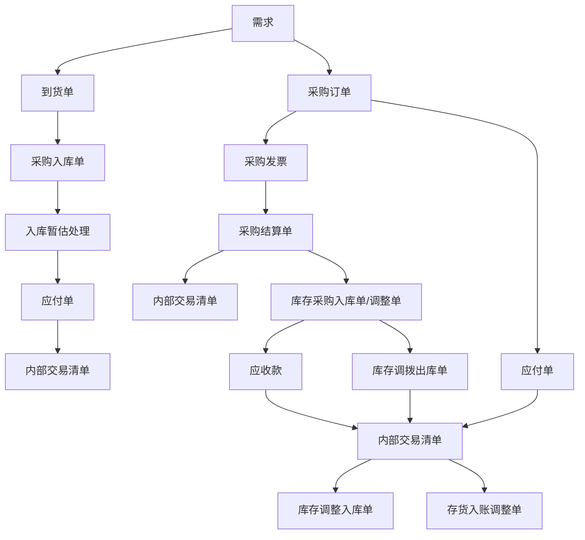

# NCV6.5产品手册-内部交易
## Page 1


产品手册- V6.5

# 内部交易


## Page 2

大型企业管理与电子商务平台

版权

© 用友集团版权所有

未经用友集团的书面许可, 本操作手册任何整体或部分的内容不得被复制、复印、翻译或缩减以用于任何目的。本操作手册的内容在未经通知的情形下可能会发生改变, 敬请留意。请注意: 本操作手册的内容并不代表用友软件所做的承诺。

## Page 3
# 目录
| 版权 | 1 |
|---|---|
| 名词解释 | 5 |
| 第一章 概述 | 7 |
| 1.1 产品概述 | 7 |
| 1.2 产品价值 | 8 |
| 第二章 应用场景 | 9 |
| 2.1 要质与补货 | 10 |
| 2.1.1 业务概述 | 10 |
| 2.1.2 业务流程 | 11 |
| 2.1.3 功能清单 | 11 |
| 2.1.4 建模参考 | 12 |
| 2.1.5 产品解决方案 | 12 |
| 2.2 调拨发货与运输 | 16 |
| 2.2.1 业务概述 | 16 |
| 2.2.2 业务流程 | 17 |
| 2.2.3 功能清单 | 18 |
| 2.2.4 产品解决方案 | 18 |
| 2.3 内部结算平台 | 22 |
| 2.3.1 业务概述 | 22 |
| 2.3.2 业务流程 | 23 |
| 2.3.3 产品解决方案 | 23 |
| 2.4 库存调拨 | 32 |
| 2.4.1 库存调拨 | 32 |
| 2.4.2 库存调拨（按发出商品处理） | 40 |
| 2.4.3 库存调拨（按调拨方暂估） | 48 |
| 2.4.4 集采集收集结 | 57 |
| 2.5 跨组织销售 | 60 |
| 2.5.1 多工厂集中销售-销售中心结算 | 60 |
| 2.5.2 大型商超（KA）集中结算 | 68 |
| 2.6 跨组织采购 | 71 |
| 2.6.1 集采分收集结（按调入方暂估） | 71 |
| 2.7 跨组织领料 | 80 |
| 2.7.1 业务概述 | 80 |
| 2.7.2 业务流程 | 81 |
| 2.7.3 功能清单 | 81 |
| 2.7.4 产品解决方案 | 82 |
| 2.8 跨组织完工入库 | 85 |
| 2.8.1 业务概述 | 85 |
| 2.8.2 业务流程 | 86 |
| 2.8.3 功能清单 | 86 |
| 2.8.4 产品解决方案 | 87 |
## Page 4


NC
大型企业管理与电子商务平台

|  |  |
| --- | --- |
| 2.9 跨组织消耗汇总(供应商寄存) | 90 |
| 2.9.1 集采/收集集 | 90 |
| 2.9.2 集采/收集集 | 94 |
| 2.10 内部费用结算 | 98 |
| 2.10.1 业务描述 | 98 |
| 2.10.2 业务流程 | 99 |
| 2.10.3 功能清单 | 99 |
| 2.10.4 产品解决方案 | 100 |
| 2.11 对接金税系统 | 102 |
| 2.11.1 业务描述 | 102 |
| 2.11.2 业务流程 | 103 |
| 2.11.3 功能清单 | 103 |
| 2.11.4 产品解决方案 | 103 |
| 2.12 三方调拨(含反向结算) | 105 |
| 2.12.1 业务描述 | 105 |
| 2.12.2 业务流程 | 106 |
| 2.12.3 功能清单 | 106 |
| 2.12.4 产品解决方案 | 107 |
| 2.13 多方结算/多结算路径 | 111 |
| 2.13.1 业务描述 | 111 |
| 2.13.2 业务流程 | 112 |
| 2.13.3 功能清单 | 112 |
| 2.13.4 产品解决方案 | 113 |
| 2.14 其他业务 | 117 |
| 第三章 初始准备 | 119 |
| 3.1 管控模式 | 119 |
| 3.2 企业建模平台 | 121 |
| 3.2.1 多组织建模 | 121 |
| 3.2.2 精细数据维护 | 123 |
| 3.2.3 流程平台搭建 | 127 |
| 3.2.4 系统平台设置 | 129 |
| 3.3 供应链 | 129 |
| 3.3.1 内部交易 | 129 |
| 3.3.2 库存管理 | 130 |
| 第四章 操作指南 | 130 |
| 附录 |  |
| 附录 1: 单据流转 | 131 |
| 附录 2: 控制点 | 132 |
| 附录 3: 单据打印控制 | 133 |
| 附录 4: 本文参见其他手册清单 | 134 |

## Page 5

NC

大型企业管理与电子商务平台

---

## 导读

此手册面向实施顾问以及企业关键用户，旨在为实施规划、解决方案制定和落实提供指导。手册围绕产品能够解决的主要业务场景展开，并以此为依托展现产品的关键应用功能，提供业务需求与产品功能相匹配的思路。

本手册包括四大部分。第一部分是对产品及其价值的概要介绍；第二部分是对有关本模块的主要业务场景、流程、以及对应的业务功能的介绍；第三部分是初始准备设置；第四部分是关于本模块功能点的重要操作，此部分未就详细条目展开，详情可查阅产品相关模块的在线帮助说明。

此外，为了便于用户对整体内容加深理解，手册中对一些关键的名词进行了解释，并在附录中对一些可能需要对照检查的关键点进行了补充说明，以便用户查找对照。

为突出重点，本手册定位干方案性说明，仅对产品操作中的重要控制点有所描述。若读者希望深入了解特定模块的产品应用，可结合本手册，查阅如下资料：

1. 《产品手册—组织管理》——深入阐述了产品关键概念（如集团、组织、业务委托关系等）以及建模思路，是实施规划、蓝图设计的重要参考资料。
2. 产品帮助——针对具体功能点的关键字段、按钮操作进行详细解释，并提供关键应用示例。
3. 《产品手册—流程管理》——提供关于交易类型、流程设计工具的应用指导。
4. 《产品手册—基础数据》——可对手册第三部分（即初始准备设置）中的有关基础数据的理解和应用进行更详细深入地了解。

## Page 6

大型企业管理与电子商务平台

## 名词解释

### 寄存调拨

指物料所有权未发生转移的调拨业务，物料调拨入库后，物料的所有权与调拨出库时的所有权相同。

### 反向结算

反向结算主要指将物流调出方作为结算调入方、物流调入方作为结算调出方进行内部交易结算，重要应用于两种场景：

场景一，总公司向分公司供货，分公司退货场景，出于合理退税考虑，总公司要求只能形成对分公司的应收，不能形成对分公司的应付。在分公司退货时，总公司作为物流调入方、结算调出方，形成对分公司的红字应收单；分公司作为物流调出方、结算调入方，形成对总公司的红字应付单。

场景二，三方调拨场景，总公司统一安排分公司间的调拨，分公司分别与总公司做内部交易结算，同样出于合理退税考虑，总公司要求只能形成对分公司的应收，不能形成对分公司的应付，出货分公司与总公司之间内部交易结算需要反向结算，形成总公司对出货分公司的红字应收单，出货分公司对总公司的红字应付单。

### 单边结算

系统通过内部交易模块解决的是集团内部的库存调拨与结算，企业的实际情况有可能是分步实施，即内部交易双方只有-方先上了系统，那么针对企业这种情况，系统支持单边结算处理，在内部交易双方的库存调拨方式下，只对调出方（单方面）进行结算；

系统通过对调入公司是否启用库存模块进行判断是否需要做单边结算，如果调入公司未启用库存模块，则系统自动处理为单边结算；

### 要货计划

分销链上每个下游的分销节点申请的存货，按照不同维度（公司、仓库）形成对上级分销节点的要货汇总数量。

### 调入申请

调入需求方提出的希望能够在某段时间内调入（数量为正时）或退回（数量为负时）的存货信息列表。调入申请单描述的是调入方希望调入什么样的货、调入数量、收发货的时间、地点。

### 调拨订单

指内部单位间所属存货发生转移的请求或指令。

## Page 7

**分货单**

在 NC 系统中,是特指紧缺商品分货处理的业务单据。

**调拨方式**

系统包括三方调拨、财务组织间调拨、财务组织内库存组织间调拨和财务组织内库存组织内调拨业务;

**三方调拨**

涉及调入方、调出方和出货方的调拨业务,在 NC 系统中调出库存组织与出货库存组织不同,且调出库存组织与出货库存组织所属财务组织也不同。

三方调拨不支持外部供应商寄存业务。

**在途归属**

NC 系统中,约定调拨中存货的所有权转移与归属,并确定内部交易发生途极的承担方。

**结算路径**

在 NC 系统中,对于一笔物流移动,有多对两两结算关系的内部交易业务,确定相关交易结算规则。如结算主体、结算币种、结算价格、折扣等。

## Page 8

# 第一章 概述

## 1.1 产品概述

内部交易与销售管理、销售价格、销售信用等组成集团销售分销解决方案，是集团销售分销解决方案的核心组成部分之一。

通过全面的交易类型和灵活的内部结算规则配置，建立统一的内部交易结算平台，对订单、发货、发票、结算等进行有效管理，支持大型集团企业多组织、多元化经营下，各种多组织内部交易业务处理，包括采购内部结算、销售内部结算、领料内部结算、完工入库内部结算（入库即转移物权）、供应商寄存内部结算等，满足集团企业内部日益复杂交易业务，快速、清晰解决集团企业繁杂的物流与资金流业务财务核算工作，全面反映错综复杂的集团企业内部交易情况来龙去脉。


图 1.1-01 产品功能架构图

## Page 9

大型企业管理与电子商务平台

NC

NC 供应链链分为集团采购供应、集团销售分销两大业务领域的解决方案，通过集团销售分销业务、政策管理、业务流程规范、商务协同应用，帮助构建集团企业销售与分销业务经营管理平台，提升经营绩效，优化资源配置，满足客户需求，降低运营成本；

集团销售分销管理、集团采购供应管理与集团财务管理紧密集成成为财务业务一体化整体解决方案。


图1.1-02 产品架构图

## 1.2 产品价值

### 1. 支持库存调拨业务

* 支持库存组织间、库存组织内的库存调拨业务；
* 支持分销链上每个节点制定要货月计划，确定向上级节点申请要货的数量等。可基于下级节点的要货情况汇总总成本组织的要货月计划。
* 支持下级组织向上级组织提出要货申请，并根据补货结构自动获取补货组织，根据库存计划计算出合理要货量；
* 支持供方（调出方）对紧俏物资针对下级的要货申请做货物数量分配；

## Page 10

支持对调入申请的一次、多次安排,并提供批安排的快捷方式;

支持调拨订单做补货、发货安排;

支持通过“反向结算”的方式,完成调拨退货处理,三方调拨支持两两分别设定是否反向结算;也可以录入红字调拨订单,完成调拨退货;

支持赠品的调拨业务;

调入库存组织没有启用时,支持调出方通过内部交易模块处理相关业务,即支持单边结算;

支持计划订单的下达后,生成调拨订单,通过寻源确定的补货库存组织的调拨业务,作为计划订单的供给;

**2. 统一的内部交易结算平台**

对企业涉及的多种形式的内部交易提供了统一的结算平台,包括:跨组织调拨、跨组织采购、跨组织销售、跨组织领料、跨组织完工入库、跨组织消耗汇总;

支持内部交易的调出方,出库传存货核算,发出商品、暂估应收款确认应收款;

支持内部交易的调入方,做入库暂估,暂估应付;

支持多种询价规则,以及多种暂估取价规则;

支持跨组织采购、跨组织销售、跨组织调拨中赠品的处理;

支持在调拨订单、调拨出库单、销售订单、维护内部交易信息,包括内部交易双方的结算路径、两两结算方的结算价格等信息;

支持一笔交易在多个组织间的物资结算,即多结算路径;

支持内部结算清单开票、传金税;

支持调拨及采购内部费用分摊到内部调入成本;

库存调拨(包括三方调拨)、跨组织销售支持途损;跨组织销售途损支持内部结算;

本手册以下业务场景解析,未包括 NC 支持相关增值税业务处理,若需要详细了解学习,请查阅《产品手册-VAT 增值税》手册。

**第二章 应用场景**

## Page 11

## 2.1 要货与补货

### 2.1.1 业务描述

* 分销链上每个组织需要按月向上级或工厂提交要货信息，并可以进行补充和调整；
* 上级或工厂可以查询和汇总所有下级提交的要货信息并对此进行控制；
* 对于要货信息或申请可以进行集中统一的安排任务，形成内部组织之间交易协议，确定具体物料、物料需求方与供给方、价格、数量等内容；
* 允许内部组织之间多种形式物料需求的供给交易方式，如三方之间、两方组织之间、库存组织之间、仓库之间等；
* 当供给方库存物料数量不能满足需求方要求，可以通过各种方式进行补货处理，如采购、调拨、生产或委外方式，补货数量要求按照需求量进行控制；

## Page 12
# 2.1.2 业务流程
## 要货与补货


黄色代表未模块化功能模块

白色代表非功能模块化功能模块

图2-1-01 要货与补货流程图


| 领域 | 产品模块 | 功能节点 |
| --- | --- | --- |
| 供应链 | 内部交易 | 要货月计划 |
|  | 调入申请 |
|  | 调拨订单 |
|  | 分货单 |
| 销售管理 | 销售管理 | 销售订单 |
| 库存计划 | 库存计划方案 |
| 采购管理 | 请购单 |


| 领域 | 产品模块 | 功能节点 |
| --- | --- | --- |
| 供应链 | 内部交易 | 要货月计划 |
|  | 调入申请 |
|  | 调拨订单 |
|  | 分货单 |
| 销售管理 | 销售管理 | 销售订单 |
| 库存计划 | 库存计划方案 |
| 采购管理 | 请购单 |

## Page 13


大企业管理与电子商务平台

|  |  |  |
| --- | --- | --- |
|  |  | 采购订单 |
|  | 委外加工 | 委外订单 |
|  | 库存管理 | 调拨出库单 |
|  |  | 调拨入库单 |
| 生产制造 | 生产任务管理 | 生产订单 |

### 2.1.4 建模参考

| 企业组织 | 分销补货体系 | | 备注 |
| --- | --- | --- | --- |
| 分销补货体系管理 | 分销补货体系成员管理 |
| 分公司 | 产品线: 可空 | 对应组织: 分公司 库存组织: 分公司 上级成员: 工厂 | 物料类型为分销补货件 |
| 工厂 |  | 对应组织: 工厂 库存组织: 工厂 上级成员: |  |

### 2.1.5 产品解决方案

#### 1. 要货

* > 分销链上每个组织(调出库存组织)每个月计划向上级组织或工厂(调出库存组织)要货, 通过维护【要货月计划】的要货数量等信息;
* > 基于【要货月计划】可以追加计划,通过表头勾选“追加计划”,每个调入库存组织+调出库存组织,每个月只能存在一个正式的要货计划,其他只能是追加计划;
* > 上级组织或工厂(调出库存组织)可以对下级(调入库存组织)提交的要货情况,通过【要货月计划】上“查询下级计划”和“汇总”按钮进行掌握和汇总处理,生成上级的要货月计划;上下级组织关系的确定通过【企业建模平台-组织管理-分销补货体系】设置,根据“库存组织”查询、汇总下级库存组织的【要货月计划】;


## Page 14

![A diagram showing the NC Enterprise Management Platform (NC) interface. The main navigation bar includes Functional Areas, Operation Center, Master Data Maintenance, Project Plan Protection, Inventory Classification Management, Parameter Settings, and System Settings. The current page is '分拣补货设置图' (Distribution Replenishment Setup Diagram), part of '分拣计划系统设置管理' (Distribution Plan System Setup Management). The left panel shows a tree structure of organizational units, including '11-0201 华东加工厂' and '11-0301 深圳分公司', among others.]()

图 2.1-02 分销补货设置图

通过【要货月计划】生成后续的【调入申请】, 基于【要货月计划】可以控制各个【调入申请】上提交的物料及数量, 控制是通过参数“T006 要货计划是否控制调入申请”和“T007 调入申请允许超月要货计划的范围”实现。

采购管理模块的净需求【物资需求申请单】通过库存计划模块的【需求汇总平衡】, 本次平衡库存组织库存量可以满足的部分量, 根据参数“INVPO11 物资需求由其他供货库存组织库存满足部分是否自动生成调拨订单”生成【调拨订单】, 【调拨订单】不受净需求【物资需求申请单】控制可以修改、删除。

## 2. 补货

支持下级需求组织(调入库存组织)自制和参照【要货月计划】生成【调入申请】, 也支持【生产制造-物料需求计划-计划订单】生成【调入申请】、【调拨订单】, 还有非直连【销售订单】通过补货安排生成【调入申请】、【调拨订单】;

### 注意:

* 对于直连销售调拨业务, 系统提供对直连【销售订单】直连安排生成【调入申请】、【调拨订单】;
* 直连销售调拨业务支持按照“跨组织销售”模式处理应用, 其具体应用请参见“跨组织销售”业务场景描述说明;
* 【调入申请】和【调拨订单】支持交易类型管理, 直连业务要求必须在交易类型中对相关单据勾选“直连”类型;
* 当【调入申请】物料的物料类型为“分销补货”时, 系统基于【企业建模平台-组织管理-分销

## Page 15

补货体系】。在【库存计划】模块制定【库存计划方案】，再做【库存计划计算】出需求，通过【计划订单处理】的“转调整”按钮，生成【调入申请】或【调拨订单】，并根据“调入库存组织+物料”自动确定单据上的“调出库存组织”，允许修改；


图 2-1-03 物料类型设置图

▶ 也可制定了【库存计划方案】。但做【库存计划计算】需求，直接【调入申请】在单据编辑联动点击“计算要货量”按钮，支持基于【分销补货体系】按照库存计划寻源算法计算出单据上调入库存组织的“建议要货量”。库存计划寻源算法具体应用请参见“库存计划”手册。

▶ 系统支持针对不同物料类型定义寻源时的默认补货单据类型不同，分销补货件的补货单据可选值为：调入申请、调拨订单，系统默认为：调入申请，通过【企业建模平台-基础数据-参数设置】供应链-供应链基础设置中参数“SR001 默认补货单据类型”设置。


图 2-1-04 参数设置图

## Page 16

## 大金企业管理与电子商务平台

* 对审批通过【调入申请单】可以直接生成【调拨订单】，也可以通过【调入申请安排】进行集中统一的安排任务，指定具体的调出方(库存组织)、出货方(库存组织)等后可以快速生成和汇总生成【调拨订单】;
* 系统支持多种调拨方式，三方调拨、财务组织间调拨、财务组织内库存组织间调拨和财务组织内库存组织内调拨业务，根据内部交易参与方之间关系自动判断调拨方式，每个调拨方式具体应用请分别参见本文相关业务场景描述说明：


图 2.1-05 调拨订单维护列表图

* 【调入申请】可以被安排一次，也可以安排多次，通过【调入申请】交易类型设置；
* 对【调入申请】数量的后续安排控制，系统提供参数“T002 是否可以超申请数量安排调拨数量和 T003 调拨订单允许超调拨申请的倍用”设置；
* 对于企业紧缺商品分货业务，即销售组织对于某个指定物料的销售需求总量高于公司的可分配时配时，按照紧缺商品分配原则，实施物料分配业务操作，系统通过【分货单】进行处理，由发货方(发货库存组织或工厂)向下游销售组织(收货库存组织)分货指令形成双方之间的财务组织间【调拨订单】;
* 【调拨订单】支持手工录入、【销售订单】形成、【调入申请】、【调入申请安排】形成、【分货单】形成、【补货安排】形成、收集集装箱模式下【采购入库单】签字时生成、【生产制造-物料需求计划-计划订单】生成、【生产制造-生产任务管理-备料申请】生成；
* 【调拨订单】支持补货安排，通过在【调拨订单】上“补货安排”按钮直接处理，也可以通过【销售管理-补货/启运安排】在“调拨订单”页签上处理，按单采购补货安排生成为【采购订单】、【调购单】；按单调拨补货安排生成为【调拨订单】、【调入申请】；按单生产或按单外补货安排生成为【委外订单】；
* 补货数量可以超【调拨订单】数量，超出数量受参数“T008 调拨订单补货安排容差比率”控

## Page 17

制,累计补货数量大于等于订单数量后,补货关闭,累计补货数量包括所有目标单据的补货数量之和;

* ▶ 【调拨订单】出库关闭后,不能再作补货安排; 【调拨订单】发货关闭出库打开情况下,允许做补货安排;
* ▶ 库存调拨业务的【调拨订单】及后续出入库、发货、运输、内部结算处理,请分别参见本文相关业务场景描述说明;

**注意:**

* ▶ 【要货月计划】【调入申请】【调拨订单】支持实时查询物料的现存量和可用量信息,通过“联查一存量显示/隐藏”按钮支持;
* ▶ 【要货月计划】【调入申请】【调拨订单】支持审批流;
* ▶ 当【调入申请】物料的物料类型(物料档案-库存信息页签)为“工厂补货”时,系统基于【供应链基础设置-内部货源定义】,根据“调入库存组织+物料”自动带出调出库存组织,允许修改;
* ▶ 物料的物料类型为“工厂补货”时,补货单据可选值为:调入申请、调拨订单,系统默认为:调入申请;
* ▶ 物料的物料类型为“制造件”时,补货单据为:生产订单;
* ▶ 物料的物料类型为“采购件”时,补货单据为:请购单、采购订单,此时要外否;
* ▶ 物料的物料类型为“委外件”时,补货单据为:请购单、委外订单,此时要外是;
* ▶ 以上补货单据设置都是通过供应链基础设置中参数“SR001 默认补货单据类型”配置实现;
* ▶ 定化销售业务中调拨补货业务涉及调入申请、调拨订单、内部交易结算清单及补货单等单据,支持按照销售订单为源头进行特征码流转;

## 2.2 调拨发货与运输

### 2.2.1 业务描述

* ▶ 建立内部组织之间交易协议,确定调拨方式、具体物料、物料需求方与供给方、价格、数量等内容;
* ▶ 对于内部组织之间交易协议下的物料,要求在发货方工厂(调出方)先出库,需求方销售分公司

## Page 18

（调入方）再入库办理：

* 支持发货方工厂（调出方）按照内部组织之间交易协议进行发货、出库、运输处理；
* 支持由物流中心按照内部组织之间交易协议，对多家工厂进行统筹调度资源的物料发货规划与排程；
* 可以在发货方工厂（调出方）直接出库就运输安排，也支持发货运输安排处理；

## 2.2.2 业务流程

大型企业管理与电子商务平台

调拨发货及运输

|  |  |  |  |
| --- | --- | --- | --- |
|  | 销售分公司 | 工厂 | 物流中心 |
| 调拨出入库及运输 | 调拨订单  调拨入库单 | 调拨订单  调拨出库单  运输单 |  |
| 调拨发货、出入库及运输 | 调拨订单  发货安排  调拨入库单 | 发货单  调拨出库单  运输单 | 发货安排 |

调拨订单

发货安排

发货单

调拨出库单

运输单

调拨入库单

调拨出库单

调拨订单

调拨发货流程图说明：

* 从销售分公司接收调拨订单后，可直接生成调拨入库单。
* 调拨订单可生成发货单（支持拆单式生成和参照式生成）。
* 发货单可生成发货安排。
* 发货单可生成调拨出库单。
* 发货单可生成运输单。
* 发货安排可生成调拨出库单。
* 发货安排可生成运输单。
* 调拨出库单可生成运输单。

黄色代表本模块内完成或处理
白色代表其他模块完成或处理

## Page 19

NC

大型企业管理与电子商务平台

图 2.2-01 调拨发货及运输流程图

2.2.3 功能清单

| 领域 | 产品模块 | 功能节点 |
| --- | --- | --- |
| 供应链 | 内部交易 | 调拨订单 |
| 库存管理 | 调拨出库单 |
|  | 运输管理 | 调拨入库单 |
| 运输单 |
|  | 销售管理 | 发货安排 |
|  |  | 发货单 |

2.2.4 产品解决方案

1. 调拨出入库及运输

* 通过【调拨订单】建立内部组织之间交易协议，【调拨订单】表头确定内部组织交易协议的双方关系，如调出库存组织、订单类型（交易类型）、调拨方式、调入库存组织、调出业务员及部门、在途归属、结算路径等，在收发货信息页签中分别记录、调出仓库、调入仓库、调入业务员及部门、计划发货日期、计划到期日、收货客户、收货地区、收货地址、运输方式等信息；
* 【调拨订单】审批后，发货方工厂（调出方）在【库存管理-调拨出库单】直接出库签字处理，需求方销售分公司（调入方）在【库存管理-调拨入库单】才能进行入库处理；
* 系统支持按【调拨订单】控制【调拨出库单】，通过参数“T005 调订单出库容差控制方式”控制，此容差为【物料】档案基本信息页签中设置的“出库容差”，具体应用请参见《产品手册-基础数据》附录参数说明；
* 【调拨订单】自动出库关闭，基于【物料档案】中定义的“出库关闭下限”自动进行，当累计出库数量≥调拨订单主数量\*(1-出库关闭下容差)，调拨订单自动出库关闭；


## Page 20

### 2.2.02 物料设置图


图 2.2-02 物料设置图

> 【调拨出库单】可以直接作下游【运输单】的运輸业务处理;

#### 注意:

* 基于【物料】档案基本信息页签中“出库关闭下容差%”设置, 对起【调拨订单】作自动出库关闭、发货关闭处理;
* 【调拨订单】支持自动询价、直接补货、发货安排、库存预留物料等处理;
* 在【生产制造需求管理-实际独立需求处理】已审批且未出库关闭的【调拨订单】支持生成【计划订单】。

2. 调拨发货、出入库及运输

* 发货是业务流程中可选环节。除增加发货环节业务处理外,调拨订单出库、运输相关业务处理与上面产品解决方案相同,请结合参照查阅;
* 【调拨订单】生成【发货单】系统提供 2 种方式,第 1 种方式是【调拨订单】参照生成【发货单】;第 2 种方式是通过【发货安排】作集中统一处理生成【发货单】;
* 其中第 2 种方式可以直接基于【调拨订单】“发货安排”按钮处理生成【发货单】,也可以通过单独功能节点【发货安排】生成【发货单】,要求当【调拨订单】上“物流组织”不为空,且此流程配置了【发货单】环节;【发货安排】后不可以撤销返回再安排处理;

## Page 21

图 2-03 发货安排图


▶ 【发货单】和【发货安排】主组织是物流组织，是物流组织业务处理核心单据之一；

▶ 【调拨订单】生成【发货单】。受参数“T010 超订单发货容差控制方式”控制，此容差为【物料】档案基本信息页签中设置的“出库容差”，具体应用请参见《产品手册—基础数据》附录参数说明；

▶ 【调拨订单】自动发货关闭和【调拨订单】自动出库关闭，基于【物料档案】中定义的“出库关闭下限”自动进行，当累计发货主数量 >= 调拨订单主数量 \* (1-出库关闭下限容差)，【调拨订单】自动发货关闭；

▶ 【调拨订单】发货关闭出库打开情况下，允许做补货安排；

▶ 【发货单】可以直接作下游【调拨出库单】或【运输单】的业务处理；

▶ 系统支持按【发货单】控制【调拨出库单】，通过参数“T011 超发货单出库容差控制方式”控制，此容差为【物料】档案基本信息页签中设置的“出库容差”，具体应用请参见《产品手册—基础数据》附录参数说明；

### 3. 跨组织

▶ 支持由物流中心按照内部组织之间交易协议，集中对多家工厂进行统筹调度资源的物料发货规划与排程，【调拨订单】统一由物流组织作【发货安排】生成【发货单】；

## Page 22

图 2-2-04 发货安排列表图

物流中心集中对多家工厂进行统筹调度资源的物料发货规划与排程，是通过【企业建模平台-组织管理-物流业务委托关系】设置；

图 2-2-06 物流业务委托关系图

需要对【调拨订单】收发货信息真签上“物流组织”字段进行维护，由集团管理员登录在【企业建模平台-客户化配置-模板设置】单据模板中进行增补显示处理；

图 2-2-06 单据模板设置图

## Page 23

### 2.3 内部结算平台

#### 2.3.1 业务描述

内部交易结算系统是按照内部结算规则展开的,如内部交易订货单价和结算价等,内部结算规则是建立统一的内部交易结算平台,支持大型集团企业多组织内部交易业务处理,如库存调拨(跨财务组织)、跨组织采购、跨组织销售、跨组织领料、跨组织完工入库和跨组织消耗汇总(供应商寄存);

* 库存调拨:集团不同财务组织间物料调拨,调出、调入财务组织不同,进行内部结算。
* 采购内部结算:集中采购,分散收货,集中结算,内部调拨模式;跨不同财务组织的采购需求传递汇总至集采中心(组织),进行集中订货,不同财务组织各自收货,由集采中心(组织)集中结算、集中支付,采购结算财务组织与收货库存组织所属财务组织不同时,进行内部结算。
* 销售内部结算:包括跨组织发货和KA集中结算地结算模式等,跨组织发货是销售组织从总部库存组织发货,销售组织的财务组织和客户结算,销售结算财务组织与总部发货库存组织所属财务组织不同时,进行内部结算;KA集中结算地结算是经营部A从经营部的库存组织A发货,客户集中结算地的财务组织B和客户结算,销售结算财务组织B与总部发货库存组织所属财务组织A不同时,进行内部结算。
* 领料内部结算:发货库存组织与领用库存组织所属财务组织不同。
* 入库即转移物料(入库即调拨):完全基于销售计划进行生产,生产下线,直接将物权转移给销售分公司,生产工厂与收货库存组织所属财务组织不同,工厂与分公司进行内部结算。
* 供应商寄存内部结算:支持集采分收集结外部供应商寄存物料,寄存物料实现销售或消耗后作内部结算,汇总采购结算财务组织与消耗库存组织所属财务组织不同时,进行内部结算;受托代销业务也按照供应商寄存内部结算模式处理。

以上支持的六种内部结算业务场景会分别详细介绍应用,下面先对内部结算平台规则的总体解决方案作详细说明。

## Page 24

## 2.3.2 业务流程

内部结算平台

| 内部结算类型 | 规则 | 业务单据 | 内部交易待结算记录及暂估标记 | 内部交易结算记录 |
| --- | --- | --- | --- | --- |
| 跨组织销售 |  | 销售订单 | 待结算清单 | 结算清单 |
| 销售出库单 |
| 调拨订单 |
| 库存调拨 | 内部结算规则 | 调拨出库单 | 待结算清单 | 结算清单 |
| 调拨入库单 |
| 跨组织采购 | 结算路径 | 采购订单 | 待结算清单 | 结算清单 |
| 采购入库单 |
| 材料出库单 |
| 跨组织领料 | 结算路径 | 采购入库单 | 待结算清单 | 结算清单 |
| 材料出库单 |
| 跨组织完工入库 | 结算路径 | 产成品入库单 | 待结算清单 | 结算清单 |
| 消耗汇总 (供应商寄存) |
| 跨组织消耗汇总 |  | 消耗汇总 (供应商寄存) | 待结算清单 | 结算清单 |
| 消耗汇总 (供应商寄存) |

黄色代表本模块内功能或处理
白色代表其他模块功能或处理

图 2.3-01 内部结算流程图

## 2.3.3 产品解决方案

### 1. 内部结算规则设置

* 是集团企业内部各单位间发生物料调拨行为时，根据不同内部结算类型、不同单据交易类型、价格、币种、结算规则（谁来发起结算）、在途归属（所有权何时转移，途损由谁承担）等处理规则的一种约定，对涉及内部交易的相关单据后续业务处理按规定进行约束；
* 【内部结算规则】在集团级进行设置，基于调出、调入财务组织设定（财务组织间），不支持

## Page 25


大型企业管理与电子商务平台

组织间(如库存组织间)、组织内(如库存组织内)调拨的设置,即组织间、组织内调拨业务不能内部结算;

支持系统的内部结算类型为:库存调拨、跨组织采购、跨组织销售、跨组织领料、跨组织完工入库和跨组织消耗汇总;以下为系统按照支持的6种内部结算类型预置的内部结算规则:

| 内部结算类型 | 结算主体 | 在途归属 | 价格规则 | 暂估取价规则 | 询价后价格是否可改 | 出库传递应收 | 是否传递应付 |
| --- | --- | --- | --- | --- | --- | --- | --- |
| 库存调拨 | 调出组织 | 调出方 | 调出库存组织的内部转移价格 | 内部调拨价格 | Y | N | Y |
| 按内部结算规则取价 |  |  |  |
| 跨组织销售 | 调出组织 | 调出方 | 调出库存组织的内部转移价格 | 内部调拨价格 | Y | N | Y |
| 按内部结算规则取价 |  |  |  |
| 跨组织采购 | 调出组织 | 调出方 | 对应采购订单价格 | 内部调拨价格 | Y | N | Y |
| 按内部结算规则取价 |  |  |  |
| 跨组织领料 | 调出组织 | 调出方 | 调出库存组织的内部转移价格 | 内部调拨价格 | Y | N | Y |
| 按内部结算规则取价 |  |  |  |
| 跨组织完工入库 | 调出组织 | 调出方 | 调出库存组织的内部转移价格 | 内部调拨价格 | Y | N | Y |
| 按内部结算规则取价 |  |  |  |
| 跨组织消耗汇总 | 调出组织 | 调出方 | 空 | 空 | Y | N | Y |

支持按照【调拨订单】、【采购订单】、【销售订单】、【材料出库单】和【产成品入库单】

## Page 26

的交易类型设置内部结算规则：

* 可以按照组织或调入组织作为结算主体，即约定内部交易由哪方发起结算，受【内部结算规则】上的属性“结算主体”确定，一般应用时按照调出方作为结算主体；
* 支持内部交易发生的途损处理，通过在“在途归属”字段设置，此字段决定了内部交易发生途损后，谁来承担：如果由调出方承担途损，则结算时不包含途损的数量，仅以收货数量作为结算依据；如果调入方承担途损，则结算时，需要包含途损数量，即以收货数量和途损数量之和作为结算依据；【调整订单】自动匹配内部结算规则带入“在途归属”，后续结算以此为准；
* 系统支持按照签收定价结算业务，通过勾选“签收定价”字段，勾选为要求调入方必须作签收处理后才能作内部结算，内部交易结算判断签收依据；【调整出库单】对应库存【签收途损单】上的“签收金额”字段非空，表示已签收定价，结算价格直接取签收单价；签收金额为空，表示未作签收定价，再取相关订单上的价格；不勾选为内部结算不要求签收定价，直接取【调整订单】上的价格；
* 一般是存货传货核算的列选是必备3个条件：物料档案财务页签中“实物物料价值管理模式”为“存货核算”，仓库档案中“进行存货成本计算”勾选，传存货核算的相关库存单据（如库存【采购入库单】、【销售出库单】等）交易类型“影响成本”勾选；


图 2.3-02 物料设置截图

## Page 27


NC

大型企业管理与电子商务平台

|  |  |  |  |  |  |  |  |  |  |  |  |  |  |  |  |  |  |  |  |  |  |  |  |  |  |  |  |  |  |  |  |  |  |  |  |  |  |  |  |  |  |  |  |  |  |  |  |  |  |  |  |  |  |  |  |  |  |  |  |  |  |  |  |  |  |  |  |  |  |  |  |  |  |  |  |  |  |  |  |  |  |  |  |  |  |  |  |  |  |  |  |  |  |  |  |  |  |  |  |  |  |  |  |  |  |  |  |  |  |  |  |  |  |  |  |  |  |  |  |  |  |  |  |  |  |  |  |  |  |  |  |  |  |  |  |  |  |  |  |  |  |  |  |  |  |  |  |  |  |  |  |  |  |
| --- | --- | --- | --- | --- | --- | --- | --- | --- | --- | --- | --- | --- | --- | --- | --- | --- | --- | --- | --- | --- | --- | --- | --- | --- | --- | --- | --- | --- | --- | --- | --- | --- | --- | --- | --- | --- | --- | --- | --- | --- | --- | --- | --- | --- | --- | --- | --- | --- | --- | --- | --- | --- | --- | --- | --- | --- | --- | --- | --- | --- | --- | --- | --- | --- | --- | --- | --- | --- | --- | --- | --- | --- | --- | --- | --- | --- | --- | --- | --- | --- | --- | --- | --- | --- | --- | --- | --- | --- | --- | --- | --- | --- | --- | --- | --- | --- | --- | --- | --- | --- | --- | --- | --- | --- | --- | --- | --- | --- | --- | --- | --- | --- | --- | --- | --- | --- | --- | --- | --- | --- | --- | --- | --- | --- | --- | --- | --- | --- | --- | --- | --- | --- | --- | --- | --- | --- | --- | --- | --- | --- | --- | --- | --- | --- | --- | --- | --- | --- | --- | --- | --- | --- | --- |
| 功能导航: 库存中心 > 仓库   | 操作类型 | 操作 | 单据 | 数量 | 状态 | 操作 | 备注 | | --- | --- | --- | --- | --- | --- | --- | | 库存设置 | | | | | | | | 基础档案设置 | | | | | | | | 核算单位 |  | | | | | | | 计量单位 | 数量, 体积, CUB, 质量 |  | | | | | | 仓库 | 仓库名称 |  | | | | | | 调拨设置 | 调拨规则 |  | | | | | | 库存设置 | | | | | | | | 仓库设置类型 | 仓库编码 | 仓库名称 | 仓库状态 | 是否启用 | 是否出库 | 是否进库 | | 跨组织销售   与内部组织   调拨   库存状态: 已启用   库存类型: 仓库 | 1. 通用仓库 | 14441仓库 | 通用仓库 | 已启用 | 已启用 | 已启用 | | 2. 外协加工库 | 14442外协加工库 | 外协加工库 | 已启用 | 已启用 | 已启用 | | 3. 生产加工库 | 14443加工库 | 加工库 | 已启用 | 已启用 | 已启用 | | 4. 生产仓库 | 14444生产仓库 | 生产仓库 | 已启用 | 已启用 | 已启用 | | 5. 周转仓 | 14445周转仓 | 周转仓 | 已启用 | 已启用 | 已启用 | | 6. 周转仓 | 14446周转仓 | 周转仓 | 已启用 | 已启用 | 已启用 | | 7. 周转仓 | 14447周转仓 | 周转仓 | 已启用 | 已启用 | 已启用 | | 8. 周转仓 | 14448周转仓 | 周转仓 | 已启用 | 已启用 | 已启用 | | 9. 周转仓 | 14449周转仓 | 周转仓 | 已启用 | 已启用 | 已启用 | | 10. 零售仓库 | 14450零售仓库 | 零售仓库 | 已启用 | 已启用 | 已启用 | | 11. 总部公司库 | 14451总部公司库 | 总部公司库 | 已启用 | 已启用 | 已启用 | | 12. 周转仓 | 14452周转仓 | 周转仓 | 已启用 | 已启用 | 已启用 |   图 2-3-03 仓库设置图 | | 功能导航 | 销售中心 | 交易类型设置 | 交易类型配置 | | --- | --- | --- | --- | | 库存调拨  14401 库存出入库  14402 库存出入库  14403 库存出入库  14404 库存出入库  14405 库存出入库  14406 库存出入库  14407 库存出入库  14408 库存出入库  14409 库存出入库  14410 库存出入库  14411 库存出入库  14412 库存出入库  14413 库存出入库  14414 库存出入库 | 核算单位  44401 库存出入库  44402 库存出入库  44403 库存出入库  44404 库存出入库  44405 库存出入库  44406 库存出入库  44407 库存出入库  44408 库存出入库  44409 库存出入库  44410 库存出入库  44411 库存出入库  44412 库存出入库  44413 库存出入库  44414 库存出入库 | 库存设置   | 调拨 | 名称 | | --- | --- | | 40-01 | 调拨销售出库 | | 40-02 | 调拨转销售出库 | | 40-03 | 调拨客户销售出库 |   调拨销售出库  调拨转销售出库  调拨客户销售出库 | 业务规则配置 |   图 2-3-04 仓库类型设置图 |

> 而跨组织业务涉及内部组织的虚撤出、入方(组织)是否传存货核算，如跨组织销售、跨组织领用业务中的虚撤入方(组织)，跨组织采购、跨组织完工入库和跨组织消耗汇总业务中的虚撤出方(组织)，不仅仅通过物料档案属性等判断，还通过在【内部结算规则】中“调出方传存货核算”和“调入方传存货核算”勾选设置判断；

> 以下6个业务场景实际出入库方(组织)和虚拟出入/出方(组织)，结算规则中“调出方、调入方传存货核算”系统已经都默认勾选，虚拟入/出(组织)可以手工维护，实际出入库方(组织)不可以手工维护；虚拟入/出方请见下表内下划横线内容；

|  | 调出方是否传存货核算 | 调入方是否传存货核算 |
| --- | --- | --- |
| 内部结算类型 | 调出成本域 | 调入成本域 |
| 内部 (库存)调拨 | 按照调拨入库单交易类型属性确定 调拨出库单: 调出库存组织-调出仓库 | 按照调拨入库单交易类型属性确定 调拨入库单: "调入库存组织-调入仓库"对应的调入成本域 |

## Page 28

NC
大企业集团管理与电子商务平台

|  |  |  |
| --- | --- | --- |
| **跨组织采购** | **内部结算规则“调出方存货核算量”勾选**  首先取内部结算规则上的调出成本域,如果内部结算规则未设置,则取采购结算财务组织主成本域 | **内部结算规则“调入方存货核算量”勾选**  按照采购入库单交易类型属性确定  采购入库单:“收货库存组织/收货仓库”对应的成木域 |
| **跨组织销售** | 按照销售出库单交易类型属性确定  销售出库单:“发货库存组织+发货仓库”对应的成本域 | **内部结算规则“调入方存货核算量”勾选**  首先取内部结算规则上的调入成本域,如果内部结算规则未设置,则取销售结算财务组织主成本域  按照产成品入库单交易类型属性确定 |
| **跨组织 完工入库** | 按照内部结算规则“调出方存货核算量”勾选  产成品入库单:“生产库存组织+仓库”对应的成本域,如果没有确定成本域,则取生产财务组织对应主成本域 | 产成品入库单:“收货库存组织+收货仓库”对应的成本域 |
| **跨组织领料** | 按照材料出库单交易类型属性确定  材料出库单:“发货库存组织+发货仓库”对应的成本域 | **内部结算规则“调入方存货核算量”勾选**  材料出库单:“领用库存组织+领用仓库”对应的成本域  如果领用仓库为空,无法确定成本域,则取领用财务组织的主成本域 |
| **跨组织 消耗汇总** | **内部结算规则“调出方存货核算量”勾选**  首先取内部结算规则上设置的调出成本域,如果内部结算规则未设置,则取供应商所属财务组织主成本域 | 按照消耗汇总记录交易类型属性确定  消耗汇总记录:“消耗库存组织+消耗仓库”对应的成本域 |

> 系统支持按照核算币种维度设置内部结算规则,在内部结算时,“库存调拨”业务类型按照【调拨订单】上的业务币种,其他业务类型按照【内部结算规则】的币种维度处理;

> 系统只支持内部结算类型为“库存调拨”的反向结算,如库存调拨业务中调出方与调入方之间反向进行结算,三方调拨中分公司经总公司转货,在出货方(分公司)与调出方(总公司)之间进行反向结算,但供应商寄存调拨业务不支持反向结算;反向结算通过在【内部结算规则】中“反向结算”勾选设置,只有内部结算类型为“库存调拨”可以勾选;

> 除在【内部结算规则】中勾选“反向结算”外,在【调拨订单】的交易类型中还需要勾选设置,当库存调拨中调出方与调入方反向结算时,勾选“反向结算”,当三方调拨中调出方与出货方反向结算时,勾选“调出出货方反向结算”;

> 系统支持在内部结算双方击、入单库据签字后,自动结算形成内部结算清单记录,通过在【内部

## Page 29

部结算规则】中“自动结算”勾选设置；

* 系统支持按照物料分类或物料设置细化内部结算规则；
* 设置价格规则主要在业务单据询价和结算询价时使用，支持的11种价格来源及匹配取价方式请参考以下内容：

* 调出库存组织的销售价格政策：询销售组织，按库存组织在找对应的销售组织的价格策略；匹配顺序：库存组织本身为销售组织，则库存组织作为销售组织；否则，判断库存组织所属财务组织本身是否为销售组织；如果财务组织本身为销售组织，则取财务组织为销售组织；否则，判断库存组织所属公司本身是否为销售组织；如果公司本身为销售组织，则取公司为销售组织；根据以上规则无法获取销售组织时，则销售组织为空，无法进行销售询价；
* 调出成本域结存成本：询价时点的调出成本域该物料的真实结存价，为调出成本域账簿的本币价，如果币种不同，需要按币种进行转换；
* 最新内部结算价格：币种为一个询价维度、按币种询价；
* 最新的跨组织采购的采购订单价：计划到货日期最新的采购订单行价；
* 调入成本域计划价：调入成本域计划价为调入成本域账簿的本币价，如果币种不同，需要按币种进行转换；
* 调拨出库单成本”：取库存调拨出库单对应的存货核算调拨出库单上的出库成本，与公司参数“是否含税优先”无关，只能取到无税价，只有经过成本计算上的调拨出库单才能有出库成本，否则无法取到价格；为调出成本域账簿的本币价，如果币种不同，需要按币种进行转换；
* 调拨出库签收价：调拨出库单对应签收运输单上的签收价格，公司参数为“含税优先”时，取含税价，否则取无税价；为调出库存组织的本币价，如果币种不同，需要按币种进行转换；根据签收价进行内部结算的业务，存在有时签收价格为空的情况，价格规则则序为“调出签收价”、“订单调拨价格”，在内部交易结算，可以直接询“订单调拨价格”进行结算；
* 采购订单价格：只有跨组织采购的模式下才能询到该价格，公司参数为“含税优先”时，取含税价，否则取无税价；如果币种不同，需要按币种进行转换；
* 对应销售订单价格：只有跨组织销售的模式下才能询到该价格，跨组织销售内部调拨的一种取价方式，也可以支持销售直运调拨业务，调拨订单直接取销售订单价格，根据“财

## Page 30

务组织:库存组织”对应的销售组织取销售价格;如果币种不同,需要按币种进行转换;

* 调出库存组织的内部转移价格:存货物料库存在页签上的“内部转移价格”,为调出库存组织的本币价,如果币种不同,需要按币种进行转换;
* 订单调拨价格:取内部交易信息维护的价格,根据签收价进行内部结算的业务,存在有时签收价格为空的情况,价格规则顺序为“调出签收价”、“订单调拨价格”,在内部交易结算,可以直接调“订单调拨价格”进行结算;
* 支持按照先后顺序设置多个取价规则;


图 2-3-05 取价规则设置图

* 暂估价取价规则在手工暂估或者自动暂估是使用,支持的7种价格:按内部结算规则取价、取调拨出库签收价、订单调拨价格(集采调拨采购订单上的价格,其他取调拨订单上的价格)、对应销售订单价格、采购入库单对应采购订单价格、调拨出库单出库成本、按调出库存组织的内部转移价格,支持按照先后顺序设置多个暂估取价规则;对库存调拨的暂估取价规则,按【调拨订单】价格作为第一默认,跨组织销售按【销售订单】价格作为第一默认;
* 自动调价后系统支持调整,并通过“加价率”实现内部交易双方可以对结算价格按一定比例上下浮动计算处理;
* 系统支持结算是否计税相关配套设置,通过【内部结算规则】中“计税类别”和“税率”控制,结算时税率的顺序为:结算路径税率、内部结算规则税率、调拨订单税率、物料档案上税率;若是调入方是小规模纳税人,根据调入方组织所属公司法人的纳税人类型判断,“计税类别”为“应税内含”,传存货核算时,成本为含税金额;调入方的税码直接取0税率

## Page 31


大宏企业管理与电子商务平台

### 注意:

* > 调拨订单支持掏价，受参数“TO016 内部交易价触发条件”控制；
* > 掏价受参数“TO01 含税优先”影响：调出成本或结存成本、调拨出库单出库成本、调拨出库成本价和调出库存组织的内部转移价格，都是取的本币无税价，这个参数如果是含税优先，需要计算含税价；同时需要做货币转换；
* > 其他价格按条件掏价，如果币种不相同，则掏不到价，掏含税价还是无税价由参数“TO01 含税优先”确定；
* > 内部交易结果结转调出方、调入方的调入成本、调出成本与应收、应付，系统支持按照物料转移（库存单据）或开具双方结算单的时点环节结转设置，下面按照调出方、调入方分别介绍；
* > 调出方调出成本
  + ● 物料转移时点环节：在【内部结算规则】中“出库签字是否自动传存货”设置，勾选，库存中相关出库单签字后生成对应的【存货核算-调拨出库单】，按照暂估价规则进行暂估；
  + ● 开具双方结算单时点环节：在【内部结算规则】中“出库签字是否自动传存货”设置，不勾选，则出库单据签字不传【存货核算】模块，传入系统后台的“待结算清单”后继续转存存货核算或应收管理的“内部结算清单”依规，到双方开具【内部结算清单】作【转财务】生成【存货核算-调拨出库单】，适用于财务组织间的内部交易；
  + ● 物料转移时点环节还可以作发出商品处理，在【内部结算规则】中“出库签字是否自动作发出商品”设置，勾选，自动作发出商品处理，库存相关出库单签字自动生成【存货核算-销售成本结算单】（发出商品借方），到双方开具【内部结算清单】作“转财务”转回发出商品，生成【存货核算-销售成本结算单】（发出商品贷方），并生成【存货核算-调拨出库单】确认调出成本；不勾选，不支持自动发出商品处理，可以手工【发出商品】功能节点处理：“出库签字自动作发出商品”与“出库签字是否自动传存货”二者互斥；在途归属是调入方时，不允许作发出商品处理；供应商寄存调拨业务（跨组织消耗汇总）不支持发出商品处理；
* > 调出方的应收
  + ● 物料转移时点环节：在【内部结算规则】中“是否应收应付”勾选设置同时“出库传

## Page 32


用友网络科技股份有限公司

大型企业管理与电子商务平台

应收规则”选择“确认应收”, 库存相关出库单签字传确认应收, 到双方开具【内部结算清单】作“转财务”调整确认应收, 即单据补差; 或选择“传售信应收”, 库存相关出库单签字生成售信应收单, 到双方开具【内部结算清单】作“转财务”回冲售信应收, 再生成确认应收, 即单到回冲; 全部按照明细规则形成应收单据;

● 开具双方结算单的时点环节: 在【内部结算规则】“出库传应收规则”选择“不传应收”同时“是否传应收应付”勾选设置, 系统在库存相关出库单签字不传应收(也可以手工【暂估应收处理】功能节点处理), 到双方开具【内部结算清单】作“转财务”传应收;

> 调入方调入成本

● 物料转移时点环节: 在【内部结算规则】中“入库是否自动暂估成本”设置, 勾选, 库存相关入库单签字生成【存货核算-调拨入库单】, 根据参数“1009入库暂估处理方式”(单到回冲、单到补差)按照暂估取价规则进行暂估, 单到回冲方式处理: 到双方开具【内部结算清单】作“转财务”生成回冲红字和新的蓝字【存货核算-调拨入库单】, 单到出差方式处理: 到双方开具【内部结算清单】作“转财务”生成【存货核算-入库调整单】调整入库成本;

● 开具双方结算单时点环节: 在【内部结算规则】中“入库是否自动暂估成本”设置, 不勾选, 库存相关入库单签字不传【存货核算】模块, 传入系统后台的“传结算清单”(后经转存货核算或应收管理的“内部结算单”依据), 到双方开具【内部结算清单】作“转财务”生成【存货核算-调拨入库单】, 确定采购入库成本, 适用于财务组织间的内部交易;

> 调入方的应付

● 物料转移时点环节: 在【内部结算规则】中“入库是否自动暂估成本”、“暂估成本是否自动暂估应付”和“是否传应收应付”同时勾选, 库存相关入库单签字传存货核算同时形成暂估【应付单】, 到双方开具【内部结算清单】作“转财务”生成回冲红字和新的蓝字【应付单】;

● 开具双方结算单的时点环节: 在【内部结算规则】“暂估成本是否自动暂估应付”不勾选, 同时“是否传应收应付”勾选设置, 库存相关入库单签字不形成暂估【应付单】, 而是到双方开具【内部结算清单】作“转财务”生成【应付单】, 全部按照明细规则形成应付单据, 适用于财务组织间的内部交易。

## Page 33


大型企业管理与电子商务平台

### 注意：

* 调出方不作转账应收款处理，在【内部结算规则】“是否传应收账款”不勾选，同时“出库传应收账款规则”只能设置为“不生成应收”，库存相关出库单和内部结算清单都不允许传【应收单】；
* 调入方不作转账应付处理，在【内部结算规则】“是否传应付款”不勾选，同时“暂估成本是否暂估应付”只能设置为“否”，库存相关入库单和内部结算清单都不允许传【应付单】；
* 暂估应付只支持单到回冲方式；

2. 内部结算路径设置

* 指定公司之间的调拨业务需要插入的多个结算主体，并定义结算主体两两之间结算的价格规则；
* 结算时可以自动匹配多结算路径进行结算，内部结算清单转财务时则根据定义的结算主体和价格信息，两两结算，对插入的结算主体分别生成存货调拨出入库单和应收应付单；
* 关于结算路径的具体应用，请参见第二章应用场景“多方结算”的相关内容；

## 2.4 库存调拨

### 2.4.1 库存调拨

#### 2.4.1.1 业务描述

* 集团内不同成员组织之间，双方内部对物料的调拨使用；
* 不同成员单位是分属不同财务核算组织的库存组织之间；
* 或是同一财务核算组织的不同库存组织之间；
* 或是同一财务核算组织的同一库存组织不同仓库之间。
* 以下按照不同成员单位是分属不同财务核算组织的库存组织之间对物料的调拨，举例说明；
* 假设在双方开具结算清单时结转成本与往来；

## Page 34

### 2.4.1.2 业务流程


图 2.4-01 库存调拨流程图

### 2.4.1.3 功能清单

| 领域 | 产品模块 | 功能节点 |
| --- | --- | --- |
| 供应链 | 内部交易 | 调拨订单 |
| 供应链 | 库存管理 | 调拨出库单 |
| 内部交易 | 调拨入库单 |
|  | 内部交易 | 内部结算清单 |

## Page 35


## 2.4.1.4 产品解决方案

### 1. 调拨物料

* 通过【调拨订单】建立内部组织之间交易协议，【调拨订单】表头确定内部组织交易协议的双方关系，如调出库存组织、订单类型(交易类型)、调拨方式、调入库存组织、调出业务员及部门、在途归属、结算路径等，在收发货信息页签中分别记录、调出仓库、调入仓库、调入业务员及部门、计划发货日期、计划到货日期、收货客户、收货地区、收货地址、运输方式等信息；
* 系统支持按【调拨订单】控制【调拨出库单】，通过参数“T005\_超订单出库类型控制方式”控制，此控管为【物料】档案基本信息页签中设置的“出库类型”，具体应用请参见《产品手册-基础数据》附录参数说明：

  

### 2. 内部结算

* 一般是否存贷核算的判读是必备3个条件：物料档案财务页签中“实物物料价值管理模式”为“存货核算”，仓库档案中“进行存货成本计算”勾选，传存货核算的库存【调拨入库单】、

## Page 36

【调拨出库单】(此例为本单据)交易类型“影响成本”勾选;本例库存调拨业务中调出方与调入方都有在实物物料出、入库,双方是否传存货核算都是按照必备3个条件进行判断:


图 2.4-03 物料-财务信息设置图


图 2.4-04 仓库设置图


图 2.4-05 交易类型设置图

## Page 37

系统对于分属不同财务核算组织的库存组织之间对物料的调拨，需要进行内部交易结算，必须先在【内部交易-内部结算规则】设置。本例中双方开具结算清单时结转成本未往来处理，在【内部结算规则】中如下设置：


图 2.4-06 内部结算规则设置图

待调入方作完库存【调拨入库单】签字处理后，基于库存【调拨出库单】做【内部结算清单维护】的内部结算；


图 2.4-07 调拨业务联查图

可以按照调出组织或调入组织作为结算主体，即约定内部交易由哪方发起结算，受【内部结算规则】上的属性“结算主体”确定，一般应用时按照调出方作为结算主体；

在【内部结算清单】中点击“结算”按钮按照查询条件，查找到需要结算的单据进行结算、审核和转财务一系列处理，系统自动结转调出方的调出成本与应收，调入方的调入成本与应付：

## Page 38

大企业集团管控与电子商务平台


**注意:**

* 【内部结算清单】在保存和审批环节,受参数“T014 结算清单自动审批”和“T015 结算清单自动转财务”控制;

* 调出方调出成本
  + 开具双方结算单时点环节:在【内部结算规则】中“出库签字是否自动传存货”设置。不勾选,则出库单据签字不传【存货核算】模块,传入系统后台的“转结算清单”(后续结转存货核算或应收管理的“内部结算清单”依据),到双方开具【内部结算清单】作“转财务”生成【存货核算-调拨出库单】,适用于财务组织间的内部交易;

![图 2.4-08 调拨业务联系图: A flowchart illustrating the flow of documents related to the adjustment business process. It shows multiple nodes connected by arrows, including nodes like '出库单' (Outbound Order), '转结算清单' (Transfer Settlement Statement), '内部结算清单' (Internal Settlement Statement), and '转财务' (Transfer to Financial). The nodes are labeled with document codes (e.g., 00021301100000001, 00021301100000002). A right panel lists '辅助说明' (Auxiliary Description) and '往来单据' (往来 Documents), detailing various document types such as 出库单 (1), 转结算清单 (1), 内部结算清单 (1), and their respective counts and status (已选择/未选择).]()

图 2.4-08 调拨业务联系图

* 调出方的应收
  + 开具双方结算单的时点环节:在【内部结算规则】“出库传应收规则”选择“不传应收”同时“是否传应收应付”勾选设置。系统在库存相关出库单签字不传应收(也可以手工【暂估应收处理】功能节点处理),到双方开具【内部结算清单】作“转财务”传应收;

## Page 39

![Figure 4-09: A flowchart illustrating the business collaboration diagram for the adjustment inquiry. The process involves multiple steps (numbered 1 to 9, 11) connected by arrows. Key steps include '录入' (Entry), '单据传递' (Document Transmission), '调拨单生成' (Transfer Order Generation), '单据分派' (Document Distribution), '单据接收' (Document Reception), and '单据生成' (Document Generation). There is a highlighted step labeled '单据接收'. The process flows horizontally across the page, showing data exchange between different functional modules represented by icons.]()

图 4-09 调拨业务联合图

**▷ 调入方的调入成本**

* 开启双方结算单时点环节：在【内部结算规则】中“入库是否自动暂估成本”设置，不勾选，库存相关入库单签字不传【存货核算】模块，传入系统后台的“待结算清单”（后续结转存货核算或应收管理的“内部结算清单”依据），到双方开具【内部结算清单】作“转财务”生成【存货核算-调拨入库单】，确定入库成本，适用于财务组织间的内部交易：

## Page 40
# 图 2.4-10 调拨业务联查图

- 调入方的应付
- ● 开具双方结算单的时点环节，在【内部结算规则】“暂估成本是否自动暂估应付”不勾选，同时“是否传应收应付”勾选设置。库存相关入库单签字不形成暂估【应付单】，而是到双方开具【内部结算清单】作“转财务”生成【应付单】。全部按照明细规则形成应付单据，适用于财务组织间的内部交易。
## Page 41

图2.4-11 调拨业务账意图

**注意:**

* 财务组织内存库组织间、库存组织内调拨业务,不匹配内部结算规则,不指定结算路径,只能指定在途归属,默认在途归属为“调出方”;即不支持内部结算;
* 财务组织内调拨可以核算成本也可以不核算成本,只管理出入库业务;
* “内部交易”处理的业务场景管理,也可以通过“购销协同”进行处理;
* “内部交易”是系统对集团内部成员单位,通过内部调拨方式处理及结算,只有共同的【调拨订单】是建立双方交易关系的商务单据,物流库存单据各自是【调拨出入库单】和【调拨出库单】,双方交易结算时只有共同的【内部结算清单】进行处理;
* “购销协同处理”是系统对集团内部成员单位,各自按照独立的采购和销售业务处理及结算,如有单独的采购、销售订单,入库、出库单据和采购、销售发票,即有完整的商流、物流和资金流单据流转;
* 按照“购销协同”或“内部交易”处理,视企业管理要求的具体情况而定。

* 参与结算的调出方均支持【内部结算清单】传金税,生成金税发票,如果调拨业务启用了【结算路径】;【结算路径】上的调出方均支持【内部结算清单】传金税;

## 2.4.2 库存调拨(按发出商品处理)

### 2.4.2.1 业务描述

* 集团内不同成员单位之间,双方内部对物料的调拨使用;
* 不同成员单位是分属不同财务核算组织的库存组织之间;
* 或是同一财务核算组织的不同库存组织之间;
* 或是同一财务核算组织的同一库存组织之间。
* 以下按照不同成员单位是分属不同财务核算组织的库存组织之间对物料的调拨,举例说明;
* 物料从集团成员单位出库调拨到对方集团成员单位后,到双方结算时间周期比较长情况下,调出方财务需要进行存货管理,即调出方要求作出商品处理;
* 假设双方开具结算清单时结转成本与往来;

## Page 42

大麦企业管理与电子商务平台

![Figure 2.4.12: Inventory Adjustment (Based on Issued Goods Processing) Flowchart. The chart shows the flow of inventory adjustment. A 'Inventory Adjustment Order' leads to 'Inventory Adjustment Inbound Voucher'. This voucher leads to 'Internal Settlement Voucher'. The 'Internal Settlement Voucher' branches into 'Inventory Adjustment Inbound Voucher', 'Settlement Order', 'Invoice', 'Invoice', and 'Inventory Adjustment Outbound Voucher'. The 'Inventory Adjustment Outbound Voucher' leads to 'Issued Goods Processing'. The legend indicates that yellow boxes represent basic functions and white boxes represent other related functions.]()

黄色代表基本模块和功能或处理
白色代表其他相关功能或处理

图 2.4-12 库存调拨（按发出商品处理）流程图

### 2.4.2.2 业务流程

库存调拨

|  |  |
| --- | --- |
| 库存组织1 (调入方) | 库存组织2 (调出方) |

流程描述：

1. 库存组织2 (调出方) 发出商品给库存组织1 (调入方)。
2. 库存组织2 (调出方) 生成库存调拨出库单。
3. 库存组织1 (调入方) 生成库存调拨入库单。
4. 库存组织2 (调出方) 生成内部结算清单，包含库存调拨出库单、销售订单、发票、发票、库存调拨入库单。
5. 库存组织1 (调入方) 生成内部结算清单，包含库存调拨入库单、应付款单、应收款单、库存调拨出库单。
6. 库存组织2 (调出方) 生成发出商品处理单。

### 2.4.2.3 功能清单

| 领域 | 产品模块 | 功能节点 |
| --- | --- | --- |
| 供应链 | 内部交易 | 调拨订单 |
| 库存管理 | 调拨出库单 |
| 内部交易 | 调拨入库单 |
|  | 内部交易 | 内部结算清单 |

## Page 43


大型企业管理与电子商务平台

|  |  |  |
| --- | --- | --- |
| 财务会计 | 存货核算 | 发出商品处理 |
|  |  | 调拨出库单 |
|  |  | 调拨入库单 |
|  | 应收管理 | 应收单 |
|  | 应付管理 | 应付单 |

### 2.4.2.4 产品解决方案

1. 调整物料与以上“库存调拨”业务场景中的调整物料处理相同,请查阅参考应用;
2. 内部结算
   * 一般是否存货核算的判读是必备3个条件:物料档案财务页签中“实物物料价值管理模式”为“存货核算”,仓库档案中“进行存货成本计算”勾选,传存货核算的库存【调拨入库单】、【调拨出库单】(此例为本单据)交易类型“影响成本”勾选;本例库存调拨业务中调出方与调入方都存在实物物料出、入库,双方是否经存货核算都是按照必备3个条件进行判断;


图 2.4-13 物料信息设置图

## Page 44

图 2-4-14 仓库设置图


图 2-4-15 交易类型设置图


系统对于分销不同财务核算组织的库存组织之间对物料的调拨，需要进行内部交易结算，必须先在【内部交易-内部结算规则】设置。本例中调出方财务要求存在存货发出商品管理，且双方开具结算单据时结转成本与往来处理。在【内部结算规则】中如下设置：

图 2-4-16 内部结算规则设置图


> 调出方作库存【调拨出库单】签字处理后，系统自动发出商品处理。在【内部结算规则】中“出库签字是否自动作发出商品”设置，勾选。自动作发出商品处理，库存相关出库单签字

## Page 45


图 4-17 库存调拨(按发出商品处理)业务流查图

### 注意事项:

* 在【内部结算规则】中“出库签字自动作发出商品”与“出库签字是否自动待存货”二者互斥;
* 在盈归局是调入方时,不允许作发出商品处理;
* 供应局库存调拨业务(跨组织消耗汇总)不支持发出商品处理;
* 手工发出商品不需要在流程中配置,对于对已调拨出库,但未传存货核算并且未作内部结算的物料都可以作发出商品处理,【调拨出库单】支持操作体动作【发出商品处理】,主数量和数量不允许编辑;同时支持取消发出商品处理;
* 单边核算库存【调拨出库单】支持作发出商品处理;
* 结算前支持取消发出商品处理,反操作时,删除存货核算单据,存货核算单据必须没有进行业务处理;
* 库存出入库单据取消签字:如果已经作发出商品处理(包括自动发出商品和手工发出商品),则需要手工取消发出商品后,库存单据才能取消签字。
* 待调入方作完库存【调拨入库单】签字处理后,基于库存【调拨出库单】做【内部结算清单维护】的内部结算;

## Page 46

#### 图 2.4-18 库存调拨（按发出商品处理）业务截图


可以按照调出组织或调入组织作为结算主体, 即约定内部交易所发起到结算, 受【内部结算规则】上的属性“结算主体”确定, 一般应用时按照调出方作为结算主体;

在【内部结算清单】中点击“结算”按钮按查询条件, 查找到需要结算的单据进行结算、审核和转财务一系列处理, 系统自动结转调出方的调出成本与应收, 调入方的调入成本与应付;

调出方调出成本

* 开具双方结算单时点环节: 在【内部结算规则】中“出库签字是否自动传存货”设置, 不勾选, 则出库单据签字不传【存货核算】模块, 传入系统后台的“传结算清单”(后续结转存货核算或应收管理的“内部结算清单”依据), 到双方开具【内部结算清单】作“转财务”生成【存货核算—调拨出库单】(发出商品货方), 适用于财务组织间的内部交易;

## Page 47

NC

大型企业集团管理与电子商务平台
上海用友新道科技股份有限公司

图 2.4-19 库存调拨（按发出商品处理）业务联系图


* 调出方的应收
  + 开具双方结算单的时点环节：在【内部结算规则】“出库传应收规则”选择“不传应收”同时“是否传应收应付”勾选设置。系统在库存相关出库单签字不传应收（也可以手工【暂估应收处理】功能节点处理）。到双方开具【内部结算清单】作“转财务”传应收；

图 2.4-20 库存调拨（按发出商品处理）业务联系图


* 调入方的调入成本
  + 开具双方结算单时点环节：在【内部结算规则】中“入库是否自动暂估成本”设置，不勾选，库存相关入库单签字不传【存货核算】模块，传入系统后台的“暂结算清单”（后

## Page 48

结合存货核算或应收管理的“内部结算清单”依据），到双方开具【内部结算清单】作“转财务”生成【存货核算-调投入库单】确定入库成本，适用于财务组织间的内部交易。


图 4-21 库存调拨(按发出商品处理)业务联查图

#### ▶ 调入方的应付

* 开其双方结算单的时点环节。在【内部结算规则】“暂估成本是否自动暂估应付”不勾选。同时“是否传应收账款”勾选设置，库存相关入库单签字不形成暂估【应付单】，而是到双方开具【内部结算清单】作“转财务”生成【应付单】，全部按照明细规则形成应付单据，适用于财务组织间的内部交易。


## Page 49


NC

大型企业管理与电子商务平台

图 2.4-22 库存调拨（按发出商品处理）业务联查图

* > 发出商品数据可以在存货核算模块【发出商品明细】和【发出商品余额表】中查询；

### 2.4.3 库存调拨（按调出方暂估）

#### 2.4.3.1 业务描述

* > 集团内不同成员组织之间，双方内部对物料的调拨使用；
* > 不同成员组织是分属不同财务核算组织的库存组织之间；
* > 或是同一财务核算组织的不同库存组织之间；
* > 或是同一财务核算组织的同一库存组织之间。
* > 以下按照不同成员组织是分属不同财务核算组织的库存组织之间对物料的调拨，举例说明；
* > 假设调出方要求暂估成本与应收处理；（假设调入方要求暂估应付与成本处理，请参见“集采分收 集结”业务场景）

## Page 50

## 2.4.3.2 业务流程


图 2.4-23 库存调拨(按调出方暂估)流程图

## 2.4.3.3 功能清单

| 领域 | 产品模块 | 功能节点 |
| --- | --- | --- |
| 供应链 | 内部交易 | 调拨订单 |
| 库存管理 | 调拨出库单 调拨入库单 |
| 内部交易 | 内部结算清单 |

## Page 51

#### 2.4.3.4 产品解决方案

1. 调拨物料与以上“库存调拨”业务场景中的调拨物料处理相同，请查阅参考应用；
2. 内部结算

   ▶ 一般是否传存货核算的判读是必备3个条件：物料档案财务页签中“实物物料价值管理模式”为“存货核算”，仓库档案中“进行存贷成本计算”勾选，传存货核算的库存【调拨入库单】、【调拨出库单】（此例为本单据）交易类型“影响成本”勾选；本例仅存调拨业务中调出方与调入方都存在实物物料出、入库，双方是否传存货核算都是按照必备3个条件进行判断；

   

   图 2.4-24 物料信息设置图

## Page 52


图 2.4-25 仓库设置图


图 2.4-26 交易类型设置图

➢ 系统对于分离不同财务核算组织的库存组织之间对物料的调拨，需要进行内部交易结算，必须先在【内部交易-内部结算规则】设置。本例中调出方要求暂估调出成本与应收处理，在【内部结算规则】中如下设置：


图 2.4-27 内部结算规则图

➢ 调出方作库存【调拨出库单】签字处理后，系统自动暂估调出成本与应收；

➢ 调出方调出成本

## Page 53


图 2-4-28 库存调拨（按照出方暂估）

▶ 调出方的应收

* 物料转移时点环节：在【内部结算规则】中“出库签字是否自动传存货”设置，勾选，库存中相关出库单签字后生成对应的【存货核算-调拨出库单】，按照暂估取价规则进行暂估；
* 物料转移时点环节：在【内部结算规则】中“是否传应收应付”勾选设置同时“出库传应收规则”选择“确认应收”，库存相关出库单签字传确认应收，到双方开具【内部结算清单】作“转财务”调整确认应收，即单到补差，或选择“传暂估应收”，库存相关出库单签字生成暂估应收，到双方开具【内部结算清单】作“转财务”回冲暂估应收，再生生成确认应收，即单到回冲；全部按照明细规则形成应收单据；本例中按照单到回冲处理；

## Page 54


图 2.4-29 库存调整(按调出方暂估)

► 待调入方作完库存【调拨入库单】签字处理后,基于库存【调拨出库单】做【内部结算清单维护】的内部结算;


图 2.4-30 库存调整(按调出方暂估)

► 调出方作库存【调拨出库单】签字处理后,系统除自动暂估应收外,还支持手工暂估应收,通过【暂估应收处理】实现,当处理内部结算规则“是否传应收应付”设置为“是”且“出库传应收规则”设置为“不生成应收”的未结算调拨出库单,进行手工暂估处理;也可以处理对于自动暂估应收和手工暂估应收的取消暂估处理;

## Page 55


## 注意事项

* 调拨方式为财务组织间调拨(调出方)、三方调拨(出货方、调出方)可以作智信应收处理,单边结算(库存调拨出库单)可以作智信应收处理。
* 支持整单或同一张【调拨出库单】部分出库单行作手工智信应收处理;
* 手工智信应收时,可以按照智信价规则进行取价,对于按结算路径进行内部交易结算的业务,若结算路径设置勾选“按结算价乘折扣率得价格”,手工智信应收按智信价规则调用的价格乘折扣率计算得出智信价格;允许编辑单价、金额字段,不允许编辑数量字段;
* 若智信价规则取价格为无税单价,则以所询单价乘以折扣率计算智信应收无税单价,再根据税率计算智信应收含税单价;
* 若智信价规则取价格为含税单价,则以所询单价乘以折扣率计算智信应收含税单价,再根据税率计算智信应收无税单价;
* 手工智信应收数量 = 出库数量 - 出库单行已开票并生成确认应收数量 - 出库对冲数量;
* 可以按照调出组织或调入组织作为结算主体,即约定内部交易由哪方发起结算,受【内部结算规则】上的属性“结算主体”确定,一般应用时按照调出方作为结算主体;
* 在【内部结算清单】中点击“结算”按钮按照查询条件,查找到需要结算的单据进行结算,审核和转财务一系列处理,系统自动转结调出方的应收,调入方的调入成本与应付;
* 调出方的应收
  + 开具双方结算单的时点环节:(因在物料转移时点环节,【内部结算规则】中“是否传应收应付”勾选设置同时“出库传应收规则”选择选择“传暂应应收”,库存相关出库单签字生成暂应应收;)到双方开具【内部结算清单】作“转财务”回冲暂应应收,再生生成确认应收,即单到回冲;全部按照明细规则形成应收单据;本例中按照单到回冲处理;

## Page 56

#### 图2.4-31 库存调拨(按调出方暂估)

▶ 调入方的调入成本

* 开启双方结算单时点环节:在【内部结算规则】中“入库是否自动暂估成本”设置,不勾选,库存相关入库单签字不传【存货核算】模块,传入系统后台的“待结算清单”(后续结转存货核算应收应付款管理的“内部结算清单”依据),到双方开具【内部结算清单】作“转财务”生成【存货核算-调拨入库单】,确定调入的入库成本,适用于财务组织间的内部交易;

#### 图2.4-32 库存调拨(按调出方暂估)

▶ 调入方的应付

图2.4-31 和图2.4-32 均展示了NC系统中的库存调拨流程图，显示了调出方和调入方的业务流程。图中包含系统界面截图和流程图，涉及“待结算清单”、“内部结算清单”、“转财务”等环节。右侧是系统操作窗口，显示了“待结算清单”和“内部结算清单”的相关操作选项。

## Page 57

NC

大型企业管理与电子商务平台

* 开启双方结算单的时点环节：在【内部结算规则】“暂估成本是否自动暂估应付”不勾选，同时“是否传递应收应付”勾选设置。库存相关入库单据签字形成暂估【应付单】，而是到双方开具【内部结算清单】作“转财务”生成【应付单】，全部按照明细规则形成应付单据，适用于财务组织间的内部交易。


图 4-33 库存调拨（核销出方暂估）

**注意：**

* “库存调拨”处理的业务场景，也可以通过“购销协同”进行处理；
* “内部交易”是在统对集团内部成员单位，通过内部调拨方式处理及结算，只有共同的【调拨订单】是建立双方交易关系的商务单据，物流库存单据各自是【调拨入库单】和【调拨出库单】，双方交易结算时只有共同的【内部结算清单】进行处理；
* “销地协同处理”是系统对集团内部成员单位，各自按照独立的采购与销售业务处理及结算，如有单独的采购、销售订单，入库、出库单据和采购、销售发票，即有完整的商流、物流和资金流单据流转；
* 按照“购销协同”或“内部交易”处理，视企业管理要求的具体情况而定。

## Page 58

NC

大秦企业管理与电子商务平台

#### 2.4.4 集采集集

##### 2.4.4.1 业务描述


图2.4-34 集采集集业务示意图

说明

* > 各分工厂向集采中心提出物料需求;
* > 集采中心向供应商订货;
* > 供应商将货物送到集采中心并交票;
* > 集采中心向供应商付货款;
* > 集采中心将货物分拨给各分公司;
* > 假设在双方开具结算清单时结转成本与往来;

## Page 59

## 2.4.4.2 业务流程


黄色代表本单元的流程或数据
白色代表其他模块间的流程或数据

## Page 60

大企企业管理与电子商务平台

图 2.4-35 集采集收集结业务流程图

## 2.4.4.3 功能清单

| 领域 | 产品模块 | 功能节点 |
| --- | --- | --- |
| 供应链 | 合同管理 | 采购合同 |
| 物料需求申请单 |
| 采购管理 | 采购订单 |
| 到货单 |
| 采购发票 |
| 采购结算 |
| 库存管理 | 采购入库单 |
| 质量管理 | 存货核算 | 采购入库单 |
|  | 调拨入库单 |
|  | 入库调整单 |
|  | 调拨出库单 |
| 财务会计 | 应收管理 | 应收款 |
| 应付单 |
| 供应链 | 内部交易 | 应付单 |
| 内部结算清单 |

## 2.4.4.4 产品解决方案

1. 采购业务产品解决方案的具体应用，请参见“采购管理”模块手册相关业务场景描述说明；
2. 对内部结算与以上“库存调拨”业务场景中处理基本相同，请查阅参考应用；

* 当集采集组织采购入库后，系统支持自动调拨处理给需求组织，通过采购组织参数“P053 采购入库签字是否生成对需求库存组织的调拨订单”设置勾选实现，即可在集采集组织作完库存【采购入库单】签字处理，系统自动生成需求组织的【调拨订单】，后续业务与以上“库存调拨”业务场景中处理基本相同，请查阅参考应用；

## Page 61

## 2.5 跨组织销售

### 2.5.1 多工厂集中销售-销售中心结算

#### 2.5.1.1 业务描述


图 2.5-01 多工厂集中销售-销售中心结算示意图

**说明**

* 销售中心无库存，承担对客户的接单；
* 销售中心也作为区域物流中心指定多工厂做发货安排，从某个工厂发货；
* 销售中心给客户开发票、收款结算；
* 工厂给客户直接发货；
* 销售中心与工厂分属于不同的财务核算组织。

#### 2.5.1.2 建模参考

| 企业组织 | 业务单元属性 | 销售业务委托关系 |
| --- | --- | --- |
| 华北销售中心 | 财务组织 销售组织 | 默认库存组织：河北工厂 默认结算财务组织：华北销售中心 |

## Page 62


大型企业管理与电子商务平台

|  |  |  |
| --- | --- | --- |
| 河北工厂 | 物流组织 | 默认应收组织: 华北销售中心 |
| 财务组织 | 默认利润中心: 华北销售中心 |
| 库存组织 (工厂) |  |
| 物流组织 |

### 2.5.1.3 业务流程

| 业务 | 华北销售中心 (调入方) | 河北工厂 (调出方) |
| --- | --- | --- |
| 提单 | 销售订单 |  |
| 发货安排 | 发货安排 | 调拨组织 |
| 发货 |  | 发货单 |
| 出库 |  | 库存销售出库单 |
| 对客户结算 | 销售发票 |  |
| 结转客户应收、销售成本 | 存货核算 销售成本结转单 | 调拨组织 |
| 应收单 |  |
| 对内部结算 | 内部结算清单 |  |
| 结转内部往来、成本 | 存货核算 调拨入库单 | 存货核算 调拨出库单 |
| 应付单 | 应收单 |

图 2.5-02 多工厂集中销售-销售中心结算流程图


## Page 63

### 2.5.1.4 功能清单

| 领域 | 产品模块 | 功能节点 |
| --- | --- | --- |
| 供应链 | 销售管理 | 销售订单 |
| 发货单安排 |
| 库存管理 | 发货单 |
| 销售发票 |
| 财务会计 | 存货核算 | 销售出库单 |
| 销售成本结转单 |
| 调拨入库单 |
| 应收管理 | 调拨出库单 |
| 应收单 |
| 应付管理 | 应付单 |
| 供应链 | 内部交易 | 内部结算清单 |

### 2.5.1.5 产品解决方案

**1.** 销售业务产品解决方案的具体应用,请参见“销售管理”模块手册相关业务场景描述说明;

**2.** 对内部结算

* 系统对于发货库存组织所属财务组织与结算财务组织不同时,即内部组织销售中心与工厂分属于不同的财务核算组织,需要进行内部交易结算,必须先在【内部交易-内部结算规则】设置;
* 可以按照调出组织或调入组织作为结算主体,即约定内部交易由哪方发起结算,受【内部结算规则】上的属性“结算主体”确定,一般应用时按照调出方作为结算主体;
* 基于库存【销售出库单】做【内部结算清单维护】的内部结算;

## Page 64


图 2-5-03 多工厂集中销售-销售中心业务联查图

> 一般是否传存货核算的判读是必备3个条件:物料档案财务页签中“实物物料价值管理模式”为“存货核算”,仓库档案中“进行存货成本计算”勾选,传存货核算的库存【销售出库单】(此例为本单据)交易类型“影响成本”勾选;本例跨组织销售业务中物料由调出方直接发运给客户,调出方存在实物物料出库,调出方是否传存货核算是按照必备3个条件进行判断;


图 2-5-04 物料信息总设置图

## Page 65

大企业集团管理与电子商务平台


图 2-5-05 仓库设置图


图 2-5-06 交易类型设置图

> 跨组织销售业务中物料由调出方直接发运给客户，调入方无实物物料入库，涉及内部结算的虚拟入方（组别）是否传存货核算，不仅仅通过物料档案属性等判断，还通过在【内部结算规则】中“调入方传存货核算”勾选设置判断，虚拟入/出方的组织传存货核算请见下表内下划横线内容。

| 内部结算类型 | 调出方是否传存货核算 | 允许设置调入方是否传存货核算 |
| --- | --- | --- |
|  | 调出成本域 | 调入成本域 |
| 跨组织销售 | 按照销售出库单交易类型属性确定 销售出库单：“发货库存组织=发货仓库”对应的成本域 | 内部结算规则“调入方传存货核算”勾选：先取内局结算规则上的调入成本域，如内局结算规则未设置，则取销售结算财务组织主成本域 |

> 虚拟入方组织不作存货核算处理，在【内部结算规则】中“调入方传存货核算”不勾选，具体设置如下：

## Page 66


图 2.5-07 内部结算规则图

➤ 在【内部结算清单维护】中点击“转财务”按钮后，系统自动结转调出方调出成本与应收，调入方只有应付，即调出方对调入方的应收单和存货调整出库单，调入方对调出方的应付单；


图 2.5-08 内部结算账联图

➤ 虚拟入方组织在存货核算处理，在【内部结算规则】中“调入方存货核算”勾选，具体设置如下：


图 2.5-09 内部结算规则设置图

➤ 在【内部结算清单维护】中点击“转财务”按钮后，系统自动结转调出方调出成本与应收，

## Page 67


大型企业管理与电子商务平台

调入方调入成本与应付，即调出方对调入方的应收单和存货调拨出库单，调入方对调出方的应付单和存货调拨出库单：


图 2.5-10 内部结算联系图

系统支持按照物料转移(库存单据)或开具双方结算单的时点环节，结转调出方、调入双方的调出成本、调入成本与应收、应付，即调出方对调入方的应收单和存货调拨出库单，调入方对调出方的应付单和存货调拨入库单。本例中是按照开具双方结算单的时点环节结转。

在【内部结算规则】中具体设置如下：


图 2.5-11 内部结算规则设置图

调出方的调出成本

* 开具双方结算单时点环节:在【内部结算规则】中“出库签字是否自动传存货”设置,不勾选。则由调出单据签字不传【存货核算】模块,传入系统后台的“待结算清单”(后续结转存货核算或应收管理的“内部结算清单”依据),到双方开具【内部结算清单】作“转财务”生成【存货核算-调拨出库单】。适用于财务组织间的内部交易:

## Page 68

> 调出方的应收

* 开具双方结算单的时点环节:在【内部结算规则】“出库传应收规则”选择“不传应收”同时“是否传应收应付”勾选设置,系统在库存相关出库单签字不传应收(也可以手工【暂估应收处理】功能节点处理),到双方开具【内部结算清单】作“转财务”传应收;

> 调入方的调入成本

* 通过【内部结算规则】中“调入方传存货核算”设置,系统是否生成【存货核算-调拨入库单】;

> 调入方的应付

* 开具双方结算单的时点环节,在【内部结算规则】“暂估成本是否自动暂估应付”不勾选,同时“是否传应收应付”勾选设置,库存相关入库单签字不形成暂估【应付单】,而是到双方开具【内部结算清单】作“转财务”生成【应付单】,全部按照明细规则形成应付单据,适用于财务组织间的内部交易。


图 2.5-12 内部结算联查图

## Page 69


大型企业管理与电子商务平台

**注意:**

* 支持内部交易暂估及结算、内部交易结算途损与退损,具体应用请参见业务场景“销售开票结算”描述说明;
* 跨组织销售业务,无【调拨订单】,直接根据跨组织【销售出库单】作内部结算,按照【销售订单】价格或者在销售价格基础上乘以折扣率作为内部结算价格;

## 2.5.2 大型商超 (KA)集中结算

### 2.5.2.1 业务图示


图2.5-13 大型商超集中结算示意图

说明

* > 客户档案中存在大型商超(KA),如家乐福、沃尔玛等,此类大型商超客户一般由所属的大区公司管理覆盖本大区内的所有门店,如给门店供货,与大区公司开票结算要求;
* > 当地客户、门店向当地分公司要货;
* > 当地分公司所属的集中结算地公司向当地客户、门店所属的集中结算地客户开发票、收款结算;

说明

* > 客户档案中存在大型商超(KA),如家乐福、沃尔玛等,此类大型商超客户一般由所属的大区公司管理覆盖本大区内的所有门店,如给门店供货,与大区公司开票结算要求;
* > 当地客户、门店向当地分公司要货;
* > 当地分公司所属的集中结算地公司向当地客户、门店所属的集中结算地客户开发票、收款结算;

## Page 70

### 2.5.2.2 建模参考

| 企业组织 | 业务单元属性 | 销售业务委托关系 |
| --- | --- | --- |
| 上海分公司 | 财务组织 销售组织 库存组织 物流组织 | 默认库存组织: 上海分公司 默认结算财务组织: 华东公司 默认应收组织: 华东公司 |
| 华东公司 | 财务组织 | 默认利润中心: 华东公司 |

### 2.5.2.3 业务流程

#### 大型商超 (KA)集中结算

| 业务 | 上海分公司 | 华东公司 |
| --- | --- | --- |
| 接单 | 销售订单 |  |
| 发货 | 发货单 |  |
| 出库 | 库存销售出库单 |  |
| 对客户结算 |  | 销售发票 |
| 结转客户应收账款、销售成本 |  | 存货核算 销售成本结转单 |
| 对内部结算 |  | 应收款 |
| 结转内部往来、成本 | 存货核算 调整出库单 | 存货核算 调整入库单 |
|  | 应收款 | 应付款 |
| 内部结算清单维护 | | |

## Page 71

NC

大型企业管理与电子商务平台

图2.5-14 大型商超集中结算流程图

### 2.5.2.4 功能清单

| 领域 | 产品模块 | 功能节点 |
| --- | --- | --- |
| 供应链 | 销售管理 | 销售订单 |
| 发货单 |
| 销售发票 |
| 财务会计 | 库存管理 | 销售出库单 |
| 存货核算 | 销售成本结转单 |
| 应收管理 | 应收单 |
| 供应链 | 内部交易 | 内部结算清单维护 |

### 2.5.2.5 产品解决方案

1. 销售业务产品解决方案的具体应用,请参见“销售管理”模块手册相关业务场景描述说明;
2. 对内部结算业务产品解决方案的具体应用,与以上“多工厂集中销售-销售中心结算”业务场景相同,请查阅参考;

## Page 72

## 2.6 跨组织采购

### 2.6.1 集采分收集结（按调入方智估）

#### 2.6.1.1 业务描述


图 2-6-01 集采分收集结业务示意图

**说明**

* 各分工厂向集采中心提出物料需求；
* 集采中心向供应商订货；
* 供应商将货物送到各分工厂；
* 集采中心收到供应商发票并结算，集采中心向供应商付款；
* 集采中心与各分工厂内部结算；
* 假设分工厂要求暂估入库成本与应付处理；

## Page 73
# 2.6.1.2 业务流程
## 集采分收集结业务流程图
该流程图展示了集采分收集结流程，涉及集采组织和需求组织两个主要参与方，核心环节包括采购订单、需求、采购发票、到货单、入库暂估处理等。
### 流程描述：
1. \*\*需求组织端\*\*：
- 起始于“需求”。
- 生成“到货单”。
- 生成“采购入库单”。
- 生成“入库单”，进入“入库暂估处理”。
- “入库暂估处理”完成后，生成“应付单”。
- 与“内部交易清单”相关联。
2. \*\*集采组织端\*\*：
- 起始于“采购订单”。
- 生成“采购发票”。
- 生成“采购结算单”。
- 生成“应付单”。
- 生成“库存采购入库单/调整单”。
- 与“内部交易清单”相关联。
- 生成“应收款”。
- 生成“存货调拨出库单”。
- 与“内部交易清单”相关联。
- “内部交易清单”指向“库存调整入库单”和“存货入账调整单”。
3. \*\*交叉环节\*\*：
- “采购订单”通过“其他计划”与“需求”相关联。
- “到货单”与“采购入库单”相关联。
- “采购发票”与“采购结算单”相关联。
- “采购结算单”与“内部交易清单”相关联。
- “入库暂估处理”完成后，与“内部交易清单”相关联。
- “内部交易清单”最终指向“库存调整入库单”和“存货入账调整单”。
- “库存采购入库单/调整单”与“应收款”相关联。
- “应收款”与“内部交易清单”相关联。
- “内部交易清单”也与“应收款”相关联。
- “库存调拨出库单”与“内部交易清单”相关联。
- “内部交易清单”指向“库存调整入库单”和“存货入账调整单”。

图 2.6-02 集采分收集结业务流程图
# 2.6.1.3 功能清单
| 领域 | 产品模块 | 功能节点 |
|------|----------|-----------|
| 供应链 | 采购管理 | 物料需求申请单 |
| | | 采购订单 |
## Page 74

大企业数智管理与电子商务平台

|  |  |  |
| --- | --- | --- |
| 财务会计 | 存货核算 | 到货单 |
| 采购发票 |
| 采购结算 |
| 采购入库单 |
| 供应链 | 内部交易 | 采购入库单 |
| 调拨入库单 |
| 入库调整单 |
| 调拨出库单 |
| 应收管理 |
| 应收单 |
|  | 应付管理 | 应付单 |
|  |  | 内部结算清单 |
|  |  | 入库暂估处理 |

### 2.6.1.4 产品解决方案

1. 采购业务产品解决方案的具体应用,请参见“采购管理”模块手册相关业务场景描述说明;
2. 对内部结算
   1. > 系统对于收货库存组织所属财务组织与集采结算财务组织不同时,即内部组织集采组织与需求组织分属于不同的财务核算组织,需要进行内部交易结算,必须先在【内部交易-内部结算规则】设置;
   2. > 可以按照调出组织或调入组织作为结算主体,即约定内部交易由哪方发起结算,受【内部结算规则】上的属性“结算主体”确定,一般应用时按照调出方作为结算主体;
   3. > 基于库存【采购入库单】做【内部结算清单维护】的内部结算;

## Page 75

NC

大金企业管理与电子商务平台


图 6-03 集采收结数据业务单据联系图

* 一般是否存货货核算的判读是必备3个条件:物料档案财务负责案中“实物物料价值管理模式”为“存货核算”,仓库档案案中“进行存货成本计算”勾选,传存货核算的库存【采购入库单】(本例中为此单据)交易类型“影响成本”勾选。本例跨组织采购业务中物料由供应商直接发运给调入方需求库存组织,调入方需求库存组织存在实物物料入库,调入方是否存货核算 是按照必备3个条件进行判断。


图 6-04 财务信息设置图

## Page 76


图 2-6-05 仓库设置图


图 2-6-06 交易类型设置图

跨组织采购业务中物料由供应商直接发送给调入方需求库存组织, 调入方需求库存组织存在实物物料入库, 调出方集采库存组织无实物物料入库, 涉及内部结算的虚报出库(组织)是否存货核算, 不仅仅通过物料档案属性等判断, 还通过在【内部结算规则】中“调出方传存货核算”勾选设置判断, 虚拟入/出方的组织传存货核算请见下表内下划横线内容:

| 内部结算类型 | 调出方是否传存货核算 | 允许设置调入方是否传存货核算 |
| --- | --- | --- |
| 跨组织采购 | 调出成本域 | 调入成本域 |
| 内部结算规则“调出方传存货核算”勾选。 | 按照采购入库单交易类型属性确定 采购入库单:“收货库存组织-收货仓库”对应的成本域 |
| 首先调入调内结算规则上的调出成本域; 如果内部结算规则未设置, 则取采购结算财务组 织主成本域 | | |

虚调出方组织不作存货核算处理, 在【内部结算规则】中“调出方传存货核算”不勾选,

## Page 77

大豪企业管理电子账务平台

具体设置如下：


图 2.6-07 内部结算规则设置图

➢ 在【内部结算清单维护】中点击“转财务”按钮后，系统自动结转调入方调入成本与应付，调出方只有应收，即调入方对调出方的【应付单】和【存货调拨入库单】调出方对调入方的【应收单】。


图 2.6-08 单据联查图

➢ 虚拟调出方组织作存货核算处理，在【内部结算规则】中“调入方传存货核算”勾选，具体设置如下：


设置界面截图，包含多个可编辑的字段，如内部结算规则、调拨规则、成本核算规则等。右侧有一个导航栏，当前选中的是‘内部结算规则’。

## Page 78

NC
大企业集团管理与电子商务平台

### 图 2.6-09 内部结算规则设置图

在【内部结算清单维护】中点击“转财务”按钮后，系统自动结转调入方调入成本与应付，调出方只有应收与调出成本，即调入方对调出方的【应付单】和【存货调拨入库单】，调出方对调入方的【应收单】和【存货调拨出库单】。


### 图 2.6-10 单据联查图

系统支持按照物料转移（库存单据）或开具双方结算单的时点环节，结转调出方、调入方双方的调出成本、调入成本与应收、应付，即调出方对调入方的【应收单】和【存货调拨出库单】，调入方对调出方的【应付单】和【存货调拨入库单】。本例中调出方集采库存组织是按照开具双方结算单的时点环节结转，调入方需求库存组织是按照物料转移（采购入库单）签字的时点环节结转暂估，在【内部结算规则】中具体设置如下：


### 图 2.6-11 内部结算规则设置图

调出方的调出成本

* 通过【内部结算规则】中“调出方存货核算”设置，系统是否生成【存货核算-调拨出库单】。

## Page 79

## 调出方的应收

* 开具双方结算单的时点环节：在【内部结算规则】“出库传应收规则”选择“不传应收”同时“是否传应收应付”勾选设置，系统在库存相关出库单签字不传应收（也可以手工【暂估应收处理】功能节点处理），到双方开具【内部结算清单】作“转财务”传应收；


图2.6-12 库据联合图

## 调入方的调入成本

* 物料转移时点环节：在【内部结算规则】中“入库是否自动暂估成本”设置，勾选，库存相关入库单签字生成【存货核算-调拨入库单】，根据参数“T009入库暂估处理方式”（单到回冲、单到补差）按照暂估价规则进行暂估，单到回冲方式处理；到双方开具【内部结算清单】作“转财务”生成回冲红字和新的蓝字【存货核算-调拨入库单】单到出差方式处理；到双方开具【内部结算清单】作“转财务”生成【存货核算-入库调整单】调整入库成本；本例中采购入库暂估处理方式是单到回冲；

## Page 80


图2.6-13 单据联系图

▶ 调入方的应付

* 物料转移时点环节: 在【内部结算规则】中“入库是否自动暂估成本”、“暂估成本是否自动暂估应付”和“是否传应收应付”同时勾选, 库存相关入库单签字传贷核算法同时形成暂估【应付单】。到双方开具【内部结算清单】作“转财务”生成回冲红字和新的蓝字【应付单】。暂估应付只支持单据回冲方式;


图2.6-14 单据联系图

## Page 81

注意：

* 【采购入库单】签字暂估入库成本和暂估应付，自动生成存货【调拨入库单】和暂估【应付单】后，可以通过【入库暂估处理】取消暂估；
* 【入库暂估处理】是指公司间交易在完成实物转移后，由调入方对调入的物料进行存货成本暂估和应付暂估，支持手工暂估（入库与应付）和取消暂估处理；
* 入库暂估处理支持对库存调拨、跨组织采购、跨组织销售、跨组织领料、跨组织完工入库、跨组织消耗汇总所有内部交易结算类型的入库暂估处理；
* 调拨方式为财务组织间调拨（调入方）、三方调拨（调入方、调出方）可以作【入库暂估处理】，调入方形成对调出方的暂估，调出方形成对出货方的暂估。
* 支持资产设备集中采购的内部结算处理，支持有入库环节的资产设备集中采购的内部结算，结算时只传应收和应付，不传存货核算单据；

## 2.7 跨组织领料

### 2.7.1 业务描述

* 生产单位作备料计划，当库存不满足生产需要时，向有库存物料的库存组织进行跨组织领料；
* 领料的生产单位与发料出库组织定期内部结算；

## Page 82

## 2.7.2 业务流程


图 2.7-01 跨组织领料业务流程图

## 2.7.3 功能清单

| 领域 | 产品模块 | 功能节点 |
| --- | --- | --- |
| 供应链 | 库存管理 | 材料出库单 |
| 内部交易 | 内部结算清单 |
| 财务会计 | 存货核算 | 材料出库单 |
| 调拨出库单 |
| 调拨入库单 |
| 财务会计 | 应收管理 | 应收单 |
| 应付管理 | 应付单 |

## Page 83

### 2.7.4 产品解决方案

1. 库存领料业务产品解决方案的具体应用,请参见“库存管理”模块手册相关业务场景描述说明;

2. 内部结算

* > 对于材料出库库存组织与领用材料库存组织所属财务组织不同,需要进行内部交易结算,必须先在【内部交易-内部结算规则】设置,本例中双方开具结算清单时结转成本与往来处理,在【内部结算规则】中如下设置;

  

  图 2-7-02 内部结算规则设置图

* > 待料出库方作完库存【材料出库单】签字处理后,基于此单据作【内部结算清单维护】的内部结算;

  

  图 2-7-03 单据联合图

* > 可以按照调出组织或调入组织作为结算主体,即约定内部交易由哪方发起结算,受【内部结算规则】上的属性“结算主体”确定,一般应用时按照调出方作为结算主体;

## Page 84

一般是否传存货核算的判读是必备3个条件:物料档案财务管理中“实物物料价值管理模式”为“存货核算”,仓库档案中“进行存货成本计算”勾选,传存货核算的库存【材料出库单】(此例为本单据)交易类型“影响成本”勾选;本例跨组织领料业务中物料由调出方直接发料给领料方,调出方存在实物物料出库,调出方是否传存货核算是否按照必备3个条件进行判断:


图 2.7-04 财务信息设置图


图 2.7-05 仓库设置图

## Page 85


图 2.7-06 交易类型设置图

> 跨组织领域业务中物料由调出方直接发料给领料方,调入方无实物物料入库,涉及内部结算的虚拟入方(组织)是否存货核算,不仅仅是通过物料档案属性等判断,还要通过在【内部结算规则】中“调入方传存货核算”勾选设置判断,虚拟入/调方的组织传存货核算请见下表内下列横线内容:

| 内部结算类型 | 调出方是否存货核算 | 允许设置调入方是否传存货核算 调入成本域 |
| --- | --- | --- |
| 跨组织领料 | 调出成本域 | 内部结算规则“调入方传存货核算”勾选 材料出库单:“领用库存组织+领用仓库”对应的成本域 如果领用仓库为空,无法确定成本域,则取领用财务组织的主成本域 |
| 按照材料出库单交易类型属性确定 材料出库单:“发货库存组织+发货仓库”对应的成本域 |

> 虚拟入方组织不作存货核算处理,在【内部结算规则】中“调入方传存货核算”不勾选,在【内部结算单维护】中点击“转财务”按钮后,系统自动结转调出发料方调出成本与应收,调入领料方的应付,即调出方对调入方的应收单和存货调拨出库单,调入方对调出方的应付单和存货调拨出库单;

> 虚拟入方组织作存货核算处理,在【内部结算规则】中“调入方传存货核算”勾选,在【内部结算单维护】中点击“转财务”按钮后,系统自动结转调出发料方调出成本与应收,调入领料方调入成本与应付,即调出方对调入方的应收单和存货调拨出库单,调入方对调出方的应付单和存货调拨出库单;

> 系统支持按照物料转移(库存单据)或开具双方结算单的时点环节,结转调出方、调入方双方的调出成本、调入成本与应收、应付,即调出方对调入方的应收单和存货调拨出库单,调入方对调出方的应付单和存货调拨入库单;

## Page 86

▶ 本例中双方开具结算清单时结转成本与往来处理,在【内部结算清单】中点击“结算”按钮按照查询条件,查找到需要结算的单据进行结算、审核和转财务一系列处理,系统自动结转调出方的调出成本与应供,调入方的调入成本与应付,具体应用请参见“库存调拨”应用场景的产品解决中,内部结算开具双方结算单时点环节处理;

![图 2.7-07 单据联查图：A flowchart showing document linkage. The process starts with '采购订单' (Purchase Order), leading to '采购入库单' (Purchase Receipt Note), which leads to '产成品入库单' (Finished Goods Receipt Note). From '产成品入库单', the process branches into two paths: '内部结算清单' (Internal Settlement Statement) and '出库单' (Outbound Order). Both '内部结算清单' and '出库单' lead to '转财务单据' (Transfer to Financial Document). A detailed list of document links is shown on the right, including links for '采购订单' to '采购入库单', '采购入库单' to '产成品入库单', '产成品入库单' to '内部结算清单', '产成品入库单' to '出库单', '内部结算清单' to '转财务单据', and '出库单' to '转财务单据'.]()

图 2.7-07 单据联查图

## 2.8 跨组织完工入库

### 2.8.1 业务描述

> 基于销售计划进行工厂生产,生产下线后直接发给(物权转移)销售组织,入库即转移物权(入库即调拨);

> 工厂与销售组织定期内部结算;

> 假设在双方开具结算清单时结转成本与往来;

## Page 87

#### 2.8.2 业务流程

跨组织（财务组织）生产完工入库


图 2-8-01 跨组织生产完工入库业务流程图

#### 2.8.3 功能清单

| 领域 | 产品模块 | 功能节点 |
| --- | --- | --- |
| 供应链 | 库存管理 | 产成品入库单 |
| 内部交易 | 内部结算清单 |
| 财务会计 | 存货核算 | 产成品入库单 |
| 调拨出库单 |
| 应收管理 | 调拨入库单 |
| 应收款 |
| 应付管理 | 应付单 |

## Page 88
# 2.8.4 产品解决方案
1. 生产、入库业务产品解决方案的具体应用, 请参见“生产制造”模块手册相关业务场景描述说明;
2. 内部结算
对于生产工厂与收货库存组织(销售组织)所属财务组织不同, 需要进行内部交易结算, 必须先在【内部交易-内部结算规则】设置, 本例中双方开具结算清单时结转成本与往来处理, 在【内部结算规则】中如下设置;


图 2.8-02 内部结算规则设置图

待销售组织方作完库存【产成品入库单】签字处理后, 基于此单据作【内部结算清单维护】的内部结算;


图 2.8-03 单据联查图

可以按照调出组织或调入组织作为结算主体, 即约定内部交易由哪方发起结算, 受【内部结算规则】上的属性“结算主体”确定, 一般应用时按照调出方作为结算主体;
## Page 89

➢ 一般是存货传货核算的判读是必备3个条件:物料档案财务页签中“实物物料价值管理模式”为“存货核算”,仓库档案中“进行存货成本计算”勾选,存货核算的库存【产成品入库单】(此例为本单据)交易类型“影响成本”勾选;本例跨组织完工入库业务中物料由销售组织办理入库即存在实物物料入库,销售组织入库方是否传存货核算是按照必备3个条件进行判断:


图 2.8-04 财务信息设置图


图 2.8-05 仓库设置图

## Page 90


## 大企业数智管理与电子商务平台

| 功能导航 | | 交易类型设置 | 内部核算设置 |
| --- | --- | --- | --- |
| 财务 | 成本核算 | 物料 | 差异处理 | 库存管理 | 查询分析 | 库存出入库 | 产品入库 |
| 管理 | 内部 | 物料 | 差异处理 | 库存管理 | 查询分析 | 库存出入库 | 产品入库 |

**图 2.8-06 交易类型设置图**

* 跨组织完工入库业务中物料由销售组织入库方直接接收,工厂生产组织方无实物物料出库,涉及内部结算的虚拟入方(组织)是否传存货核算,不仅仅是通过物料档案属性等判断,还通过在【内部结算规则】中“调出方传存货核算”勾选设置判断。虚拟入/出方的组织传存货核算请见下表内下划横线内容:

|  |  |  |
| --- | --- | --- |
| **内部结算类型** | **调出方是否传存货核算** | **允许设置调入方是否传存货核算** |
| 跨组织 完工入库 | 调出成本域 | 调入成本域 |
| 内部结算规则“调出方传存货核算”勾选 | 按照产成品入库单交易类型属性确定 |
| 产成品入库单:“生产库存组织+仓库”对应的成本域,如果无法确定成本域,则按生产财务组织所对应成本域 | 产成品入库单:“收货库存组织+收货仓库”对应成本域 |
|  |  |

* 虚拟出方组织不作存货核算处理,在【内部结算规则】中“调出方传存货核算”不勾选,在【内部结算清单维护】中点击“转财务”按钮后,系统自动结转工厂生产组织方调出成本与应收,销售组织入库方只有应付,即调出方对调入方的应收单和存货调拨出库单,调入方对调出方的应付单;
* 虚拟出方组织作存货核算处理,在【内部结算规则】中“调出方传存货核算”勾选,在【内部结算清单维护】中点击“转财务”按钮后,系统自动结转工厂生产组织方调出成本与应收,销售组织入库方调入成本与应付,即调出方对调入方的应收单和存货调拨出库单,调入方对调出方的应付单和存货调拨出库单;
* 系统支持按照物料转移(库存单据)或开具双方结算单的时点环节,结转调出方、调入双方方的调出成本、调入成本与应收、应付,即调出方对调入方的应收单和存货调拨出库单、调入方对调出方的应付单和存货调拨出库单;
* 本例中双方开具结算清单时结转成本与往来处理,在【内部结算清单】中点击“结算”按钮

## Page 91

按照查询条件，查找到需要结算的单据进行结算、审核和转财务一系列处理，系统自动结转调出方的调出成本与应收，调入方的调入成本与应付，具体应用请参见“库存调拨”应用场景的产品解决中，内部结算开具双方结算单时点环节处理：

![Figure 2.8-07 Settlement Inquiry Chart. A flowchart illustrating the settlement inquiry process. The flow starts with '查看内部调拨单' (View Internal Transfer Order) and proceeds through steps like '查看调拨记录' (View Transfer Record), '查看应收款单据' (View Accounts Receivable Documents), '查看应付单据' (View Accounts Payable Documents), and '查看内部结算单' (View Internal Settlement Order). The central part shows a red box containing five interconnected boxes representing documents: '内部调拨单' (Internal Transfer Order), '内部调拨记录' (Internal Transfer Record), '内部应收款单据' (Internal Accounts Receivable Documents), '内部应付单据' (Internal Accounts Payable Documents), and '内部结算单' (Internal Settlement Order). A '快捷操作' (Quick Operation) sidebar lists options including '打印' (Print), '导出' (Export), '修改' (Edit), '删除' (Delete), and '内部结算单查询' (Internal Settlement Order Inquiry).]()

图 2.8-07 单据联查图

## 2.9 跨组织消耗汇总（供应商寄存）

### 2.9.1 集采分收集结

#### 2.9.1.1 业务描述

> 总公司集中从供应商寄存采购物料，分公司各自收货；

> 分公司对供应商寄存采购物料进行材料消耗或对外销售处理；

> 总公司汇总消耗情况集中与供应商结算，与内部耗用物料分公司结算；

#### 2.9.1.2 业务流程

## Page 92

大宏企业管理与电子商务平台

NC

## VM1集采分收集结


## Page 93

图 2.9-01 跨组织消耗汇总业务流程图

### 2.9.1.3 功能清单

| 领域 | 产品模块 | 功能节点 |
| --- | --- | --- |
| 供应链 | 采购管理 | 物资需求申请单 |
| 库存计划 | 库存计划计算 |
| 计划订单处理 |
| 采购管理 | 请购单 |
|  | 采购订单 |
|  | 到货单 |
|  | 消耗汇总结算 |
|  | 消耗汇总暂估处理 |
| 库存管理 | 消耗汇总规则定义 |
|  | 采购入库单 |
|  | 材料出库单 |
|  | 销售出库单 |
|  |  | 其他出库单 |
|  |  | 报废单 |
|  |  | 调拨出库单 |
|  |  | 消耗汇总 |
| 财务会计 | 销售管理 | 销售发票 |
| 内部交易 | 内部结算清单 |
| 存货核算 | 采购入库单 |
|  | 调拨出库单 |
|  | 调拨入库单 |
|  | 应收管理 | 应收单 |
|  | 应付管理 | 应付单 |

## Page 94

## 2.9.1.4 产品解决方案

1. 1. 采购、内部耗用、对供应商结算业务产品解决方案的具体应用，请参见“采购管理”和“库存管理”模块手册相关业务场景描述说明；
2. 2. 内部结算

   * 供应商寄存内部结算：支持集采分收集外部供应商寄存物料，寄存物料实现销售或消耗后 作内部结算，汇总总采购结算财务组织与消耗库存组织所属财务组织不同时间，进行内部结算；
   * 内部交易结算必须落在【内部交易-内部结算规则】设置，本例中双方开具结算清单时结转成 本与往来处理，在【内部结算规则】中如下设置：

   图 2.9-02 内部结算规则设置图

   * 可以按照调出组织或调入组织作为结算主体，即约定内部交易由哪方发起结算，受【内部结 算规则】上“属性”“结算主体”确定，一般应用时按照调出方作为结算主体；
   * 一般若存货交易核算的则必是必备3个条件：物料档案财务页签中“实物物料价值管理模式” 为“存货核算”，仓库档案中“进行存货成本计算”勾选，传存货核算的库存交易类型“影 响成本”勾选；本例跨组织消耗汇总-集采分收集集结业务中，分公司（领用组织）是否传存 货核算是按照必备3个条件进行判断：集采公司（集采组织）是否传存货核算，不仅仅通过 物料档案属性等判断，还通过在【内部结算规则】中“调出方传存货核算”勾选设置判断， 虚拟入/出方的组织传存货核算请见下表内下划横线内容：

内部结算类型

|  | 调出方是否传存货核算 | 允许设置调入方是否传存货核算 |
| --- | --- | --- |
| 跨组织 | 调出成本域 | 调入成本域 |
| 消耗汇总 | 内部结算规则“调出方传存货核算”勾选 首先取内部结算规则上设置的调出成本域。 | 按照消耗汇总记录交易类型属性确定 消耗汇总记录：“消耗库存组织+消耗仓库”对应成本域 |

## Page 95

|  |  |
| --- | --- |
|  | 如果内部结算规则未设置，则取供应商所属 财务组织主成本域 |

> 虚拟出方组织(集团-集采组织)不作存货核算处理,在【内部结算规则】中“调出方传存货核算”不勾选,在【内部结算清单维护】中点击“转财务”按钮后,系统自动结转分公司(领用组织)调出成本与应付,集采公司(集采组织)只有应收,即调入方对调出方的调入成本与应付:调出方对调入方的调出成本与应收;

> 虚拟出方组织作存货核算处理,在【内部结算规则】中“调出方传存货核算”勾选,在【内部结算清单维护】中点击“转财务”按钮后,系统自动结转分公司(领用组织)调入成本与应付,集采公司(集采组织)只有应收和调出成本,即调入方对调出方的调入成本与应付:调出方对调入方的调出成本和应收;

> 集团(集采组织)基于库存【消耗汇总】(同时触发对内和对外结算)审批后,在【内部交易结算清单维护】中点击“结算”按钮按照查询条件,查找到需要结算的单据进行结算、审核和转财务一系列处理,系统自动结转集团(集采组织)的调出成本与应收,分公司(领用组织)的调入成本与应付;

> 系统支持在按照物料转移(库存单据)或开具双方结算单的时点环节,本例中是按照开具双方结算单的时点环节结转,对于按照物料转移(库存【消耗汇总】)时点环节,作收货公司对消耗汇总的内部交易转借,在【内部交易-入库暂估处理】节点处理,调入方暂估处理具体应用请参见“集采分收集结(按调入方暂估)”业务应用场景内容描述说明;

> 受托代销业务也按供应商寄存内部结算单模式处理,模型上和消耗汇总采购整合,库存【消耗汇总】中汇总发票的功能完成了代销业务;

## 2.9.2 集采收集结

### 2.9.2.1 业务描述

> 总公司集中从供应商寄存采购物料,总公司收货;

> 总公司向分公司调拨;

> 分公司对供应商寄存采购物料进行材料消耗或对外销售处理;

> 总公司汇总消耗情况集中与供应商结算,与内部用物料分公司结算;

## Page 96


大型企业管理与电子商务平台

## 2.9.2.2 业务流程

VM1集采集收集结


图 2.9-03 集采集收集结业务流程图

## Page 97

大型企业管理与电子商务平台

**NC**

### 2.9.2.3 功能清单

| 领域 | 产品模块 | 功能节点 |
| --- | --- | --- |
| 供应链 | 采购管理 | 物资需求申请单 |
| 库存计划计算 |
| 采购管理 | 库存计划单处理 |
| 请购单 |
| 采购订单 |
| 到货单 |
| 消耗汇总结账 |
| 消耗汇总暂估处理 |
| 库存管理 | 消耗汇总规则定义 |
| 采购入库单 |
| 调拨出库单 |
| 调拨入库单 |
| 材料出库单 |
| 销售出库单 |
| 其他出库单 |
| 销售管理 | 报废单 |
| 消耗汇总 |
| 销售发票 |
| 内部交易 |
| 财务会计 | 存货核算 | 调拨订单 |
| 内部结算清单 |
| 应收管理 | 采购入库单 |
| 调拨出库单 |
| 应付管理 | 调拨入库单 |
| 应收单 |
|  |  | 应付款单 |

## Page 98

### 2.9.2.4 产品解决方案

1. 采购、内部耗用、对供应商结算业务产品解决方案的具体应用,请参见“采购管理”和“库存管理”模块手册相关业务场景描述说明;
2. 内部调拨

   > 寄存物料从集团(集采组织)作调入分公司的【调拨订单】处理,在集团(集采组织)先【调拨出库单】,再到分公司【调拨入库单】,其中【调拨订单】交易类型的调拨类型选择寄存调拨,决定后续库存【调拨出库单】或【调拨入库单】不结转存货核算;

**注意:**

> 涉及【调拨订单】交易类型“调拨类型”为“寄存调拨”的【调拨出库单】行不参与消耗汇总;

1. 内部结算

   > 供应商寄存内部结算:支持集采收集组织外部供应商寄存物料,寄存物料从集团(集采组织)调拨到分公司,分公司消耗使用后作内部结算,即汇总采购结算财务组织与消耗库存组织所属财务组织不同时,进行内部结算;

   > 内部交易结算必须先在【内部交易-内部结算规则】设置,本例中双方开具结算清单时结转成本与往来处理,在【内部结算规则】中如下设置:

   

图 2.9-04 内部结算规则设置图

1. 可以按照调出组织或调入组织作为结算主体,即约定内部交易由哪方发起结算,受【内部结算规则】上的属性“结算主体”确定,一般应用时按照调出方作为结算主体;
2. 一般是否传存货核算的判读是必备3个条件:物料档案财务标签中“实物物料价值管理模式”为“存货核算”,仓库档案中“进行存货成本计算”勾选,传存货核算的库存交易类型”影响

## Page 99

成本”勾选；-本跨组织消耗汇总-集采集散业务中，分公司（领用组织）是否传存货核算

算是按照必备3个条件进行判断：集采公司（集采组织）是否传存货核算，不通过物料档案属性等判断，而是通过在【内部结算规则】中“调出方传存货核算”勾选设置，虚拟入/出方的组织传存货核算请见下表内下划横线内容：

| 内部结算类型 | 调出方是否传存货核算 调出成本域 | 允许设置调入方是否传存货核算 调入成本域 |
| --- | --- | --- |
| 跨组织 消耗汇总 | 内部结算规则“调出方传存货核算”勾选 首先取内部结算规则上设置的调出成本域， 如果内部结算规则未设置，则取供应商所属 财务组织主成本域 | 按照消耗汇总记录交易类型属性确定 消耗汇总记录：“消耗库存组织+消耗仓库”对应成本域 |

* 虚拟出方组织（集团-集采组织）不作存存货核算处理，在【内部结算规则】中“调出方传存货核算”不勾选，在【内部结算清单维护】中点击“转财务”按钮后，系统自动结转分公司（领用组织）调入成本与应付，集采公司（集采组织）只有应收，即调入方对调出方的调入成本与应付；调出方对调入方的应收单；
* 虚拟出方组织作存货核算处理，在【内部结算规则】中“调出方传存货核算”勾选，在【内部结算清单维护】中点击“转财务”按钮后，系统自动结转分公司（领用组织）调入成本与应付，集采公司（集采组织）只有应收和调出成本，即调入方对调出方的调入成本与应付；调出方对调入方的调出成本和应收单；
* 集团（集采组织）基于库存【消耗汇总】（同时触发对内和对外结算）审批后，在【内部交易结算清单维护】中点击“结算”按钮按照查询条件，查找需要结算的单据进行结算、审核和转财务一系列处理，系统自动结转集团（集采组织）的调出成本与应收，分公司（领用组织）的调入成本与应付；

## 2.10 内部费用结算

### 2.10.1 业务描述

* 采购过程发生的部分费用需要分摊到收货方，调整收货方入库成本，即支持跨组织采购的内部费用分摊结算；

## Page 100

## 2.10.2 业务流程

支持组织间、组织内调拨的内部费用的分摊结果；


图2-10-01 内部费用结算业务流程图

## 2.10.3 功能清单

| 领域 | 产品模块 | 功能节点 |
| --- | --- | --- |
| 供应链 | 采购管理 | 采购发票 |
| 库存管理 | 采购入库单 调拨入库单 |

## Page 101

你是一个高质量的 OCR + Markdown 排版助手。请识别图片中的中文和英文文本，保持原有的标题层级、列表、段落结构，尽量用 Markdown 语法（`# 标题`、`- 列表`、```` ``` 代码块 ````、`| 表格` 等）表达。

注意：请不要输出任何 JSON 格式的内容。请不要在 Markdown 表格的单元格中添加换行符，否则可能会显示为两个单元格。如果表格内容过多，导致表格过长，你可以适当换行，但请不要破坏表格结构。如果表格内容过多，导致表格过长，你可以适当换行，但请不要破坏表格结构。


大型企业管理与电子商务平台

|  |  |  |
| --- | --- | --- |
|  | 内部交易 | 内部费用结算 |
| 财务会计 | 存货核算 | 内部费用结算单 |
| 入库调整单 |

## 2.10.4 产品解决方案

1. 1. 集采分收集结内部费用结算

   * > 支持集采分收集结场景下，收货方通过内部费用结算将费用分摊到收货方，调整收货方入库成本，即由收货方做费用【采购发票】，与收货方集采分收的【采购入库单】进行内部费用结算，内部费用结算必须在同组织处理；
   * > 首先在【物料】档案的基本信息页签中勾选“是否服务”，明确此物料为服务性质；
   * > 然后在【采购管理-采购成本要素定义】中定义哪些物料结算入采购存货成本，并确定分摊方式，系统支持按金额、数量、重量和体积的分摊方式；

   

   图2.10-02 采购成本要素定义图

   * > 【内部费用结算】可以对费用类【采购发票】的金额进行入采购存货成本的结算，只有已审批、已分摊金额小于发票金额的费用、折扣类【采购发票】可以被查询出来进行结算；可以参与内部费用结算的入库单【采购入库单】、【调拨入库单】包括：已内部暂估或已内部结算的跨财务组织【调拨入库单】；已签字的非跨组织【调拨入库单】；已集采内部暂估或已集采内部结算的跨组织【采购入库单】；即已有对应【存货核算】单据的库存【采购入库单】；【调拨入库单】；
   * > 采购入库单（包括调拨入库单）和采购发票同时勾选，通过“费用结算”按钮进行费用结算。再通过“费用分摊”按钮将选择的费用类【采购发票】本次结算金额，按费用分摊算法【采购成本要素定义】的分摊方式）分摊到选择的【调拨入库单】、【采购入库单】上。【采购入库单】【调拨入库单】可以多次进行内部费用结算。结算后生成【内部费用结算单】，同时生成收货库存组织的存货【入库调整单】。

## Page 102


图2.10-03 内部费用结算设置图

【内部费用结算单】中采购入库单的存货入库成本已经加入了分摊的费用，并生成了存货【入库调整单】。系统支持【内部费用结算单】删除，作为【内部费用结算】的反操作，取消【采购入库单】（【调拨入库单】）与【采购发票】的【内部费用结算】关系，同时删除对应的存货【入库调整单】。如果【入库调整单】已有成本计算等后续操作，则不能删除：


图2.10-04 内部费用结算单


图2.10-05 单据联查图

## Page 103

NC
大型企业管理与电子商务平台

**注意：**

* 只有传递了【存货核算】的入库单才能做费用结算，暂估了入库成本时，不论是否结算，均按暂估数据分摊，没有暂估时，按核算数据分摊，可以多次费用结算。
* 采购业务采购费用结算入采购存货成本的应用，在【采购管理】模块中也有单独的功能节点，费用分摊的算法及生成存货【入库调整单】的算法同采购的费用结算，可以参考采购管理模块相关应用场景描述说明。

#### 2. 库存调整内部费用结算

* 支持内部调拨场景下，收货方通过内部费用结算将费用分摊到收货方，调整收货方入库成本，即由收货方做费用【采购发票】，与收货方【调拨入库单】进行内部费用结算，内部费用结算必须在同组织处理；
* 组织内、组织间调拨支持做【内部费用结算】，按照【调拨入库单】做费用结算；
* 库存调整内部费用结算与集采分收集结内部费用结算的应用相同，详细应用请参见“集采分收集结内部费用结算”业务应用场景描述说明。

## 2.11 对接金税系统

#### 2.11.1 业务描述

* 要求与金税系统实现数据交互，如内部结算协议可以导入金税系统形成金税发票数据，金税发票数据按照税号与内部结算协议数据对应上；

## Page 104

NC

大型企业管理与电子商务平台

## 2.11.2 业务流程

对接金税系统

调出库存组织

流程图说明:

* 左侧标注: 对接金税
* 流程步骤: 内部结算清单维护 -> 开票 -> 结算清单开票
* 数据流向: 结算清单开票 → 金税文件 (导入税票号)
* 金税文件 → 金税系统开票
* 金税文件 → 金税文件 (自定义格式)
* 金税文件 (自定义格式) → 金税系统开票
* 图例说明: 黄色代表本模块内功能或处理, 白色代表其他模块功能或处理。

图 2.11-01 对接金税系统图

## 2.11.3 功能清单

| 领域 | 产品模块 | 功能节点 |
| --- | --- | --- |
| 供应链 | 内部交易 | 内部结算结算清单维护 结算清单开票 |

## 2.11.4 产品解决方案

### 1. 导出传金税文件

* 增加单据“虚拟金税单据”,在【流程管理单据-转换规则】提供销售发票与“虚拟金税单据”的VO对照(VO对照字段可以公式编辑),金税发票的表头/表体字段来源于金税提供的接口文件,同时支持金税表头、表体自定义项:


## Page 105


大型企业管理与电子商务平台

| 4911 结算清单开票 开票→gYK 金额转换示例 | | | | |
| --- | --- | --- | --- | --- |
| 父单据 | 父单据名称 | 子单据名称 | 模板类型 | 规则 | 模板内容 |
| jl\_gyklx | 通用交易 | 通用交易 | 模板 | default | 通用交易 |
| code | 单据号 | 单据号 | 模板 | 1 | 单据号 |
| payment | 货品分类 | 货品分类 | 模板 |  |  |
| customer | 购方 | 购方 | 模板 | customer | 客户 |
| customername | 购方名称 | 购方名称 | 模板 | customername | 客户名称 |
| buyemail | 购方税号 | 购方税号 | 模板 | customerid | 客户纳税人识别号 |
| salesdate | 开票日期 | 开票日期 | 模板 | customerid | 客户企业统一信用代码 |
| telephone | 购方电话 | 购方电话 | 模板 | customerid | 客户电话 |
| person | 开票银行账号 | 开票银行账号 |  |  |  |
| bankname | 开票银行名称 | 开票银行名称 |  |  |  |
| memo | 备注 | 备注 |  |  |  |
| checker | 复核人 | 复核人 |  |  |  |
| price | 收票人 | 收票人 |  |  |  |
| taxname | 通用计税品目 | 通用计税品目 |  |  |  |
| vatcode | 税率代码 | 税率代码 |  |  |  |
| vatamount | 增值税额 | 增值税额 | 模板 | default | 增值税额 |

图 2.11-02 单据转换规则图

➢ 在【内部结算清单维护】中提供“开票”按钮，输入当期结算清单的发票号、发票日期、开票人等信息，再通过【结算清单开票】的“传金税”按钮，支持参与结算的调出方向金税系统导出金税文件，按照集团/财务组织参数“传金税文件格式”，默认按照金税接口文件要求导出的字段及顺序，作为默认传金税文件格式；

**注意:**

➢ 参与结算的调出方均支持【结算清单开票】传金税，生成金税发票，如果调拨业务启用了【结算路径】【结算路径】上的调出方均支持【结算清单开票】传金税；

➢ 与供应链参数“SCM03 传金税的数据合并规则”、“SCM04 税票无税金额最大限额”、“SCM05 超限额排行时数量是否必须为整数”、“SCM6 税票的最大行数”和“SCM07 传金税文件格式”执行；

➢ 【结算清单开票】传金税的具体处理方式与过程，请参见如下示意：

## Page 106

#### 2.1.3 结算清单开票传金税流程图

![流程图: 结算清单开票传金税流程图。流程从'待导出的结算清单数据'开始，经过'按税SCM03合并规则合并并(已排序)'，然后是'每张结算清单→执行下面流程'。接下来是'按税SCM03传金税文件格式(自定义TXT文件中新增一张表单)'。数据来源注释: 表头: 购方名称、地址电话、银行账号、银行名称、商品名称、销售方银行账号、自定义项等。表体: 传货名称、计量单位、数量、税率、商品数目、折后金额、税额、折扣税率、价格方式、无税金额、单价、自定义项等。流程继续: '停序导行导出未导出的行'。若该行需追加到当前税单的累计无税金额，则将该行导到当前税单中。否则，执行后续步骤。后续步骤为'当前税单的累计无税金额+当前行进行的无税金额<=SCM04价税最大限额', 通过SCM05判断。'SCM05: 发行时数量是否必须为整数?'。若整数，则'拆分当前行, 进入当前税单的行集里 INT(税票上起金额/当前税单的计税金额) (单行, 不含税)+金额-金额(如: 当前税单的计税金额 > 0.1, 则不含税金额) 金额-无税金额+税额; 剩余部分的数量算入以后新增的税单中。'。若非整数, 则'拆分当前行, 进入当前税单的行集里 -税票上起金额/当前税单计税金额(整数, 小数点后保留2位); 如果当前行行数 > 1, 则当前行行数 - 1, 当前税单计税金额+无税金额 + 税额; 剩余部分的数量算入以后新增的税单中。'。最后一步是'当前行传入当前税单的部分被处理为一个新行'。]()

### 2. 导入金税票号

在【结算清单开票】中提供“导入税票号”按钮，导入从一个金税系统导出的txt文件，系统根据当前txt文件中每张税票对应的单据编号，匹配所有财务组织结算清单表中的结算清单单编号，然后将税票中的发票号回填回到结算清单表中的金税票号字段。

## 2.12 三方调拨(含反向结算)

### 2.12.1 业务描述

集团内部成员单位之间物料调拨都需要通过总公司经手进行转货：

## Page 107

NC

大型企业管理与电子商务平台

▶ 集团内部成员组织单位之间调拨物料业务，存在调入单位、调出单位、出货单位三个成员组织单位，且三个成员组织单位分属不同的财务组织；

▶ 一般由总公司统一对分公司进行内部结算；

## 2.12.2 业务流程


图 2.12-01 三方调拨业务流程图

## 2.12.3 功能清单

| 领域 | 产品模块 | 功能节点 |
| --- | --- | --- |
| 供应链 | 内部交易 | 调拨订单 |
|  | 内部结算清单 |
| 库存管理 | 调拨出库单 |

## Page 108

## 2.12.4 产品解决方案

### 1. 内部结算

三方调拨涉及调入方、调出方和出货方的调拨业务,调入库存组织、调出库存组织与出货库存组织不同,且调入库存组织、调出库存组织与出货库存组织所属财务组织也不同;即在调出方与调入方进行内部结算,调出方还要与出货方进行内部结算;

内部交易结算一般是调出方(总公司)结算,调出方调余有调入业务时,结算时支持反向结算,即依然是总公司结算但作为调入方为结算主体处理,反向结算匹配结算规则为反向匹配,即调出方作为调入方,调入方作为调出方匹配结算规则;

库存调拨支持三方调拨业务,且支持反向结算,本例中假设是调出方(总公司)与出货方(物流公司)进行反向结算,反向调拨匹配内部结算规则:首先按照“调出财务组织+调出库存组织+调入财务组织+调入库存组织+订单类型”匹配“反向结算”的内部结算规则,如果未匹配到,则匹配正确的内部结算规则:反向调拨不需要转换调出调入方,直接按照结算清单上的调出调入方进行匹配(结算清单的关系已经是反向关系了);调出方(总公司)与调入方(炼钢厂)为正向结算,正向调拨匹配内部结算规则:按照“调出财务组织+调出库存组织+调入财务组织+调入库存组织+订单类型”,匹配内部结算类型为“库存调拨”,并且为“正向结算”的内部结算规则:

|  |  |  |
| --- | --- | --- |
| 财务会计 | 存货核算 | 调拨入库单 |
|  | 调拨出库单 |
| 应收管理 | 调拨入库单 |
| 应付管理 | 应收单 |
|  |  | 应付单 |

## Page 109

### 注意：

* 例：内部结算规则：1。调出方是：B，调入方是：A；
* 2。调出方是：A，调入方是：B；
* 3。调出方是：B，调入方是：A，勾选反向结算；
* 调拨订单：调出方是：A，调入方是：B；
* 正向调拨：按内部结算规则2；
* 反向调拨：首先按内部结算规则3，如果没有规则3，就按规则1；（本笔业务的结算清单：调出方是：B，调入方是：A）

* 首先在【内部交易-内部结算规则】中进行正向和反向结算设置，下图为反向结算设置：


* 然后还需要在【调拨订单】交易类型管理中“调出出货方向反向结算”设置勾选，此勾选表示调出方与出货方作反向结算，若勾选“反向结算”表示调出方与调入方作反向结算。对于普通调拨的退货，如果关联库存实时，需要按照实际物流方向做调拨订单，并做反向结算，而不是做退货调拨订单；
* 最后需要维护【调拨订单】表头“出货库存组织”字段，通过集团管理员登录在【企业建模平台-客户化配置-模板设置】单据模板中进行增补显示处理；
* 三方【调拨订单】，只确定在途归属，不进行询价，【调拨订单】上不可以维护内部价格（价格、金额），必须在【调拨订单】上“辅助功能-内部交易信息”界面维护调出调入方、调出出货方的内部价格；

## Page 110

图 2.12-03 内部交易信息图

> 【调拨订单】、库存【调拨出库单】、库存【调拨入库单】环节是按照实际物流方向执行; 但是结算方向取反,以便完成先调拨出库、后调拨入库的实际库行业务处理,实现账实相符;

> 待调出方作完库存【调拨出库单】签字处理后,基于此单据在【内部结算清单维护】作调出方与调入方的内部结算;

> 待调出方作完库存【调拨入库单】签字处理后,基于此单据在【内部结算清单维护】作调出方与出货方的内部结算;

> 系统支持出入库单据签字后,可以自动结算,形成内部结算清单中结算处理后结果记录,通过在【内部结算规则】中“自动结算”勾选;

> 在【内部结算清单维护】中点击“结算”按钮按照查询条件,以调出方(总公司)身份需要内部结算的是出负2条数据记录,一条为对调入方(炼钢厂)的蓝字(正)数据,另一条为对出货方(物流公司)的红字(负)数据;


图 2.12-04 内部结算清单表图

> 在【内部结算清单】对需要结算的蓝字(正)数据进行结算、审核和转财务一系列处理,系

## Page 111


大企企业级管理与电子商务平台

统自动分别结转调出方对调入方的调出成本和应收，调入方对调出方的调入成本和应付；假设本例中是按照开具双方结算单的时点环节结转，具体应用请参见“库存调整-库存调拨”业务场景描述；


图 2.12-05 单据核查询图

> 在【内部结算清单】对需要结算的红字（负）数据进行结算、审核和转财务等一系列处理，系统自动分别结转调出方对出货方的调出成本（负）和应收（负），出货方对调出方的调入成本（负）和应付（负）


图 2.12-06 单据联查图

## Page 112

### 注意:

* 外部供应商寄存业务不支持三方调拨和反向结算。
* 三方调拨不支持结算路径;
* 反向结算需要反向匹配结算路径，三方调拨反向结算时两两匹配结算路径；
* 三方调拨业务需按照内部结算规则，分别按照调出和调入方、调出和出货方匹配内部结算规则，确定在途归属，详细对应关系见下图;

| 调出出货方 | 调出调入方 | 最终在途归属 |
| --- | --- | --- |
| 调出方 | 调出方 | 出货方 |
| 调出方 | 调入方 | 出货方 |
| 调出方 | 调出方 | 调出方 |
| 调出方 | 调入方 | 调入方 |
| 调出出货方反向结算 | 调出调入方 | 最终在途归属 |
| 调出方 | 调出方 | 调出方 |
| 调出方 | 调入方 | 调入方 |
| 调入方 | 调出方 | 出货方 |
| 调入方 | 调入方 | 出货方 |
| 调出出货方反向结算 | 调出调入方反向结算 | 最终在途归属 |
| 调出方 | 调出方 | 调入方 |
| 调出方 | 调入方 | 调出方 |
| 调出方 | 调出方 | 出货方 |
| 调入方 | 调入方 | 出货方 |
| 调出出货方 | 调出调入方反向结算 | 最终在途归属 |
| 调出方 | 调出方 | 出货方 |
| 调出方 | 调入方 | 出货方 |
| 调入方 | 调出方 | 调入方 |
| 调入方 | 调入方 | 调出方 |

## 2.13 多方结算(多结算路径)

### 2.13.1 业务描述

* 集团内部成员组织之间发生一笔调拨业务，物料的发出方组织与接收方组织不直接结算，而是需要和其他结算组织（一个以上）进行内部结算；
* 被指定中间插入的其他结算组织，是未涉及此笔调拨业务的集团内部成员组织；

## Page 113

## 2.13.2 业务流程

### 多方结算(多结算路径)


图 2.13-01 多方结算业务流程图

### 2.13.3 功能清单

| 领域 | 产品模块 | 功能节点 |
| --- | --- | --- |
| 供应链 | 内部交易 | 调拨订单 |
| 内部结算清单 |
| 库存管理 | 库存管理 | 调拨出库单 |
| 调拨入库单 |
| 财务会计 | 存货核算 | 调拨出库单 |
| 调拨入库单 |

## Page 114

## 2.13.4 产品解决方案

### 1. 内部结算

* 此类多方结算即通过多结算路径实现的业务，系统提供的解决方案只限于财务补单方式，即在【内部结算清单维护】作转财务时，自动补齐这笔业务的结算路径上相关各结算组织的存货核算单据和应收应付单据；
* 首先在【结算路径】中设置多方财务组织与成本域、税率和折扣率的结算路径，通过结算路径上的“按结算价乘折扣率计算价格”，可以实现在询到的价格基础上按折扣率结算；


图 2.13-02 内部结算路径设置图

* 然后【调订单】系统会根据调入调出财务组织自动匹配【结算路径】或手工维护，支持结算路径上不同结算组织同步结算，不支持结算路径分步结算；
* 【调订单】启用结算路径，如果在结算路径上勾选了“按结算价乘折扣率计算价格”，系统按照【结算路径】两端的调出调入组织匹配【内部结算规则】并询价；否则，按照【结算路径】中每对组织分别匹配【内部结算规则】并询价（暂估价和结算取价规则相同），询到的价格按照设置的折扣率结算；

## Page 115

图 2.13-03 调拨订单维护图

▶ 【调拨订单】和库存【调拨出库单】上通过“内部交易信息”按钮。维护“交易双方”和“结算路径”页签上的内部结算价格、税率和折扣率等信息,支持按照【内部结算规则】上价格规则进行询价;当【调拨订单】不维护“交易双方”页签上的内部结算信息时,不允许维护“结算路径”页签:

图 2.13-04 内部交易信息图

## Page 116


大都会计管理与电子商务平台

**图 2.13-05 结算路径信息图**

* 待调出方作完库存【调拨出库单】签字、调入方作完库存【调拨入库单】签字处理后，基于库存【调拨出库单】做【内部结算清单维护】的内部结算。
* 在【内部结算清单】中点击“结算”按钮按照查询条件，查找得到需要结算的单据进行结算，在【内部结算清单维护】上通过“结算价格维护”按钮，在存货路径列表和路径存2个页签中，支持重新调整维护结算单价、折扣和金额信息：


**图 2.13-06 结算价格维护列表图**


**图 2.13-07 路径存货核算图**

* 【调拨订单】引用结算路径后(结算前在相关单据上允许删除修改内部结算路径)，根据调入调出财务组织匹配【结算路径】，虽然会有多个对结算主体，但只结算一次，形成一个结算清单，即同步结算。【内部结算清单】转财务处理后，会自动形成【结算路径】上各结算组织的应收、应付单和存货核算出入库单，如东莞加工厂对华东公司的应收单和存货核算出入库单，华东公司对东莞加工厂的应付单和存货核算出入库单，华东公司对陕西分公司的应收单和存货核算出入库单，陕西分公司对华东公司的应付单和存货核算出入库单；假设本例中是按照开具双方结算

## Page 117

单的时点环节给转，具体应用请参见“库存调拨-库存调拨”业务场景描述：


图 2.13-08 子据列表图

## Page 118

大型企业管理电子商务平台


**注意:**

* 三方调拨形成的丙两结算与多方结算的插入中间的多个结算组织形成的结算不同;
* 三方调拨及调出库存组织调拨调入库存组织,由出库存货冲销直接供货,这种方式下三方都存在物料实物的出入流,而多方结算中的结算路径上插入中间的多个结算组织没有物料物流转移,只是纸面的结算组织,没有实际业务发生;
* 结算时先按照结算路径上设置的税率进行处理;
* 支持多条结算路径应税收,根据调拨出库单上的结算路径确定暂估对象暂估应收处理,即按照结算路径进行内部暂估后,内部交易结算时,必须按照已指定的结算路径进行结算;
* 对于按结算路径进行内部交易结算的业务,若结算路径设置勾选“按结算价来拆扣率得价格”,手工暂估应收按暂估价规则购到的价格重新扣率计算得出暂估价格;
* 若暂估价规则取得价格为无税单价,则以所购单价来以折扣率计算暂估应收无税率价,再根据税率计算暂估应收含税率价;
* 若暂估价规则取得价格为含税率价,则以购销单价来以折扣率计算暂估应收含税率价,再根据税率计算暂估应收无税率价;
* 支持多条结算路径的发出商品处理;散发出商品处理后,不允许修改调拨出库单上的结算路径;
* 只有两方库存调拨时支持结算路径结算,三方调拨不支持结算路径;
* 被引用过的结算路径,不能删除;
* 启用了结算路径,路径上的调出方的支持内部结算清单待全税;

## 2.14 其他业务

| 应用场景 | 业务描述 | 产品解决方案要点 |
| --- | --- | --- |
| 调拨量承诺 | 当商品出现紧缺,防止出现下达的订单无法出库的情况,可以通过库存可用量检查、库存预留锁定存量等方式,以提高客户满意度。 | 调拨订单支持可用量检查,可用量不足的控制方式支持“提示”和“严格控制”两种,在库存参数中进行设置。 支持调拨订单作库存预留,可以对现存量库存、预计入(包括采购入库、调拨入库等)作预留并 |

## Page 119

跨组织销售内部
途损处理

|  |  |  |
| --- | --- | --- |
| 跨组织销售内部 | 跨销售组织之间内部交易业务, 业务过程中发生的途损(合理损耗、非合理损耗)等, 在内部交易双方之间结算。 | 支持按照库存和仓库预留记录查询物料的存量和可用量; 调拨订单预留采购订单、生产订单等。 跨组织销售调拨时, 匹配的结算规则的途损归属为调出方时, 参照销售出库单做途损单, 维护相应的途损信息, 途损单传待结算清单, 进行内部结算处理, 结算时自动处理途损业务传存货核算和应收、应付。 |
| 赠品处理 | 集团内部组织发生物料内部交易, 其中有赠品物料处理。 | 赠品不参与结算, 赠品出库差额时传存货核算调拨入库单和调拨出库单、调拨入库单的单价和金额为零。 |

## Page 120

## 第三章 初始准备


图 3-01 初始准备主要设置

### 3.1 管控模式

管控模式用于初始化时进行档案规则的配置，即针对每个档案根据最常规的应用方案，设置它的默认规则。用户可以在每个档案可支持的规则范围内进行调整，调整档案的规则时，需要同时受档案间的约束规则显示；

管控模式属全局级节点，拥有权限的用户（系统管理员）可以维护并查看全局内的全部数据，这些数

## Page 121


大型企业管理与电子商务平台

大友网络科技股份有限公司

---

据在数据库内唯一;

一个档案只能在可选择的管控模式范围内选择,按照“管控模式”配置的不同,档案将分为全局级、集团级、组织级的多个节点,通过集团管理员完成授权后交由指定操作员使用;

管控模式设置包括:管理权限配置、可见性范围和唯一性范围;管控模式配置是定义节点可维护数据的最大范围;可见性范围是决定用户可以查看、使用基础数据的最大范围;唯一性范围是决定基础数据唯一性的范围;


图 3.1-01 管控模式图

系统对企业建模平台中大部分基础档案支持管控模式,内部交易模块中没有基础档案设置支持管控模式;

当档案中存在数据时,管控模式只能往细化调整,即切换后的管控模式要包含当前管控模式决定的所有节点,且调整后管控模式的唯一性校验范围只能小于等于原管控模式的唯一性校验范围;

管控模式影响到后续业务方案的实现,是业务建模中的重要环节,务必对所有业务分析清楚,多角度判断有无错漏后再设定;关于管控模式的具体应用设置请参见《产品手册-系统管理》。

## Page 122

## 3.2 企业建模平台

### 3.2.1 多组织建模

通过设置物资组织、库存组织、销售组织、采购组织等相关业务组织，支持多组织架构，同时还可以通过交叉、多级、跨组织的业务委托关系，实现集团销售业务的多组织业务协同。

组织建立在系统中包括业务单元，信用控制域、销售业务委托关系、物流委托关系和分销补货体系，具体操作应用请参见《产品手册-组织管理》。

#### 3.2.1.1 组织管理-组织结构定义

##### 1. 业务单元

对企业中的业务职能进行了划分，是企业中特定业务职能（业务及政策）的载体，是为了完成特定业务职能而划分的具有相应功能权限的单位。比如：财务业务单元完成财务核算的功能；销售业务单元完成销售业务的功能；库存业务单元完成库存管理、内部交易调拨业务等；

库存组织是一个库存资源管理的单元，库存平衡、库存计划、ATP 计算范围，物流计划员发货安排、调拨安排的可支配物资范围。对调拨订单、调入申请、补货/直运安排的主组织，每个库存组织属于一个确定的财务组织，但不能跨越超过该财务组织。

在工业企业中，库存组织即为工厂，MPS、MRP、库存计划等计算安排在一个工厂范围内；在商业企业中，库存组织对应一个配送中心，也可以不对任何实体行政组织；

库存组织（含工厂）之间是离散结构，不存在上下级隶属关系；

销售管理的主组织是销售组织，一般为集团企业销售、分销体系的专业组织结构，在企业比较常见的对应组织，如销售公司、销售大区、销售事业部、销售分公司、办事处等；

销售业务发生或销售政策制定、下发，都在销售组织的任意层级上进行，同时与集团财务组织、采购组织、库存组织、物流组织、信用控制域等多组织进行业务协同处理；

财务组织是销货发票、销售费用单的主组织，也是销售结算的主组织，销售结算包括销售应收结算、销售成本结算、发商品处理、暂估应收处理等；

物流组织是集团企业负责物流运输的专业组织，主要解决集团企业多工厂的物资集中物流运输管理体系，可以是企业的运输调度部门或内部专业物流公司，企业发货安排和运输安排的组织，是发货单和运输

## Page 123


大企业数智管理与电子商务平台

---

单的主组织；

运输组织之间是离散结构，不存在上下级隶属关系；

**2. 销售业务委托关系**

销售组织接单后，可以委托哪个库存组织进行出货，以及默认的开票结算财务组织，默认应收的财务组织，即销售组织卖哪个库存组织的货，对应的开票公司和开票财务组织；

**3. 物流委托关系**

库存组织物流的委托物流组织，即指定哪个法人公司下的哪个库存组织委托运输组织是哪个，具体委托收货、发货或收发货业务；销售走发货流程，必须设置物流业务委托关系；

**4. 分销补货体系**

是分销资源计划补货渠道，也是分销资源补货选择的库存组织路径，应用在资源补货的追溯路线，以库存组织上下级关系作为追溯路线；可以按照产品线进行设置：代表工厂、中央配送中心、区域配送中心的渠道分销补货关系；

**5. 成本域**

物料成本计算的一个范围，例如：移动平均在什么单据范围内计算；是存货核算主组织是成本域，成本域的主组织是财务业务单元；支持按照财务组织、库存组织、库存组织+仓库层次控制成本域；成本域之间是离散结构；

**3.2.1.2 功能节点与主组织对照表**

| 路径 | 功能节点 | 主组织 |
| --- | --- | --- |
| 内部交易 | -基础设置 | 内部结算规则 | 集团 |
| 内部结算路径 | 库存组织（调入） |
| -调入申请 | 要货月计划维护 |
| 调入申请维护 | 库存组织（安排调出） |
| -调拨订单 | 调入申请安排 |
| 分货单维护 | 库存组织（发货） |
| -调拨订单 | 调拨订单维护 | 库存组织（调出） |
| 调拨订单修订 |

## Page 124


NC
大型企业级管理与电子商务平台

|  |  |  |
| --- | --- | --- |
| -内部交易结算 | 调拨订单关闭 |  |
| 发出商品处理 | 财务组织 (调出) |
| 暂估应收处理 | 财务组织 (调出) |
| 入库暂估处理 | 财务组织 (调入) |
| 内部结算清单维护 | 财务组织 (结算) |
|  | 结算清单开票 | 财务组织 |
|  | 内部费用结算 |  |
|  | 内部费用结算单 |  |

### 3.2.2 基础数据维护

物料档案、供应商档案、客户档案等基础档案管理通过“管控模式”设置,支持集团统管、集团管控部分信息、下属组织自行管理部分信息等多种方式,实现统分结合,统而不僵、管放适当的集团管控目的。

基础数据维护在系统中包括参数设置、客户信息、物料信息和结算信息中相关基本档案,具体操作应用请参见《产品手册—基础数据》。

#### 3.2.2.1 基础设置

##### 1. 参数设置

在系统中,对于同一业务应用场景或业务流程等,不同的对象有不同的应用要求、控制范围和处理方式;可以通过设置不同的变量来满足,使得应用效果和业务流程可以适当的配置,这些变量被称之为参数,这个配置过程即为参数设置过程。具体操作是指在参数设置平台中输入和设置系统所有的参数值,使得进行相关处理时通过系统设置的参数值判断如何控制;

参数设置中的参数分为业务参数和系统参数,功能节点也为参数设置和系统参数设置两个节点,主要解决在实际中用于系统配置和与具体业务相关的参数的管理人员应该不同的问题;

系统参数设置节点一般由系统管理员来管理,主要包含系统配置型、与具体业务无关、影响整个系统的运行方式的参数。一般包含关于系统设置、关于用户的全局级参数和关于权限的参数;

参数设置节点一般由集团管理员或普通人员来管理,主要包含影响业务处理流程和方式、与业务处理紧密相关,与集团、组织相关的一些参数;

增加参数级次管理节点,由系统管理员可以在参数的组织类型转换模式的范围内调整参数的所属组织

## Page 125

### 类型即管理范围，调整时需要谨慎，有些参数一旦调整就不支持往回调了：

参数的分类是根据参数内容的影响范围进行的划分：

* > 全局级参数:是指参数仅能在全局中进行设置,影响范围是整个全局,是系统级统一设置的参数。例如上机日志明细级别……等;
* > 集团级参数:是指参数可以在各个集团中进行设置,影响范围是本集团,不同集团间参数无控制关系。例如集团本位币、数量小数位、会计平台启用时间……等;
* > 组织级参数:是指参数根据所影响业务范围的主组织进行设置,对于存在上下级关系类型的组织,上级组织可参数对下级组织起控制作用。例如:科目显示名称模式(主体账簿级)、采购最高库存控制(采购组织级)……等。

本模块中许多管控的参数设置，可以参考本文“附录2 单据参数”内容。

#### 3.2.2.2 客户信息

##### 1. 渠道类型

客户的销售属性:基于渠道类型可以进行销售业务、销售价格、销售信用等管理,可以实现垂直销售组织管理与销售渠道水平管理的矩阵式管理结构,是企业销售管控、统计等工作的十分重要数据口径之一。

##### 2. 客户基本分类

用来划分客户的基本信息所属分类方式,客户还可以按销售业务纬度的所属分类方式划分,在销售管理中提供选择分类方式的参数。

##### 3. 客户销售分类

用来划分客户的销售业务纬度所属分类方式,客户还可以按基本信息所属分类方式划分,在销售管理中提供选择分类方式的参数。

##### 4. 客户

NC 系统最核心的基本档案之一,应用于 NC 系统众多领域,主要记录集团企业内、外部客户的具体业务信息,通过基本信息、财务信息、销售信息和信用控制信息 4 个页签分别进行维护。

客户档案开始维护时,只有基本信息页签可以维护,其他信息页签必须通过“分配”按钮分配相关组织后才可显示出来,并得分配的相关组织带入相关组织页签,形成行记录信息,后续可以补充维护相关信息。但不能再增行记录信息,系统支持【删除】,相当于取消分配处理操作;

基本信息页签主要包括:是否供应商、对应供应商、客户类型、上级客户、散户等,上级客户即客户

## Page 126


大型企业管理与电子商务平台

南京苏豪股份有限公司

总公司编码, 通过指定上级客户实现客户的上下级关系, 可以实现大集团超客户的统一结算地结算, 按客户总公司询价、按客户总公司信用(额度、账期)检查控制等应用:

财务信息页签主要包括: 是否催款、是否协同和内控账期天数等, 内控账期天数是集团内相关组织对应的财务组织对客户信用账期设置的天数。流程配置中通过函数“客户超内控账期天数”是按此天数进行信用检查控制:

分配将客户指定给某些销售组织, 被指定的销售组织可以与客户进行销售业务交易, 在销售信息页签主要包括: 所属销售组织、结算财务组织、应收组织、利润中心、默认订单类型、预收款比例、默认收款协议、物料最低价比例等, 默认收款协议是销售订单处理时, 自动带入应付款协议, 并按协议规定进行信用账期检查控制:

分配将客户指定给某些信用控制域, 客户按被指定信用控制域的信用政策控制。在信用控制信息页签主要包括: 所属信用控制域、基于上级客户信用控制和基于上级客户账期控制:

### 3.2.2.3 供应商信息

**1. 供应商基本分类**

供应商基本分类是用来划分供应商的基本信息所属分类方式, 上级的供应商基本分类将直接作为下级对供应商进一步分类的基础, 所以在此处设置分类的时候, 要注意适用于下级组织的基础分类标准。

**2. 供应商**

供应商档案是NC系统最核心的基本档案之一, 应用于NC系统众多领域, 主要记录集团企业内、外部供应商的具体业务信息, 通过基础信息、电子采购、财务信息、采购信息4个页签分别进行维护。

供应商档案初始维护时, 只有基本信息页签可以维护, 其他信息页签必须通过“分配”按钮分配相关组织后才可显示出来, 并将分配的相关组织带入相关组织页签, 形成记录信息, 后续可以补充维护相关信息, 但不能再增加行记录信息, 系统支持『删除』, 相当于取消分配处理操作;

基本信息页签主要包括: 是否客户、对应客户、供应商类型、对应财务组织、纳税人登记号、上级供应商、散户、外部检测机构等, 其中的纳税人登记号: 既为客户又为供应商的“纳税人登记号”必须保持一致;

电子采购信息页签主要包括: 供应商等级、供应商等级状态、黑名单、电子采购-供应商可供产品目录等, 其中供应商等级: 档案引用自【电子商务】-【电子采购】-【供应商基础设置】-【考核等级划分】黑名单: 勾选黑名单后, 代表此供应商被禁止参与电子采购的招标竞标活动, 在产品中表现为不能被电子采购进行业务参照:


## Page 127

财务信息页签主要包括：默认支付协同等；默认收款协议是采购订单处理时，自动带入付款协议；采购信息页签主要包括：开票供应商、发货供应商等；

### 3.2.2.4 物料信息

1. **物料销售分类**

   用来划分产品、物料的销售属性分类方式，物料还可以按基本信息所属分类方式划分，在销售管理中提供选择分类方式参数；
2. **物料**

   物料档案由多个页签构成，这些页签又分为基本信息页签和组织信息页签两类，其中基本信息页签只有一个，用来设置物料公共属性。这些属性不随物料所在的组织不同而不同。

   物料的组织页签包括财务、销售、库存、计划、生产和成本多个，用来设置物料在不同的组织类型下的属性，比如在销售组织信息页签中，记录的就是该物料在不同的销售组织的销售信息，由于一种物料可以在多个销售组织进行销售，也可以被存储在多个库存组织中。因此一个物料只能有一个物料基本信息，但该基本信息可以对应多个组织类型下的多个组织信息。

   基本信息页签包括物料分类、主计量单位、是否寄售、是否价格折扣、实物物料管理模式、是否成套件、税目、产成品是否周转、单位体积、单位重量、是否零售、多少标准存储单位、入库容差、出库容差、出库关闭下容差、电子采购等；入库容差（%）：定义由上游单据生成下游入库单据时，允许入库的差额；出库容差（%）：定义由上游单据生成下游出库单据时，允许出库的差额；出库关闭下容差（%）：定义由上游单据生成下游出库单据时，上游单据自动进行出库关闭的条件；

   财务信息页签包括：所属财务组织、税目、出口退税率、计划价、参考成本和实物物料价值管理模式；实物物料价值管理模式分为：存货核算、固定资产、费用。“存货核算”其价值由存货核算系统进行管理，比如普通物料、周转材料的一次摊销法。对于传存货核算的交易类型，仅在物料价值管理模式为存货核算时，才传存货核算；

   销售信息页签包括：所属销售组织、销售分类、是否附属品、最低售价、参考售价等；

   库存组织页签包括：所属库存组织、采购组织、供货库存组织、内部补货库存组织、物料类型、分销补货件、工厂补货件、采购件、委外件、制造件、ABC分类、是否批次管理、是否保质期管理、保质期单位、保质期、是否进行序列号管理、合理途损率、保管损耗率、是否主条码管理、是否条码管理、是否扫描条码增加业务数量、是否按毛重管理库存、是否自动平衡主轴计量、是否按换算率计结存、是否出库

## Page 128


NC
E

大型企业管理与电子商务平台
NETSUP

---

## 2.2.3 业务流程

跟踪入库、出库优先级、是否允许负库存、是否自动进行订单可用量检查、采购分类、安全库存、再订货点、计划属性、最高库存、最低库存、最大周转天数、主供供应商、主仓库、内部转移价、现有存量、时格、计划展望期、需求时界、确认时界、是否预留、是否预留到期解除预留、是否可用量按批次计算、是否可用量减去冻结量、是否可用量按仓库计算、是否可用量减去借入量、是否根据检验结果入库、是否免检、是否销售退费免检、是否退货根据检验结果入库、是否分成损益、是否预计包含请购单、是否预计包含采购订单、是否预计包含分包到货单、是否预计包含调入申请、是否预计包含出库销售订单、是否预计包含生产订单、是否预计包含委外订单、是否预计包含出库调入申请、是否预计出包含出库销售订单、是否预计出包含生产订单、是否预计包含调拨调出出库、是否预计出包含备料计划、是否预计出包含维修单订单、可用量、是否销售订单可用量检查通过后自动预留、是否备料计划可用量检查通过后自动预留、是否调拨订单可用量检查通过后自动预留、是否维修单订单可用量检查通过后自动预留；

其中分销补货线：主要适用于产成品通过分销渠道销售，分销渠道上非门店库存组织产生物料(一般为成品)需求时，由上级分销渠道库存组织来满足。分销渠道上库存组织的补货关系体现为产品中的 DRP 结构；是否允许负库存、是否允许库存中的现存存量为负数。如果为“是”，则允许现存存量小于实发数量的出库；是否自动进行订单可用量检查；自动进行订单可用量检查，在单据保存时对调拨订单、调拨订单检查可用量；内部转移价、一般而言，指的是组织间的物料转移，使用内部转移价格进行结算。加强内部成本管理。内部结算规则中定义的价格规则，如果价格规则定义为“按调出组织的内部转移价格”，则取消组织对应的物料档案的“内部转移价”；现存量：依据库存管理系统收集的数据显示，不可编辑；是否预留：有此标志物料的需求量包括销售订单、备料计划、调拨订单(调出库存组织)、维修工单、发货单可以进行预留，有此标志物料的现存量和供货单据包括采购订单、生产订单、调拨订单(调入库存组织)可以被预留；是否预留到期解除预留；后台任务“预留到期解除预留”，对勾选此标志的物料下库存预留时间(当前日期-预留日期)超过“预留天数”的现存量预留记录自动解除预留；预留天数：默认为30，可以手工修改。勾选“预留到期解除预留”的物料“预留天数”不能为空；可用量：依据库存管理系统收集的数据显示。不可编辑；是否调拨订单可用量检查通过后自动预留；有此标志的物料在调拨订单进行可用量检查通过后，自动进行预留。

### 3.2.3 流程平台搭建

针对不同业务类型支持灵活自定义业务流，业务流定义基于“交易类型”配置相应的业务单据流程、销售结算规则等，实现多种销售业务类型处理的需要。强调以流程为导向完成日常的业务管理工作；

流程平台的搭建在系统中包括交易类型设置和流程设计，具体操作应用请参见《产品手册-流程平台》。

## Page 129

## 1. 交易类型管理

交易类型是一个业务的上下游环节进行衔接时所遵循的约束规则。当上下游单据之间采用不同的交易类型流转,即采用不同的约束规则进行业务处理会得到不同的业务结果;通过交易类型的设置,可以让同样的单据派生出不同的业务流形态。

| 领域 | 模块 | 单据 | 交易类型细则 |
| --- | --- | --- | --- |
| 供应链 | 内部交易 | 调入申请 | 是否询价 是否只能处理一次 是否直运 |
| 调拨订单 | 调拨类型(普通/销售直运/寄存调拨) 反向结算 调出出货方向反向结算 未调到价格是否提示 修订询价 |
|  |  |

## 2. 单据接口定义

用于设置流程单据与流程单据之间接口关系,如预订单生成销售订单、销售合同生成销售订单、销售发票生成应收单等;“业务流定义”只支持对流程单据进行配置,单据接口定义是对通过业务流定义单据间关系的补充;单据接口定义支持按照单据交易类型进行细分设置。

### 3. 审批流

用来为某个具体的业务单据或某个具体单据的一个业务类型进行审批流程的定义。被定义了审批流程的单据将按照定义的审批流程被传递和审批;审批流的单据的提交、收回权限只能是创建者。

调入申请单、要货月计划、分货单、调拨订单和内部结算清单单支持审批流。

### 4. 业务流

定义企业业务流程的流程配置平台,可以任意根据用户的实际业务重新梳理业务单据、动作及组件,包括每种单据的来源单据是什么、又驱动生成哪些单据、完成什么动作、动作生效的约束条件以及动作生效后将配置哪些组件等,对发生的各种业务进行事前、事中、事后的控制,以此更好满足集团企业个性化管控需求。

## Page 130


大型企业管理与电子商务平台

## 3.2.4 系统平台设置

### 3.2.4.1 预警平台

#### 1. 预警条目配置

可以根据实际需要自定义销售业务、采购业务、库存控制的预警消息,提高较强的风险防范与操作及时性,实现预先通知、未雨绸缪的作用,是一种较为常用的风险控制手段。

| 序号 | 业务预警条件 | 条件描述 |
| --- | --- | --- |
| 1. | 调入申请行超时预警 | 调入申请行超过设定的预警小时数仍未处理,则产生预警 |
| 2. | 调拨订单自动作废 | 调拨订单单据日期超过该天数则自动作废 |

## 3.3 供应链

### 3.3.1 内部交易

#### 3.3.1.1 基础设置

针对不同内部交易类型业务进行内部交易基础信息定义,以适应集团企业内部不同成员单位的跨财务组织(结算财务组织)的内部交易管理要求,包括内部结算规则、内部结算路径的基础维护。

#### 1. 内部结算规则

内部交易结算 是按照内部结算规则展开的,如内部交易订单询价和结算询价等,内部结算规则是建立统一的内部交易结算平台,支持大型集团企业多组织内部交易业务处理,如库存调拨(跨财务组织)、跨组织采购、跨组织销售、跨组织领料、跨组织完工入库和跨组织消耗汇总(供应商寄存);

库存调拨:集团不同财务组织间物料调拨,调出、调入财务组织不同,进行内部结算。

采购内部结算:集中采购,分散收货,集中结算,内部调拨模式,采购结算财务组织与收货库存组织所属财务组织不同时,进行内部结算。

销售内部结算,包括跨组织发货和 KA 集中结算地结算模式,销售结算财务组织与总部发货库存组织所属财务组织不同时,进行内部结算;

领料内部结算:发货库存组织与领用库存组织所属财务组织不同;

## Page 131

入库即转移物权(入库即调整): 生产工厂与收货库存组织所属财务组织不同, 工厂与分公司进行内部结算;

供应商寄存内部结算: 支持集采分收集结外部供应商寄存物料, 寄存物料实现销售或消耗后作内部结算, 汇总采购结算财务组织与消耗库存组织所属财务组织不同时, 进行内部结算; 受托代销业务也按供应商寄存内部结算模式处理。

关于内部结算平台整体规则的具体应用, 请参见第二章应用场景的相关内容;

## 2. 结算路径

指定公司之间的调拨业务需要插入的多个结算主体, 并定义结算主体两两之间结算的价格规则;

结算时可以自动匹配多结算路径进行结算。内部结算清单转财务时则根据定义的结算主体和价格信息, 两两结算, 对插入的结算主体分别生成存货调整出入库单和应收应付单;

关于结算路径的具体应用, 请参见第二章应用场景“多方结算”的相关内容;

## 3.3.2 库存管理

### 3.3.2.1 基础设置

#### 1. 消耗汇总规则定义

供应商寄存方式进行库存管理的业务中, 需要进行消耗汇总, 以便与供应商进行结算。在一个集团中, 对供应商寄存库存进行消耗的组织可能与供应商进行结算的组织不同; 另一方面, 消耗的方式和类型也不相同, 比如: 有的是通过材料领用出库的方式进行消耗; 有的是通过销售方式进行消耗。

定义哪些组织的哪些交易类型的哪些单据需要参加消耗汇总。规则定义后, 在消耗汇总功能节点被引用: 消耗汇总规则定义的主组织是财务组织。

# 第四章 操作指南

本手册具体详细操作应用, 请登录 NC 系统参见相关产品帮助。

## Page 132


NC

大型企业管理与电子商务平台

# 附录

## 附录 1：单据流转

单据流转主要通过业务流定义和单据接口定义实现，业务流定义是定义企业业务流的流程配置平台，可以任意根据用户的实际业务重新梳理业务单据、动作及组件，包括每种单据的来源单据是什么、又驱动生成哪些单据、完成什么动作、动作生效的约束条件以及动作生效后将配置哪些组件等，对发生的各种业务进行事前、事中、事后的控制，以此更好满足集团企业个性化管控需求；业务流定义只支持对流程单据进行配置；

非流程单据与流程单据在产品应用上的区别在于——流程单据支持通过“业务流定义”配置上下游单据流转，而非流程单据则是通过“单据接口定义”进行设置与上下游单据发生关联。典型的流程单据如销售订单、发货单、销售出库单、销售发票、运输单、调入申请、调拨订单等。非流程单据的上下游衔接如预订单生成销售订单、销售合同生成销售订单、销售发票生成应收款单等。是否为非流程单据，是通过【应用管理平台】→【开发配置工具】→【交易管理】→【单据类型管理】来设置的，在产品中实际上为后台的默认设置。

**1. 调入申请**

| 领域 | 模块 | 上游 | 下游 | 是否流程 | 流转条件 |
| --- | --- | --- | --- | --- | --- |
| 供应链 | 销售管理 | 销售订单 |  | 非流程配置 | 销售转需求组件 |
| 内部交易 | 要货月计划 |  | 非流程配置 |  |
| 库存计划 | 计划订单 |  | 非流程配置 | 参数 SR0001 |
| 生产制造 | 物料需求计划 | 计划订单 |  |  |  |
| 供应链 | 内部交易 |  | 调入申请安排 | 非流程配置 |  |
|  |  | 调拨订单 | 非流程配置 | 调入申请安排 |

**2. 分货单**

| 领域 | 模块 | 上游 | 下游 | 是否流程 | 流转条件 |
| --- | --- | --- | --- | --- | --- |
| 供应链 | 内部交易 |  | 调拨订单 | 非流程配置 |  |

**3. 调拨订单**

## Page 133

NC

大型企业管理与电子商务平台

| 领域 | 模块 | 上游 | 下游 | 是否流程 | 流转条件 |
| --- | --- | --- | --- | --- | --- |
| 供应链 | 销售管理 | 销售订单 |  | 非流程配置 | 动作驱动组件 |
| 内部交易 | 调入申请安排 |  | 非流程配置 |  |
| 库存管理 | 采购入库单 |  | 非流程配置 | 参数 |
| 销售管理 | 销售订单 |  | 非流程配置 | 补货安排 |
| 生产制造 | 库存计划 | 计划订单 |  | 非流程配置 | 参数 SR001 |
| 物料需求计划 | 计划订单 |  | 非流程配置 |  |
| 生产制造 | 生产任务管理 | 备料申请 |  | 非流程配置 |  |
| 供应链 | 采购管理 |  | 请购单 | 非流程配置 | 补货安排 |
|  |  | 采购订单 | 非流程配置 | 补货安排 |
| 内部交易 |  | 调入申请 | 非流程配置 | 补货安排 |
| 委外加工 |  | 调拨订单 | 非流程配置 | 补货安排 |
| 销售管理 |  | 委外订单 | 非流程配置 | 补货安排 |
|  | 库存管理 |  | 发货单 | 非流程配置 | 发货安排 |
|  |  |  | 调拨出库单 |  |  |

### 附录2：控制点

1. 单据参数

| 单据 | 所属组织与范围 | 代码 | 名称 | 相关参数 |
| --- | --- | --- | --- | --- |
| 调拨订单 |  | T002 | 是否可以超申请数量安排调拨数量 | T003 |
| 调拨订单 |  | T003 | 调拨订单允许超调拨申请的范围 (%) | T002 |
| 调拨出库单 |  | T005 | 超订单出库容差控制方式 |  |
| 调入申请 | 组织 | T006 | 要货计划是否控制调入申请 | T007 |
| 调入申请 | T007 | 调入申请允许超月要货计划的范围 (%) | T006 |
| 调拨订单 | T008 | 调拨订单补货安排容差比率 |  |
| 调拨入库单 | T009 | 入库暂估处理方式 |  |

## Page 134

NC
大型企业管理与电子商务平台

|  |  |  |  |
| --- | --- | --- | --- |
| 发货单 | T010 | 超订单发货容差控制方式 |  |
| 调拨出库单 | T011 | 超发货单出库容差控制方式 |  |
| 内部结算清单维护 | T014 | 结算清单自动审批 |  |
| 内部结算清单维护 | T015 | 结算清单自动转财务 |  |
| 调拨订单 | T016 | 内部交易询价触发条件 |  |
| 内部结算清单维护 |  |  |  |

### 附录3：单据打印控制

《动态建模平台-客户化配置》的打印控制提供打印次数设置、打印次数查询、打印次数申请，以下列示支持打印控制的业务部分单据：

| 模块 | 单据 |
| --- | --- |
| 合同管理 | 销售合同 |
| 销售报价单 |
| 销售订单\修订 |
| 发货单 |
| 销售发票 |
| 库存管理 | 代垫运费发票 |
| 途损验收单 |
| 助促销品申请单 |
| 销售出库单 |
| 调拨入库单 |
| 调拨出库单 |
| 销售价格 | 价格调整单 |
| 基准折扣调整单 |
| 销售信用 | 促销价调整表 |
| 信用额度审批单 |
| 内部交易 | 分货单 |
| 调入申请 |
| 调拨订单\修订 |
| 销售返利 | 内部结算清单 |
| 返利结算单 |
| 客户费用申请 |
| 营销费用管理 | 客户费用单 |
| 客户费用申请 |
| 运输管理 | 运输申请单 |
| 运输单 |
|  | 应付费用结算单 |

## Page 135

NC

大型企业管理与电子商务平台

|  |
| --- |
| 应付运费发票 |
| 应收运费发票 |
| 代垫运费发票 |

## 附录 4：本文参见其他手册清单

| 序号 | 手册名称 | 备注 |
| --- | --- | --- |
| 1 | 库存计划 |  |
| 2 | 采购管理 |  |
| 3 | 销售管理 |  |
| 4 | 库存管理 |  |
| 5 | 生产制造 |  |
| 6 | 系统管理 |  |
| 7 | 组织管理 |  |
| 8 | 基础数据 | 附录“参数说明” |
| 9 | 流程管理 | 附录“交易类型” |
| 10 | VAT 增值税 |  |
| 11 | 客户化配置 |  |

## Page 136

NC

用友网络科技股份有限公司

大型企业管理与电子商务平台

Large-scale Enterprise Management and E-business Solution Platform

用友 yongyou

用友网络科技股份有限公司

Yonyou Network Tech Co. Ltd.
